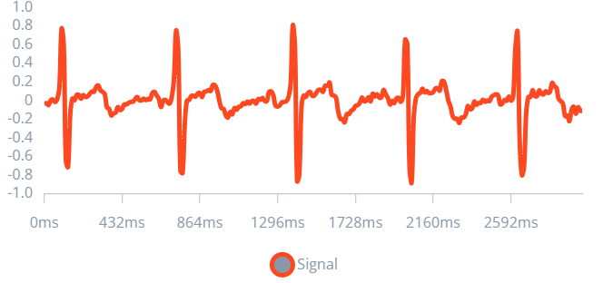
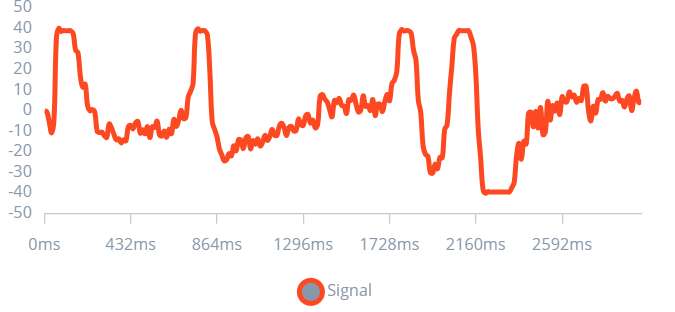

# Laboratorio N°14 -  Edge Impulse (EI)

Integrante: Jimena Alpiste Espinoza (74297329)
# Objetivos: 
- Crear un proyecto en EI por cada señal trabajada en clase (EMG, ECG, EEG)
- Subir cada señal mediante un código en python a EI.
  
# Links del Edge Impulse: 
- [Señal EMG ](https://studio.edgeimpulse.com/public/431540/live ) 
- [Señal ECG ](https://studio.edgeimpulse.com/public/431532/live) 
- [Señal EEG ](https://studio.edgeimpulse.com/public/431539/live)
  
# Imágenes 

**Señal EMG**

**Bicep Braquial**

| Window1 | Window8 | Window 16|
|-----------|-----------|-----------|
|  | |  |

**Pulgar Supinación**

| Window0 | Window5 | Window 10|
|-----------|-----------|-----------|
|  | |  |

**Señal ECG**

**Post Ejercicio**

| Window 0 | Window 4 | Window 10|
|-----------|-----------|-----------|
|  | |  |

**Post inhalación**

| Window 0 | Window 4 | Window 9|
|-----------|-----------|-----------|
|  | |  |

**Señal EEG**

**Preguntas Simples**

| Window1 | Window3 | Window 5|
|-----------|-----------|-----------|
|  | |  |

**Preguntas Complejas**

| Window 0 | Window13 | Window 14|
|-----------|-----------|-----------|
|  | |  |
