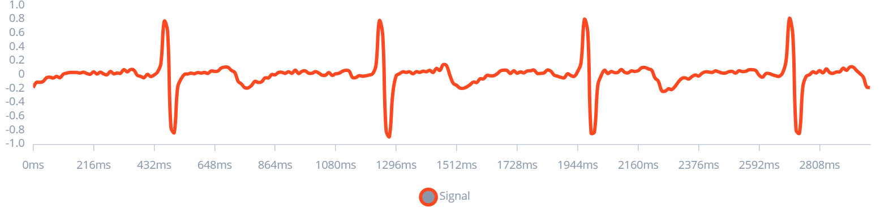
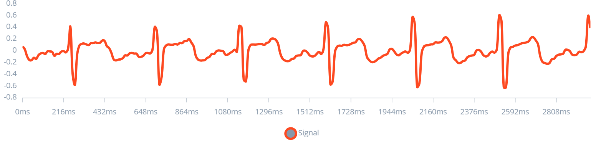

# PENÚLTIMO ENTREGABLE: Visualización de Imágenes EDGE IMPULSE

Este entregable tiene como objetivo mostrar las señales EMG, EKG y EEG tras un proceso de filtrado y ventaneo. Mostrado en EDGE IMPULSE

## EKG

Link EDGE IMPULSE: https://studio.edgeimpulse.com/public/431196/live 

### EKG basal

| EKG basal 1 | EKG basal 3 | EKG basal 6 | EKG basal 9 | EKG basal 10 |
|----------|----------|----------|----------|----------|
|   |  |  |  |  |

### EKG post ejercicio

| ekg_post_ejercicio_1 | ekg_post_ejercicio_3 | ekg_post_ejercicio_5 | ekg_post_ejercicio_7 | ekg_post_ejercicio_9 |
|----------|----------|----------|----------|----------|
|  |  |  |  |  |

## EMG

Link EDGE IMPULSE: https://studio.edgeimpulse.com/public/431550/live

### EMG bicep braquial

| EMG bicep 0 | EMG bicep 2 | EMG bicep 4 | EMG bicep 6 | EMG bicep 8 |
|----------|----------|----------|----------|----------|
|  |  |  |  |  |

### EMG pulgar supinación

| EMG pulgar 0 | EMG pulgar 2 | EMG pulgar 4 | EMG pulgar 6 | EMG pulgar 8 |
|----------|----------|----------|----------|----------|
|  |  |  |  |  |

## EEG

Link EDGE IMPULSE: https://studio.edgeimpulse.com/public/431551/live

### EEG preguntas simples

| EEG_PS 1 | EEG_PS 2 | EEG_PS 3 | EEG_PS 4 | EEG_PS 5 |
|----------|----------|----------|----------|----------|
|  |  |  |  |  |

### EEG preguntas compuestas

| EEG_PC 9 | EEG_PC 11 | EEG_PC 13 | EEG_PC 15 | EEG_PC 17 |
|----------|----------|----------|----------|----------|
|  |  |  |  |  |
