# Laboratorio N°2 - Adquisión de señales y graficación en Arduino

## Tabla de contenidos:
 __________________________________________________________________________________________________
- [Objetivos](#Objetivos)
- [Equipo Utilizado](#Equipo_utilizado)
- [Resultados](#Resultados)
- [Conclusiones](#Conclusiones)
__________________________________________________________________________________________________
## Objetivos:
- Adquirir señales conocidas como señal cuadrada, triangular, senoidal, rampa, etc.
- Entender los criterios de selección de la frecuencia de muestreo.
- Manipular y configurar adecuadamente una fuente de alimentación regulable; multímetro digital; Generador de señales y osciloscopio digital.

## Equipo_utilizado:
| Modelo          | Descripción                                    | Cantidad |
|-----------------|-----------------------------------------------|----------|
| AFG1022         | Generador de señales                          | 1        |
| TBS 1000C Series| Osciloscopio digital                          | 1        |
| -               | Cable BNC Male-Male                           | 1        |
| -               | Punta de osciloscopio con conector BNC (Male)| 1        |
| -               | Par de cables Male-Male                       | 1        |
| SAMD            | Arduino 33 IoT                                | 1        |


## Resultados:
- Conexión Arduino nano 33 IoT y cable BNC :


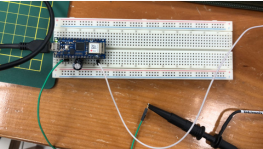

Figura 1. Conexiones del Arduino.
<p align="center">
  
</p>
<p align="center">Figura 1. Conexiones del Arduino</p>
Se estableció la conexión del Arduino Nano 33 IoT en el protoboard, junto con un condensador, para configurar un filtro RC. Este filtro se empleó en conjunto con un cable BNC para analizar la señal sinusoidal proveniente del generador de señales

- Código en Arduino IDE:
```C++
unsigned long lastMsg = 0;
float F = 3;          // Frecuencia de la señal en Hz
double Fs = 10 * F;      // Frecuencia de muestreo en Hz (10 veces la frecuencia de la señal)
double Ts_ms = (1 / Fs) * 1000;  // Período de muestreo en milisegundos (recíproco de la frecuencia de muestreo)

void setup() {
  Serial.begin(9600);
  while (!Serial);  // Esperar hasta que se inicie la comunicación serial
}

void loop() {
  unsigned long now = millis();  

 
  if (now - lastMsg > Ts_ms) {
    lastMsg = now;  

    double signal_analogica = analogRead(A0);  
    Serial.println(signal_analogica);                                 
  }
}
```

Figura 2. Código para el ploteo de las señales

- Generador de Señales:
Se configuro el generador de señales para proporcionar una señal sinusoidal de 2 Hz de frecuencia, con 3.3V de amplitud y 0V de offset

| Onda Sinusoidal          | Onda Cuadrada                                    | Onda Triangular |
|-----------------|-----------------------------------------------|----------|
| 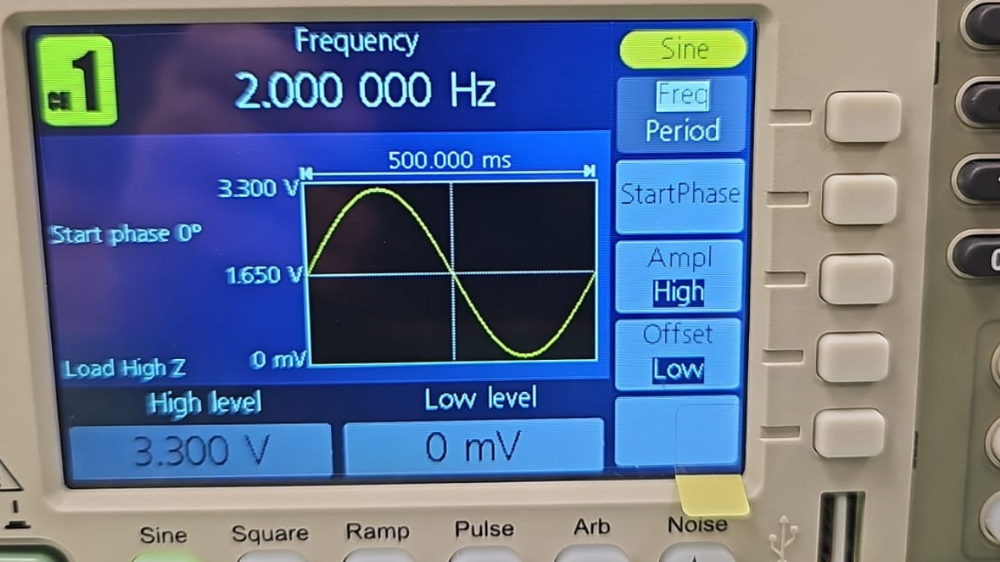   | 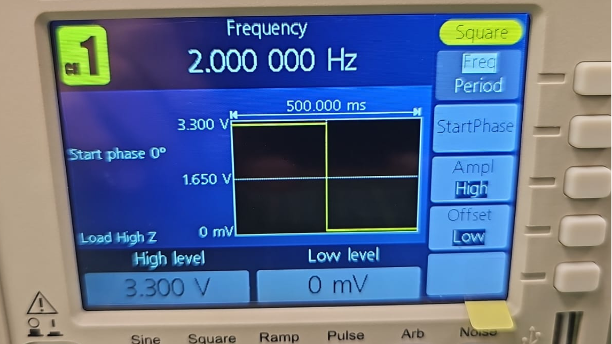                        | 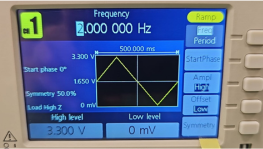      |


- Señal obtenida del Osciloscopio:

| Señal          | Imagen                                                                               | Descripción                                                                                      |
|----------------|--------------------------------------------------------------------------------------|--------------------------------------------------------------------------------------------------|
| Onda Sinusoidal | 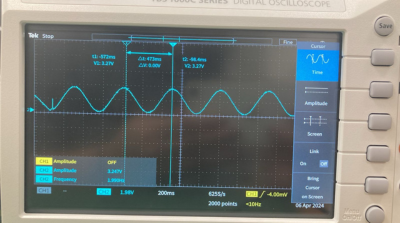 | Para esta onda tuvimos que configurarla con una frecuencia de 2Hz, una amplitud de 3.3v. Donde se puede apreciar una atenuación de aproximadamente 50 mV y una frecuencia detectada de 1.9 Hz |
| Onda Cuadrada  | 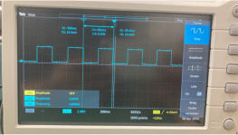    | Para esta onda tuvimos que configurarla con una frecuencia de 2Hz, una amplitud de 3.3v. Del mismo modo, se apreció una atenuación junto a ruido en las zonas altas de la onda. |
| Onda Triangular| 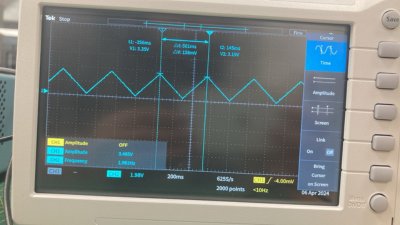  | Para esta onda tuvimos que configurarla con una frecuencia de 2Hz, una amplitud de 3.3v. En esta señal, se observó la variación de la amplitud y frecuencia se ven afectados, debido al ruido que se puede apreciar en la imagen. |


- Señal obtenida del Arduino IDE:

| Señal          | Con Condensador                           | Sin Condensador                |
|---------------------------------|---------------------------------|---------------------------------|
|Onda Sinusoidal|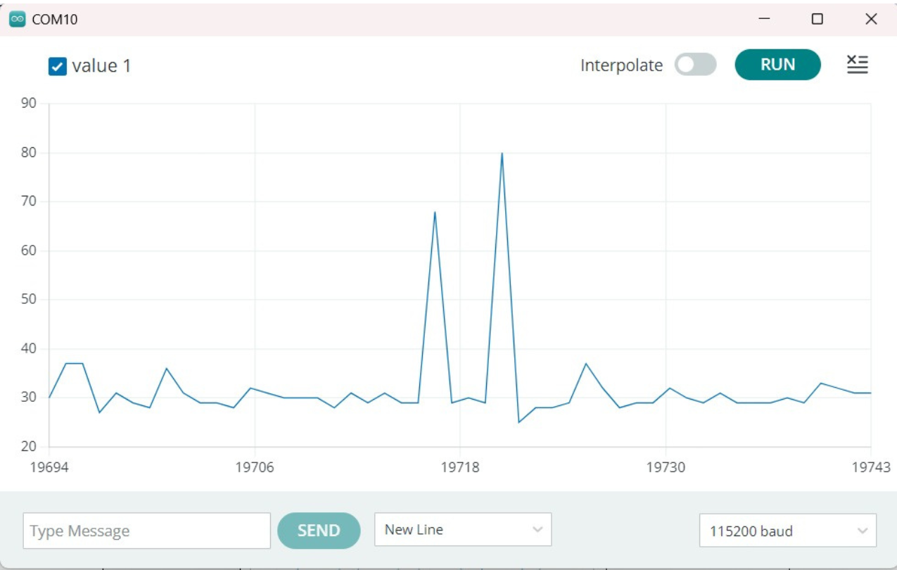|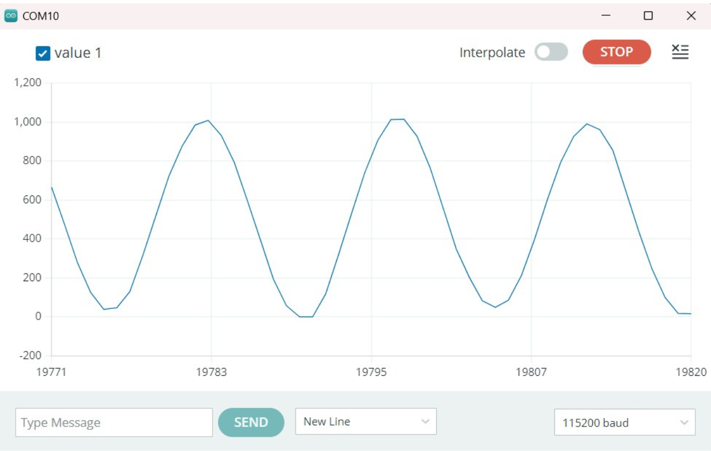|
|Onda Cuadrada|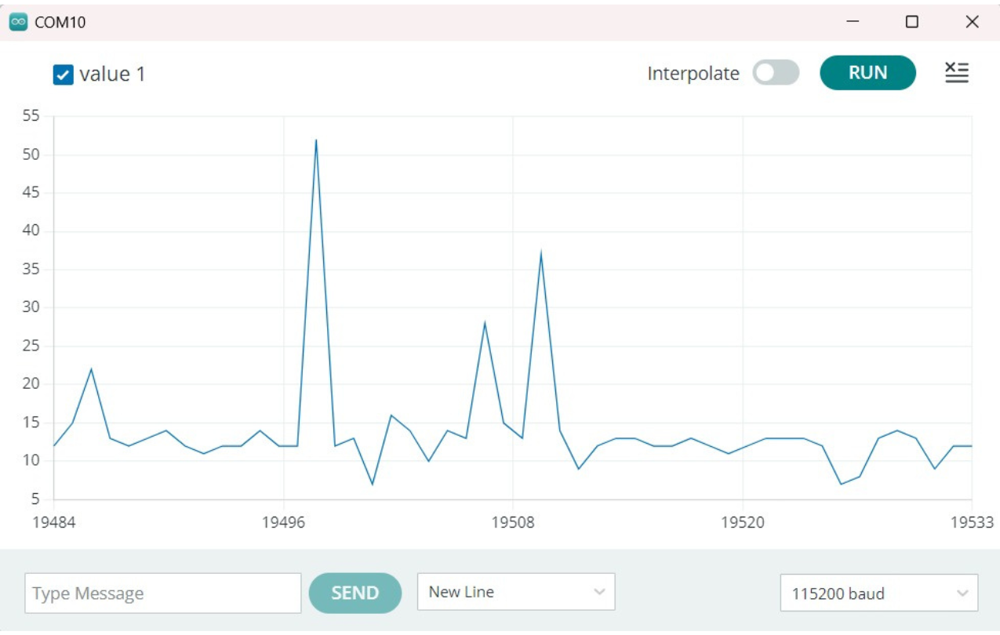|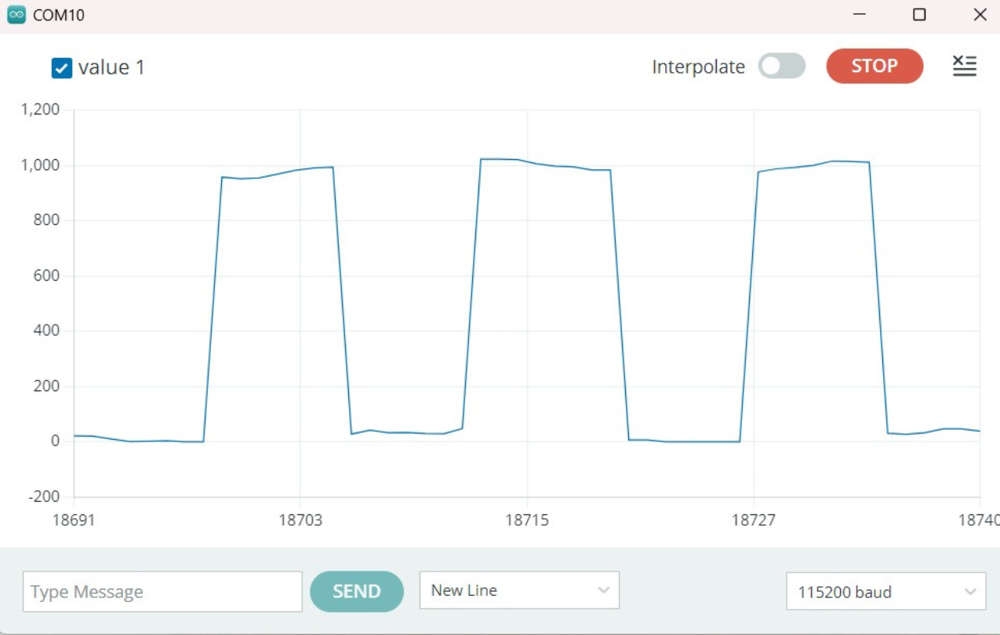|
|Onda Traingular|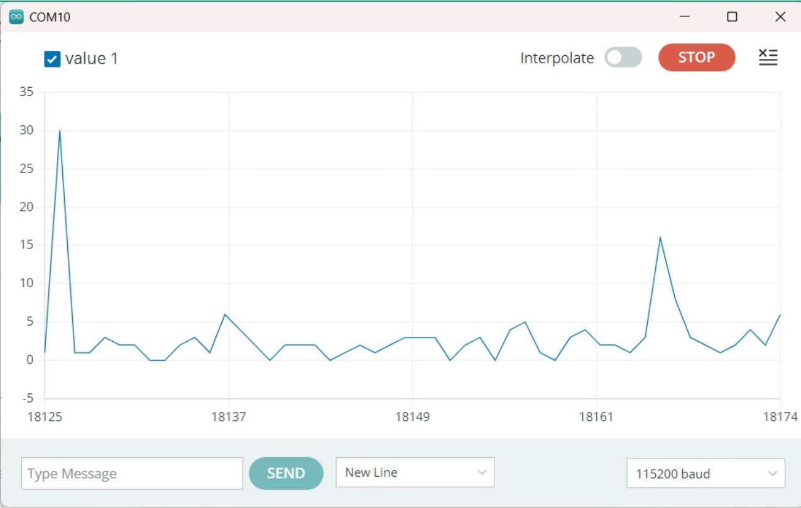|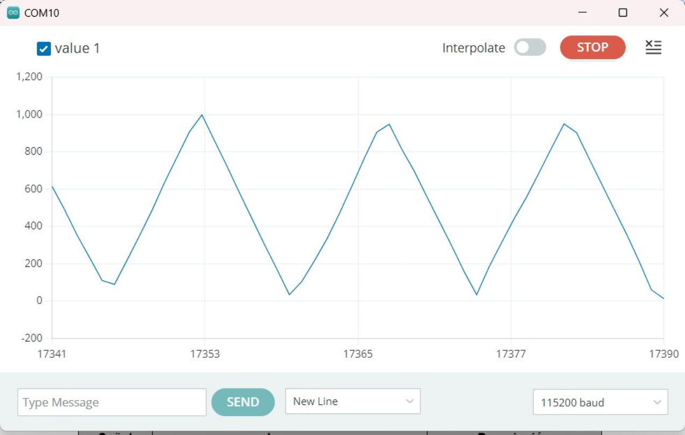|


- Arduino Cloud:
  
Se presentaron problemas en el Arduino Cloud al momento de subir el código al Nano 33 IoT por lo cual no se pudo realizar una lectura con el entorno virtual.

## Conclusiones:
En este experimento, se logró exitosamente plotear señales en el Arduino IDE provenientes del generador de señales. La comparación con las gráficas obtenidas del osciloscopio permitió validar la precisión de las mediciones realizadas por el Arduino. Además, la capacidad de graficar en Arduino Cloud proporciona una alternativa conveniente para monitorear y analizar datos de manera remota, pero en esta oportunidad no se logró obtener una conexión. 
   
