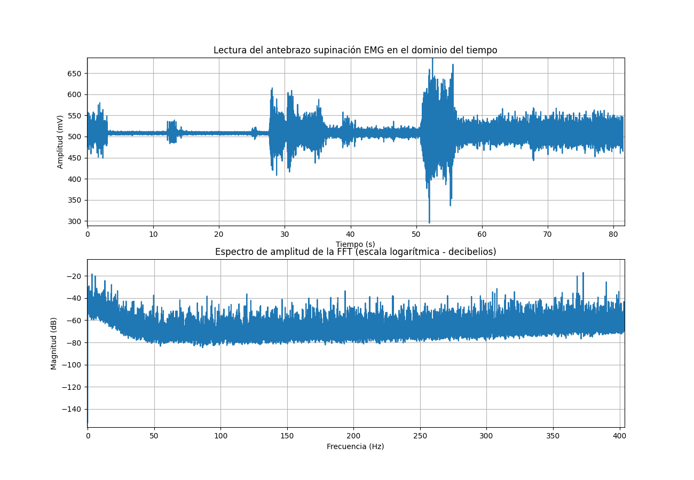
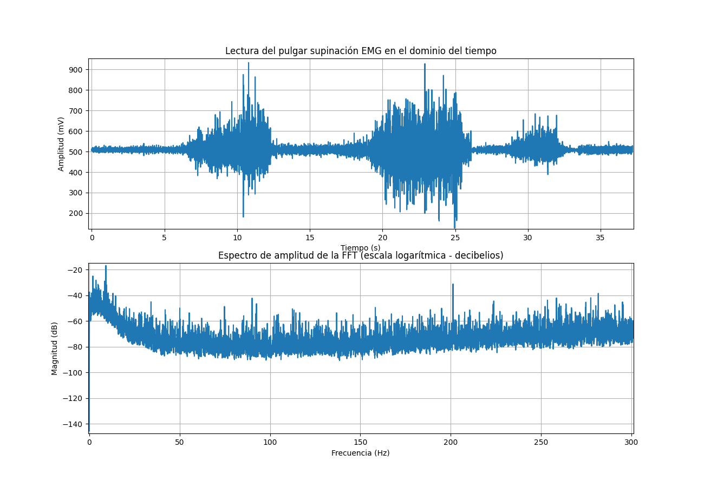

# **LABORATORIO 3: - Uso de BITalino para EMG**
# **Tabla de contenidos**

1. [Objetivos del Laboratorio](#t1)
2. [Materiales y equipos](#t2)
3. [Resultados](#t3)\
     3.1 [Tipo de Conexión para la captación de señales](#t4)\
     3.2 [Visualización de señal eléctrica mediante video y OpenSignals](#t5)\
     3.3 [Archivos](#t6)\
     3.4 [Ploteo de la señal en Python](#t7)

## **Objetivos del Laboratorio** 
* Adquirir señales biomédicas de EMG.
* Hacer una correcta configuración de BiTalino.
* Extraer la información de las señales EMG del software OpenSignals (r)evolution

  
## **Materiales y equipos** 
* 1 Kit BITalino
* 1 Laptop
* 1 paciente de prueba

## **RESULTADOS** 

### **Tipo de Conexión para la captación de señales** 
Se hizo uso del dispositivo Bitalino en conjunto con su sensor EMG de tres electrodos para la obtención de señales electromiográficas, como se evidencia en la imagen que se muestra posteriormente.

El siguiente procedimiento consiste en colocar los electrodos EMG en el usuario de prueba. Para ello se utilizó la **Guía De BITalino en EMG** elaborada por **pluX** brindada por el laboratorio.

### **Visualización de señal eléctrica mediante video y OpenSignalsl** 
### PRUEBA 1: Antebrazo   

En la prueba 1 se tomo señales del reposo y contracción delantebrazo, teniendo la conexión de tierra próxima al codo de la persona. Presione el icono de **Youtube** para acceder a la lista de reproducción de la primera prueba. 

### PRUEBA 2: Bicep braquial  

En la prueba 2 se tomo señales del reposo y contracción del bicep braquial, teniendo la conexión de tierra próxima al codo. Presione el icono de **Youtube** para acceder a la lista de reproducción de la segunda prueba 

### PRUEBA 3: Dedo Pulgar  
En la prueba 3 se tomo señales del reposo, contracción y oposición del dedo pulgar, manteniendo la conexión de tierra en la zona próxima al codo. Presione el icono de **Youtube** para acceder a la lista de reproducción de la primera prueba 

### **Archivos** 
- [Documentos (.txt)](https://github.com/renatog2500/inb_2024_gh12/tree/be701a0d1b2c92ef9167bfc775c26846401e695d/Documentaci%C3%B3n/EMG)
- [Programa de ploteo (python)](https://github.com/renatog2500/inb_2024_gh12/blob/be701a0d1b2c92ef9167bfc775c26846401e695d/Software/Ploteo_de_datos_lab3.py)
### **Ploteo de la señal en Python** 
### Ploteo de la señal del antebrazo

  

Figura 1. Ploteo de la señal en el tiempo y su dominio en frecuencia

### PRUEBA 2: Bicep braquial  

  

Figura 2. Ploteo de la señal en el tiempo y su dominio en frecuencia

### Ploteo del dedo pulgar  

  

Figura 3. Ploteo de la señal en el tiempo y su dominio en frecuencia

