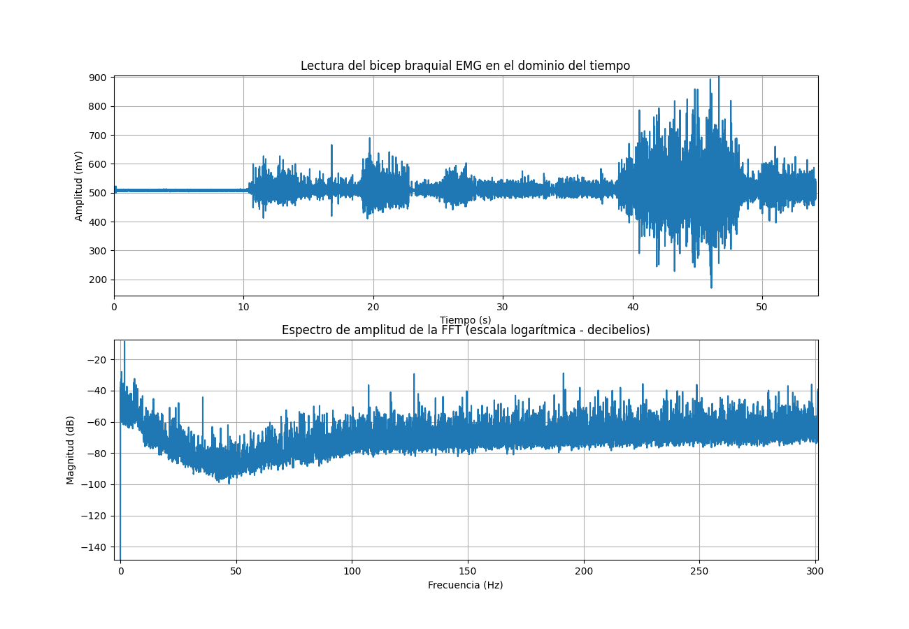

# **LABORATORIO 3: - Uso de BITalino para EMG**
# **Tabla de contenidos**

1. [Objetivos del Laboratorio](#t1)
2. [Materiales y equipos](#t2)
3. [Resultados](#t3)\
     3.1 [Tipo de Conexión para la captación de señales](#t4)\
     3.2 [Visualización de señal eléctrica mediante video y OpenSignals](#t5)\
     3.3 [Archivos](#t6)\
     3.4 [Ploteo de la señal en Python](#t7)

## **Objetivos del Laboratorio** 
* Adquirir señales biomédicas de EMG y ECG.
* Hacer una correcta configuración de BiTalino.
* Extraer la información de las señales EMG y ECG del software OpenSignals (r)evolution

  
## **Materiales y equipos** 
* Kit BITalino
* Laptop

## **RESULTADOS** 
### **Tipo de Conexión para la captación de señales** 
### **Visualización de señal eléctrica mediante video y OpenSignalsl** 
### PRUEBA 1: Antebrazo   

### PRUEBA 2: Bicep braquial  

### PRUEBA 3: Dedo Pulgar  

### **Archivos** 
- [Documentos (.txt)](https://github.com/renatog2500/inb_2024_gh12/tree/be701a0d1b2c92ef9167bfc775c26846401e695d/Documentaci%C3%B3n/EMG)
- [Programa de ploteo (python)](https://github.com/renatog2500/inb_2024_gh12/blob/be701a0d1b2c92ef9167bfc775c26846401e695d/Software/Ploteo_de_datos_lab3.py)
### **Ploteo de la señal en Python** 
### Ploteo de la señal del antebrazo

  

Figura 1. Ploteo de la señal en el tiempo y su dominio en frecuencia

### PRUEBA 2: Bicep braquial  

  

Figura 2. Ploteo de la señal en el tiempo y su dominio en frecuencia

### Ploteo del dedo pulgar  

  

Figura 3. Ploteo de la señal en el tiempo y su dominio en frecuencia
