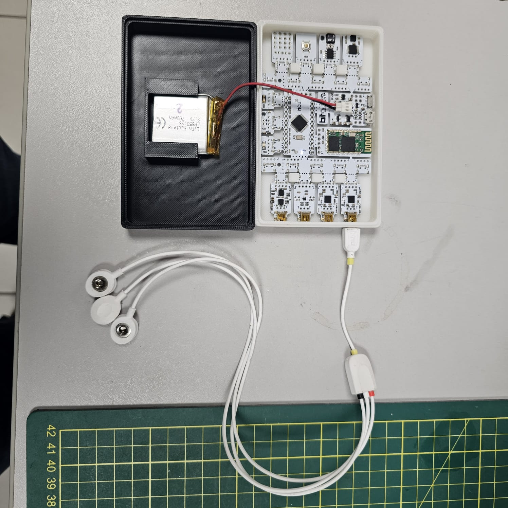
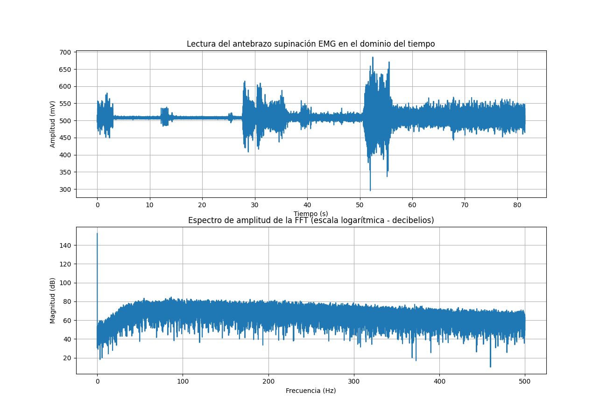
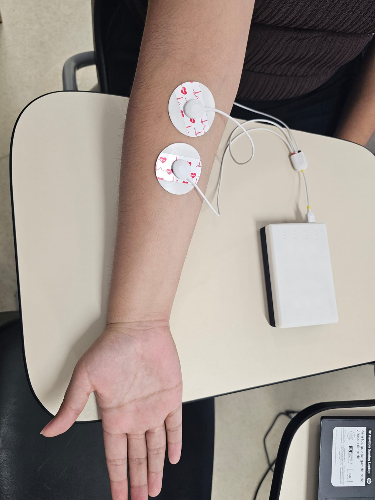
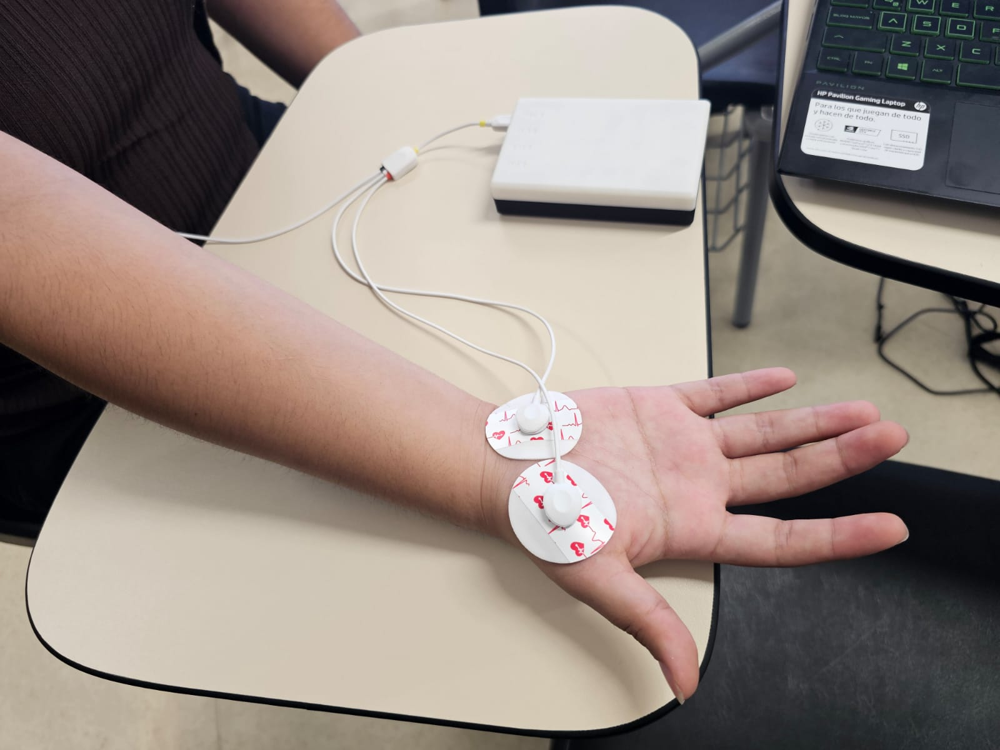

# **LABORATORIO 3: - Uso de BITalino para EMG**
# **Tabla de contenidos**

1. [Objetivos del Laboratorio](#t1)
2. [Materiales y equipos](#t2)
3. [Resultados](#t3)\
     3.1 [Tipo de Conexión para la captación de señales](#t4)\
     3.2 [Visualización de señal eléctrica mediante video y OpenSignals](#t5)\
     3.3 [Archivos](#t6)\
     3.4 [Ploteo de la señal en Python](#t7)
4. [Bibliografía](#t8)

## **Objetivos del Laboratorio** <a name = "t1"></a>
* Adquirir señales biomédicas de EMG.
* Hacer una correcta configuración de BiTalino.
* Extraer la información de las señales EMG del software OpenSignals (r)evolution

  
## **Materiales y equipos** <a name="t2"></a>
* 1 Kit BITalino
* 1 Laptop
* 1 paciente de prueba

## **RESULTADOS** <a name="t3"></a>
### **Tipo de Conexión para la captación de señales** <a name="t4"></a>
Se hizo uso del dispositivo Bitalino en conjunto con su sensor EMG de tres electrodos para la obtención de señales electromiográficas, como se evidencia en la imagen que se muestra posteriormente.

<p align="justify">
<p align="center"></p>
</p>

El siguiente procedimiento consiste en colocar los electrodos EMG en el usuario de prueba. Para ello se utilizó la **Guía De BITalino en EMG** elaborada por **pluX** brindada por el laboratorio.

### **Visualización de señal eléctrica mediante video y OpenSignalsl** <a name="t5"></a>
### PRUEBA 1: Antebrazo  <br>
<p align="justify">
En la prueba 1 se tomo señales del reposo y contracción delantebrazo, teniendo la conexión de tierra próxima al codo de la persona. Presione el icono de **Youtube** para acceder a la lista de reproducción de la primera prueba.<br>
</p>
<p align="center"></p>

<div align="center">

[](https://www.youtube.com/watch?v=wQWGIh1lzSk&list=PLVlPVkO82_qqI6ozxE2nUjjm0MG3LpNd1&ab_channel=RENATOGIUSSEPPECARDOSORE%C3%81TEGUI)

</div>

### PRUEBA 2: Bicep braquial <br>
<p align="justify">
En la prueba 2 se tomo señales del reposo y contracción del bicep braquial, teniendo la conexión de tierra próxima al codo. Presione el icono de **Youtube** para acceder a la lista de reproducción de la segunda prueba<br>
</p>
<p align="center"></p>

<div align="center">


[](https://youtu.be/370-xtUXGvk)

</div>

### PRUEBA 3: Dedo Pulgar <br>
En la prueba 3 se tomo señales del reposo, contracción y oposición del dedo pulgar, manteniendo la conexión de tierra en la zona próxima al codo. Presione el icono de **Youtube** para acceder a la lista de reproducción de la primera prueba<br>
</p>
<p align="center"></p>

<div align="center">

[](https://youtu.be/WbZ2SZej9GI)

</div>

**Explicación de la variación de la señal**
* **En reposo:**
Cuando el músculo está en reposo, se registra una actividad eléctrica mínima conocida como "ruido de base" o "actividad de base". Esta actividad se debe a la actividad eléctrica espontánea de las fibras musculares y no representa una contracción muscular significativa. En esta situación, la señal EMG es de baja amplitud y relativamente constante.[1][4]

* **Durante un movimiento:**
Cuando realizas un movimiento, como flexionar el antebrazo, las fibras musculares se activan y se contraen. Durante la contracción muscular, se produce una descarga eléctrica que se propaga a lo largo de las fibras musculares. Esta actividad eléctrica es captada por los electrodos (diodos) colocados sobre la piel. En consecuencia, la señal EMG muestra un aumento en la amplitud y una mayor variabilidad en comparación con el estado de reposo. La forma y la amplitud de la señal EMG durante el movimiento dependen de la fuerza y la duración de la contracción muscular.[2][4]

* **Durante una oposición a una fuerza:**
Cuando aplicas una fuerza externa contra la cual el músculo debe trabajar (por ejemplo, levantar un peso o empujar un objeto), se produce una contracción muscular más intensa. En esta situación, se reclutan más fibras musculares para generar la fuerza necesaria para oponerse a la carga externa. Como resultado, la señal EMG muestra una amplitud aún mayor en comparación con un movimiento sin resistencia. La amplitud de la señal EMG aumenta a medida que se incrementa la fuerza aplicada por el músculo.[3][5]

### **Archivos** <a name="t6"></a>
- [Documentos (.txt)](https://github.com/renatog2500/inb_2024_gh12/tree/be701a0d1b2c92ef9167bfc775c26846401e695d/Documentaci%C3%B3n/EMG)
- [Programa de ploteo (python)](https://github.com/renatog2500/inb_2024_gh12/blob/be701a0d1b2c92ef9167bfc775c26846401e695d/Software/Ploteo_de_datos_lab3.py)

### **Ploteo de la señal en Python** <a name="t7"></a>
- Código en Python:
```python
import pandas as pd
import numpy as np
import matplotlib.pyplot as plt
import re

# Cargar datos desde el archivo de texto según la ubicación del 
archivo = "Ubicación/del/archivo/Lectura_pulgar_supinación_EMG.txt"
def extraer_nombres_columnas(archivo):
    with open(archivo, 'r') as f:
        for linea in f:
            if linea.startswith("#"):
                matches = re.findall(r'column":\s*\[(.*?)\]', linea)
                if matches:
                    # Extraer la lista de nombres de columna de la línea
                    column_names = [name.strip().strip('"') for name in matches[0].split(',')]
                    return column_names,
                else:
                    continue


                    
#Me devuelve una tupla pues esta en "(...)"
column_name=extraer_nombres_columnas(archivo)

nombres_columnas=column_name[0]  # Imprime la lista: ['nSeq', 'I1', 'I2', 'O1', 'O2', 'A1']

#Leyendo el TxT que nos da OpenSignal, podemos entender que las columnas para nuestro Dataframe serán las siguientes:
#Se le coloca una columna "NaN" debido a que en el txt cada ultimo valor de fila tiene un espacio que lee como NaN
#nombres_columnas = ["nSeq", "I1", "I2", "O1", "O2", "A1"]

#Una vez tenemos claro, convertirmos nuestro TXT un dataframe
#Eliminamos las 3 primeras filas
#Declaramos la separación de tabulación
#Se elimina la ultima fila debido a que en el txt cada ultimo valor de fila tiene un espacio que se lee como NaN
datos = pd.read_csv(archivo, sep='\t', skiprows=3, header=None, usecols=[0, 1 ,2,3,4,5])

#Declaramos las columnas para poder tener una mejor observación del resultado
datos.columns = nombres_columnas

#Imprimimos el Dataframe resultante para ver si se obtuvo un buen resultado
print(datos)
#Comprobado el resultado solo escogemos la columna "A1", la cual usamos para nuestra medición
Lectura_EMG = datos.iloc[:, 5]

# Convertir los datos a números
Lectura_EMG = Lectura_EMG.apply(pd.to_numeric)

# Calculate FFT
fft_result = np.fft.fft(Lectura_EMG)

# Calculate frequencies
frequencies = np.fft.fftfreq(len(Lectura_EMG), d=1/1000)

# Compute the FFT magnitude
magnitudes_db = -20*np.log10(np.abs(fft_result))

#print(Lectura_EMG)
Lectura_EMG.index = Lectura_EMG.index / 1000

# Plotear la señal de EMG en el dominio del tiempo
plt.figure(figsize=(13,9))
plt.subplot(211)
plt.plot(Lectura_EMG)
plt.title("Lectura del pulgar supinación EMG en el dominio del tiempo")
plt.xlabel("Tiempo (s)")
plt.ylabel("Amplitud (mV)")
plt.grid(True)

# Plotear el espectro de amplitud de la FFT (escala logarítmica - decibelios)
plt.subplot(212)
plt.plot(frequencies[:len(frequencies)//2], magnitudes_db[:len(frequencies)//2])
plt.title("Espectro de amplitud de la FFT (escala logarítmica - decibelios)")
plt.xlabel("Frecuencia (Hz)")
plt.ylabel("Magnitud (dB)")
plt.grid(True)

plt.show()
```

### Ploteo de la señal del antebrazo
<p align="center">
  
</p>
<p align="center">Figura 1. Ploteo de la señal en el tiempo y su dominio en frecuencia</p>

### PRUEBA 2: Bicep braquial <br>
<p align="center">
  
</p>
<p align="center">Figura 2. Ploteo de la señal en el tiempo y su dominio en frecuencia</p>

### Ploteo del dedo pulgar <br>
<p align="center">
  
</p>
<p align="center">Figura 3. Ploteo de la señal en el tiempo y su dominio en frecuencia</p>


## **Bibliografía** <a name="t8"></a>

[1] "Electromiografía", MedlinePlus, Biblioteca Nacional de Medicina de los Estados Unidos. [En línea]. Disponible: https://medlineplus.gov/spanish/ency/article/003929.htm. [Accedido: 13-abr-2024].

[2] "Electromiografía (EMG)", Mayo Clinic. [En línea]. Disponible: https://www.mayoclinic.org/es-es/tests-procedures/emg/about/pac-20393913. [Accedido: 13-abr-2024].

[3] "Electromiografía", Sociedad Española de Neurología (SEN). [En línea]. Disponible: https://www.sen.es/pdf/2015/electromiografia.pdf. [Accedido: 13-abr-2024].

[4] R. Portillo Reyes, "Electromiografía Clínica", ResearchGate, 2018. [En línea]. Disponible: https://www.researchgate.net/publication/327149874_Electromiografia_clinica. [Accedido: 13-abr-2024].

[5] J. A. Bevilacqua, "Electromiografía en el Diagnóstico de Enfermedades Neuromusculares", Revista Médica Clínica Las Condes, vol. 29, no. 3, pp. 270-273, mayo-junio 2018. [En línea]. Disponible: https://www.sciencedirect.com/science/article/pii/S0716864019300070. [Accedido: 13-abr-2024].


