# Laboratorio N°4 - Uso de BITalino para ECG

## Tabla de contenidos:
 __________________________________________________________________________________________________
1. [Lista de participantes](#t1)
2. [Introducción](#t2)
3. [Objetivos del laboratorio](#t3)
4. [Materiales y Equipo Utilizado](#t4)
5. [Protocolo de conexión](#t5)
6. [Resultados y discusión](#t6)\
   6.1 [Visualización de la señal mediante video y OpenSignals ](#t7)\
   6.2 [Ploteo de la señal en Python](#t8)\
   6.3 [Archivos de la señal ploteada en Python y datos de la señal](#t9)
7. [Señal del Promsim4](#t10)
8. [Conclusiones](#t11)
9. [Bibliografía](#t12)
__________________________________________________________________________________________________
## **Lista de participantes** <a name = "t1"></a>
* Jimena Alpiste Espinoza - 74297329
* Jossymar León Mallma - 
* Renato Cardoso Cardenas - 73061678


## Introducción  <a name = "t2"></a>
Cuando el impulso cardíaco se transmite a través del corazón, la corriente eléctrica se extiende hacia los tejidos circundantes. Una pequeña fracción de esta corriente se disemina hacia la superficie corporal. Al colocar electrodos en la piel en diferentes áreas alrededor del corazón, es posible registrar los potenciales eléctricos generados por esta corriente; este registro se conoce como electrocardiograma (ECG) [1].

El ECG es una modalidad de diagnóstico no invasiva que tiene un impacto clínico sustancial en la investigación de la gravedad de las enfermedades cardiovasculares. Se utiliza cada vez más para monitorear pacientes que toman antiarrítmicos y otros medicamentos, como parte integral de la evaluación preoperatoria de pacientes sometidos a cirugía no cardíaca, y para evaluar a personas en ocupaciones de alto riesgo y a quienes practican deportes[2]. 

<div align="center">
    
    <p>Extraído de <a href="https://cardiologialosmochis.com/portfolio/electrocardiograma/">cardiologialosmochis</a></p>
</div>


**Señal de un Electrocardiograma**: 
Las fluctuaciones en el voltaje extracelular registrado por cada derivación varían desde fracciones de un milivoltio hasta varios milivoltios. Estas fluctuaciones se llaman ondas. 
En la señal ECG podemos observar las siguientes ondas [3]:

<div align="center">
     
    <p><b>Figura 1. Señal de un ECG </b> - Extraído de <a href="https://makeagif.com/gif/ecg-animation-electrical-changes-in-heart-wCF14V">cardiologialosmochis</a></p>
</div>

- Onda P: Es la primera deflexión hacia arriba. Se produce cuando se despolarizan las aurículas antes del comienzo de la contraciión auricular. La onda P debe ser suave, redondeada y positiva (hacia arriba).

- Segmento P-R: Representa el tramo de la línea isoeléctrica que se encuentra entre el final de la onda P y la siguiente deflexión. En este periodo, las aurículas terminan de vaciarse y se produce desaceleración en la transmisión de la corriente eléctrica, justo antes del inicio de la contracción de los ventrículos.

- Complejo QRS: Esta formado por los potenciales que se generan cuando se despolarizan los ventriculos antes de su contracción. En un ECG normal se deben observar ondas Q de tamaño pequeño (no mayores a un cuadrado pequeño tanto en longitud como profundidad), encontrarse solo en ciertas derivaciones y no debe exceder en duración más de dos cuadrados pequeños.

- Segmento ST: En este segmento, los ventrículos están totalmente despolarizados. Tiene valor como herramienta diagnóstica ya que su elevación o descenso en relación con la línea basal puede significar insuficiencia en la irrigación del corazón

- Onda T: Se produce por los potenciales que se generan cuando los ventriculos se recuperan del estado de despolarización. Permite a los ventrículos relajarse y prepararse para el siguiente ciclo cardíaco. Esta onda se manifiesta como una deflexión positiva (hacia arriba).

- Segmento TP: Este segmento representa el período en el que los ventrículos están completamente relajados y en reposo.

## **Objetivos del Laboratorio** <a name = "t3"></a>
* Adquirir señales biomédicas de ECG.
* Hacer una correcta configuración de BiTalino.
* Extraer la información de las señales ECG del software OpenSignals (r)evolution
  
## **Materiales y equipos** <a name="t4"></a>
<table align="center">
  <tr>
    <th>Modelo</th>
    <th>Descripción</th>
    <th>Cantidad</th>
  </tr>
  <tr>
    <td>(R)EVOLUTION</td>
    <td>Kit de BITalino</td>
    <td>1</td>
  </tr>
  <tr>
    <td>-</td>
    <td>Laptop</td>
    <td>1</td>
  </tr>
</table>
<p align="center">
  <b>Tabla 1. Materiales y equipos utilizados</b>
</p>

## Protocolo de conexión <a name="t5"></a>
Para capturar las señales ECG, se empleó el dispositivo BITalino junto con su sensor ECG de tres electrodos. Se siguió el procedimiento detallado en la guía BiTalino,**(BITalino HOME-GUIDE #2 ELECTROCARDIOGRAPHY (ECG) Exploring Cardiac Signals at the Skin Surface")** [4], como referencia para posicionar correctamente los electrodos en el sujeto de prueba. A continuación, se presentan los protocolos de conexión específicos utilizados en cada prueba llevada a cabo en este laboratorio:

| Figura 2. Colocación de electrodos para la derivación I referencia[4].                                                                                                   | Figura 3. Colocación de los electrodos en el laboratorio para la derivación I                                                                                                     |
|-------------------------------------------------------------------------------------------------------------|-----------------------------------------------------------------------------------------------------------------|
| 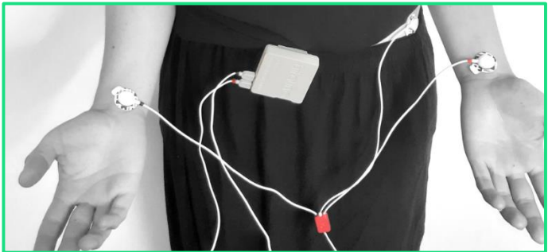 |  |


La derivación 1 en un ECG es una de las vistas básicas utilizadas para monitorear la actividad eléctrica del corazón. La colocación adecuada de los electrodos es fundamental para capturar con precisión esta actividad. En la Figura 2 se muestra la colocación de los electrodos para esta derivación. En esta configuración, se utilizaron tres electrodos: 
* IN+ (rojo) se coloca en la muñeca izquierda .
* IN- (negro) se coloca en la muñeca derecha.
* REF (blanco) se coloca en la cresta ilíaca.

**Protocolo:**
El protocolo seguido para evaluar el latido del corazón en vivo con electrocardiografía fue el de la guía experimental de BITalino [4]:
1. Registrar una línea base de señal con poco ruido y sin movimientos (respiración normal) durante 30 segundos.
2. Repetir un ciclo de INHALACIÓN-MANTENER-EXHALACIÓN-MANTENER tres veces, manteniendo la respiración y fases de reposo durante cinco segundos.
3. Registrar otra fase inicial de 30 segundos.
4. Realizar 10 burpees **(se realizaron planchas)** y observa tu frecuencia cardíaca antes y después del entrenamiento.
5. Registrar otra fase inicial de 30 segundos.
6. Realizar una inhalación larga (~10 segundos) seguida de contener la respiración durante varios segundos (~10 segundos).

**Pruebas realizadas:**
Cabe destacar que las ubicaciones mencionadas se mantuvieron para todas las pruebas: 

- Prueba 1: Lectura del Estado Basal
- Prueba 2: Lectura de los ciclos de Inhalación y Exhalación (Fases de 5 segundos) 
- Prueba 3: Segunda lectura en estado de reposo
- Prueba 4: Lectura posterior a la realización de ejercicio intenso. Ejercicios realizados: planchas y polichinelas

https://github.com/renatog2500/inb_2024_gh12/assets/130946164/7802253f-a10b-4bd8-b5fc-664aa1a81318
  
- Prueba 5: Tercera lectura en estado de reposo
- Prueba 6: Lectura de los ciclos de Inhalación y Exhalación prolongada (Fases de 10 segundos)

------------------------

## Resultados y discusión  <a name="t6"></a>
### **Visualización de señal eléctrica mediante video y OpenSignalsl** <a name="t7"></a>
| Prueba   | Señal Ploteada en Open Signals   | Descripción    |
| --------- | ---- | --------- |
| 1.Lectura de la señal Basal  | [](https://www.youtube.com/watch?v=-wfPedZAewY&list=PL1Sr3jz1xOr2I_mcd2os0of3MUAfD8h60&index=2)    | En la prueba 1 se tomo señales ECG del sujeto de prueba en estado de reposo.|
| 2. Lectura de los ciclos de Inhalación y Exhalación (Fases de 5 segundos) | [](https://www.youtube.com/watch?v=tKcrb_DEtSk&list=PL1Sr3jz1xOr2I_mcd2os0of3MUAfD8h60&index=10)   | En la 2da prueba el sujeto realizó ciclos de inhalación y exhalación de intervalos de 5 segundos durante 30 segundos, se tomó la lectura del comportamiento de la señal ECG. |
| 3.Segunda lectura en estado de reposo | [](https://www.youtube.com/watch?v=Ae_AFhxrdck&list=PL1Sr3jz1xOr2I_mcd2os0of3MUAfD8h60&index=3 )  | Se volvió a realizar la captura de la señal del electrocardiograma (ECG) del sujeto después de la sesión de ejercicios de inhalación y exhalación.|
| 4. Lectura posterior a la realización de ejercicios |[](https://www.youtube.com/watch?v=TCozf52vHHc&list=PL1Sr3jz1xOr2I_mcd2os0of3MUAfD8h60&index=5 "Haz clic para ver el video")   | El sujeto fue sometido a una serie de ejercicios físicos que incluyeron la realización de planchas y polichinelas. Luego de completar estos ejercicios, se procedió a tomar la señal del electrocardiograma (ECG).   |
| 5.Tercera lectura en estado de reposo | [](https://www.youtube.com/watch?v=QQnHKHVdN3U&list=PL1Sr3jz1xOr2I_mcd2os0of3MUAfD8h60&index=4 "Haz clic para ver el video") | Se llevó a cabo una nueva toma de la señal del electrocardiograma (ECG) del sujeto en reposo después de completar la serie de ejercicios.   |
| 6.Inhalación y exhalación prolongada durante 10 segundos | [](https://www.youtube.com/watch?v=lHYRxELjat0&list=PL1Sr3jz1xOr2I_mcd2os0of3MUAfD8h60&index=8 "Haz clic para ver el video")   | En la sexta prueba, el sujeto llevó a cabo ciclos de inhalación y exhalación en intervalos de 10 segundos. Durante este proceso, se registró y analizó el comportamiento de la señal del electrocardiograma (ECG).  |
<table align="center">
 
 
 <tr>
    <th> PRUEBA </th>
    <th> VIDEO </th>
    <th> DESCRIPCIÓN </th>
  </tr>
  <tr>
    <th> 1.Lectura de la señal Basal </th>
    <td> 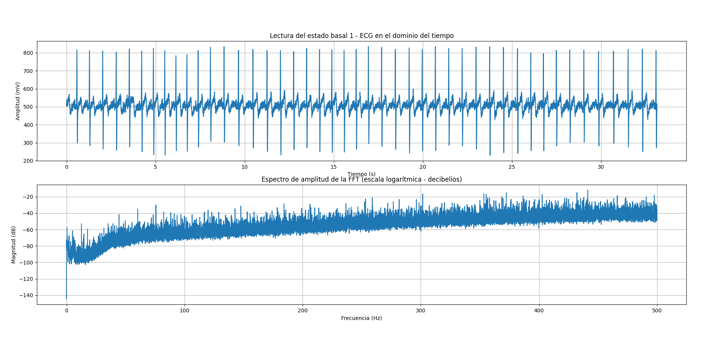 </td>
    <td> En la prueba 1 se tomo señales ECG del sujeto de prueba en estado de reposo.</td>
  </tr>
   <tr>
    <th> 2. Lectura de los ciclos de Inhalación y Exhalación (Fases de 5 segundos)</th>
    <td>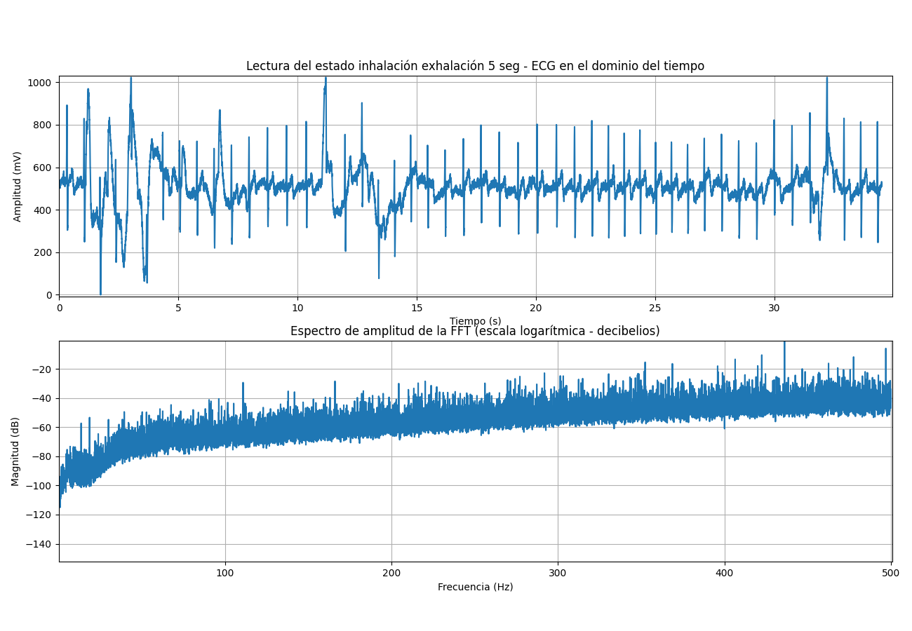</td>
    <td>En la 2da prueba el sujeto realizó ciclos de inhalación y exhalación de intervalos de 5 segundos durante 30 segundos, se tomó la lectura del comportamiento de la señal ECG.</td>
  </tr>
   <tr>
    <th> 3. Segunda lectura en estado de repos</th>
    <td>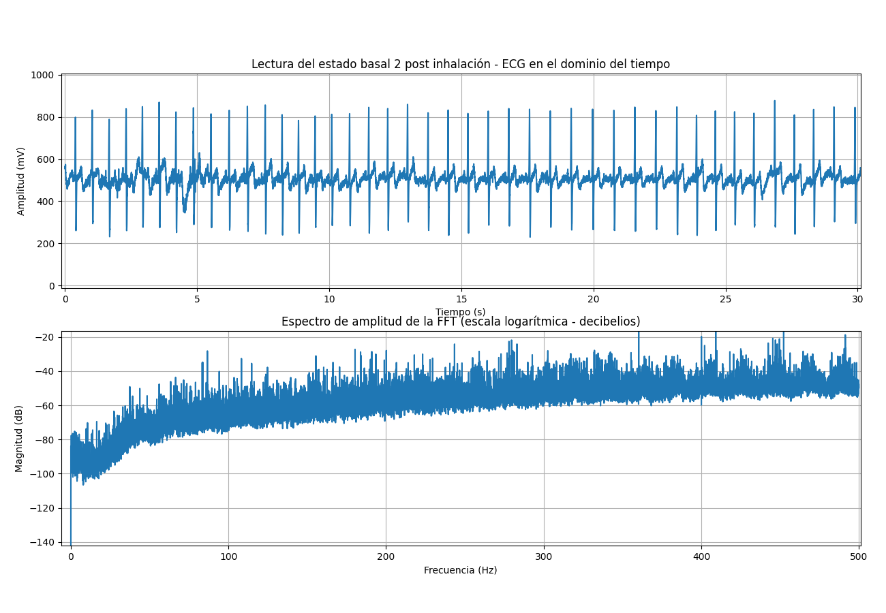</td>
    <td> Se volvió a realizar la captura de la señal del electrocardiograma (ECG) del sujeto después de la sesión de ejercicios de inhalación y exhalación. </td>
  </tr>
   <tr>
    <th> 4. Lectura posterior a la realización de ejercicios </th>
    <td>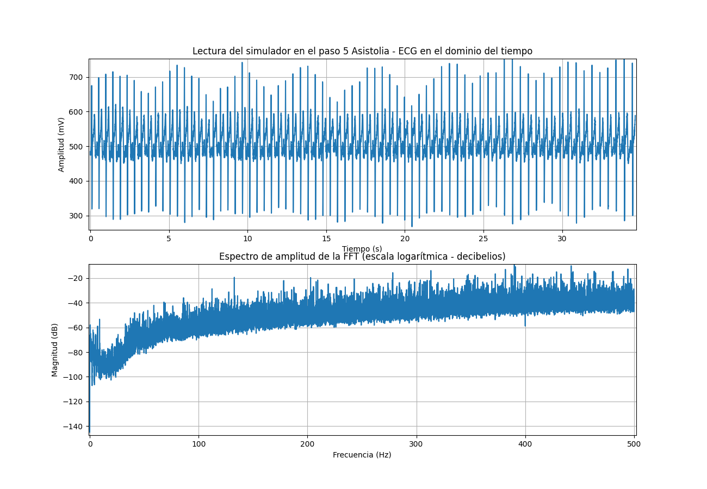</td>
    <td>El sujeto fue sometido a una serie de ejercicios físicos que incluyeron la realización de planchas y polichinelas. Luego de completar estos ejercicios, se procedió a tomar la señal del electrocardiograma (ECG). </td>
  </tr>
   <tr>
    <th> 5.Tercera lectura en estado de reposo </th>
    <td>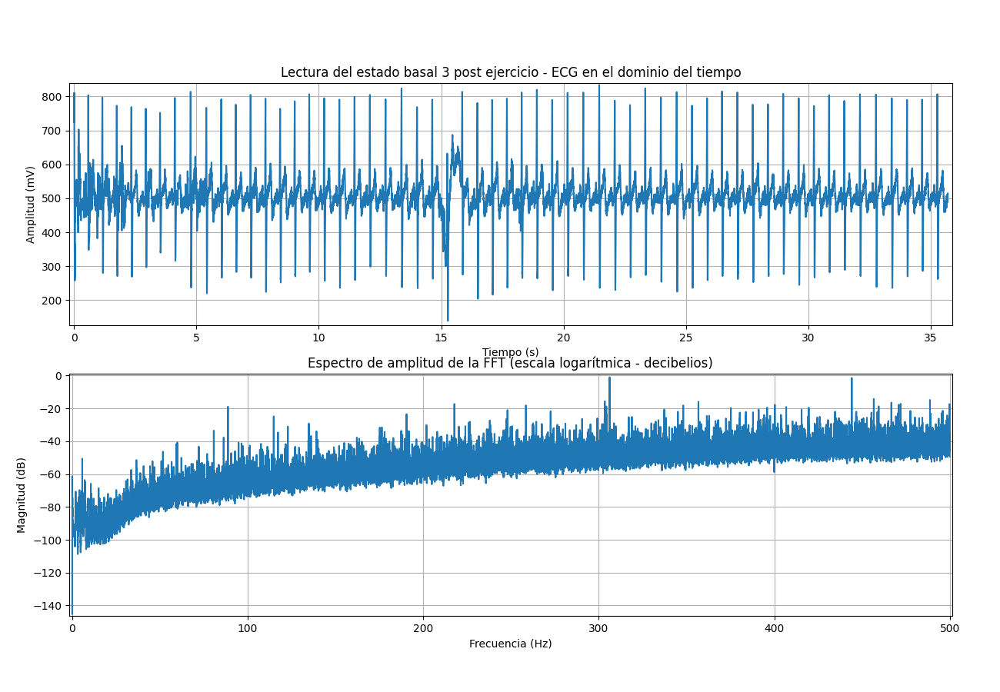</td>
    <td>Se llevó a cabo una nueva toma de la señal del electrocardiograma (ECG) del sujeto en reposo después de completar la serie de ejercicios. </td>
  </tr>
     <th> 6.Inhalación y exhalación prolongada durante 10 segundos</th>
    <td>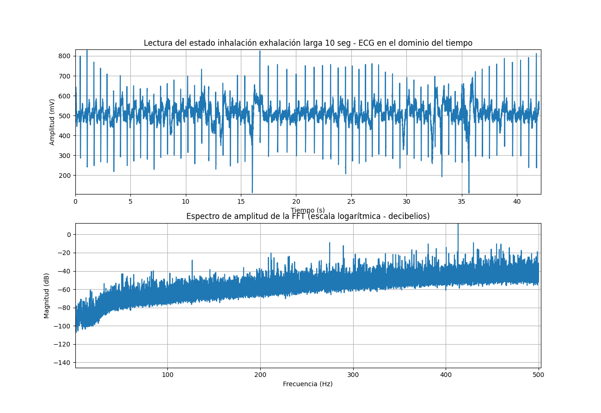</td>
    <td>En la sexta prueba, el sujeto llevó a cabo ciclos de inhalación y exhalación en intervalos de 10 segundos. Durante este proceso, se registró y analizó el comportamiento de la señal del electrocardiograma (ECG).

</td>
  </tr>
</table>
<p align="center">
  <b>Tabla 2. Videos del Protocolo </b>
</p>


### **Explicación de la variación de la señal**

**1. Estado de reposo (lectura basal):** Durante el estado de reposo, la señal EKG presenta un patrón regular y estable, reflejando la actividad eléctrica normal del corazón. Las ondas P, QRS y T se observan claramente, y los intervalos entre ellas son consistentes [1].

**2.Inhalación y exhalación en series de 5 segundos durante 30 segundos:** Durante la inspiración, se produce un aumento en la frecuencia cardíaca y una disminución en la variabilidad de la frecuencia cardíaca (VFC). Esto se debe a la estimulación del sistema nervioso simpático y la inhibición del sistema nervioso parasimpático. Durante la espiración, se observa una disminución en la frecuencia cardíaca y un aumento en la VFC, lo que refleja la activación del sistema nervioso parasimpático [2], [3].

**3. Lectura basal después de la respiración controlada:** Después de la respiración controlada, la señal EKG vuelve a un patrón similar al observado en la lectura basal inicial. Sin embargo, pueden presentarse ligeras variaciones debido a los efectos residuales de la respiración controlada en el sistema nervioso autónomo [1], [3].

**4. Lectura posterior a una serie de ejercicios:** Después del ejercicio, se observa un aumento significativo en la frecuencia cardíaca y cambios en la morfología de las ondas del EKG. La onda T puede aparecer invertida o aplanada, y el segmento ST puede presentar una depresión o elevación. Estos cambios se deben a la activación del sistema nervioso simpático y al aumento de las demandas metabólicas del corazón durante el ejercicio [4], [5].

**5. Lectura basal después del ejercicio:** Después del ejercicio, la señal EKG gradualmente vuelve a un patrón similar al de la lectura basal inicial. Sin embargo, la frecuencia cardíaca puede permanecer elevada durante un período de tiempo, y la morfología de las ondas puede tardar en normalizarse. Esto se debe a la recuperación gradual del sistema nervioso autónomo y al restablecimiento del equilibrio simpático-parasimpático [4], [5].

**6. Inhalación y exhalación prolongada durante 10 segundos:** Durante la inhalación prolongada, se observa un aumento sostenido en la frecuencia cardíaca y una disminución en la VFC, similar a lo observado en las series de respiración más cortas. Durante la exhalación prolongada, se produce una disminución sostenida en la frecuencia cardíaca y un aumento en la VFC. Estos cambios son más pronunciados en comparación con las series de respiración más cortas debido a la mayor duración de la estimulación de los sistemas nerviosos simpático y parasimpático [2], [3].


### **Ploteo de la señal en Python** <a name="t8"></a>

| Prueba     | Ploteo de la señal en el tiempo y su dominio en frecuencia     |
| -------------- | -------------- |
| **1.Lectura de la señal Basal**| |
| **2. Lectura de los ciclos de Inhalación y Exhalación (Fases de 5 segundos)** | |
| **3. Segunda lectura Basal** | |
| **4. Lectura posterior a la realización de ejercicios (no esta)** | |
| **5.Tercera lectura Basal** | |
| **6.Inhalación y exhalación prolongada durante 10 segundos** |  |


<p align="center">
  <b>Tabla 3. Ploteo del protocolo en Python </b>
</p>


- Código en Python:
```python

import pandas as pd
import numpy as np
import matplotlib.pyplot as plt
import re

# Cargar datos desde el archivo de texto según la ubicación del 
archivo = "C:/Users/Equipo/OneDrive/Escritorio/Introduccion_a_señales_biomedicas/Github/inb_2024_gh12/Documentación/EMG/Lectura_antebrazo_supinación_EMG.txt"
def extraer_nombres_columnas(archivo):
    with open(archivo, 'r') as f:
        for linea in f:
            if linea.startswith("#"):
                columnas = re.findall(r'column":\s*\[(.*?)\]', linea)
                entrada = re.findall(r'label":\s*\[(.*?)\]', linea)
                if columnas:
                    if entrada:
                        # Extraer la lista de nombres de columna de la línea
                        column_names = [name.strip().strip('"') for name in columnas[0].split(',')]
                        # Extraemos los canales usados
                        entrada = [name.strip().strip('"') for name in entrada[0].split(',')]
                        return column_names, entrada [0]
                    else:
                        continue
                else:
                    continue


                    
#Me devuelve una tupla pues esta en "(...)"
nombres_columnas,Entrada=extraer_nombres_columnas(archivo) #Aquí te devuelve la lista como un string dentro de otra lista y también el nombre del canal usado
#print(nombres_columnas) Imprime la lista: ['nSeq', 'I1', 'I2', 'O1', 'O2', 'A1']
print(type(Entrada))
#Leyendo el TxT que nos da OpenSignal, podemos entender que las columnas para nuestro Dataframe serán las siguientes:
#Se le coloca una columna "NaN" debido a que en el txt cada ultimo valor de fila tiene un espacio que lee como NaN
#nombres_columnas = ["nSeq", "I1", "I2", "O1", "O2", "A1"]

#Una vez tenemos claro, convertirmos nuestro TXT un dataframe
#Eliminamos las 3 primeras filas
#Declaramos la separación de tabulación
#Se elimina la ultima fila debido a que en el txt cada ultimo valor de fila tiene un espacio que se lee como NaN
datos = pd.read_csv(archivo, sep='\t', skiprows=3, header=None, usecols=[0, 1 ,2,3,4,5])

#Declaramos las columnas para poder tener una mejor observación del resultado
datos.columns = nombres_columnas

#Imprimimos el Dataframe resultante para ver si se obtuvo un buen resultado
print(datos)
#Comprobado el resultado solo escogemos la columna "A1", la cual usamos para nuestra medición
Lectura_EMG = datos[Entrada]

# Convertir los datos a números
Lectura_EMG = Lectura_EMG.apply(pd.to_numeric)

# Calculate FFT
fft_result = np.fft.fft(Lectura_EMG)

# Calculate frequencies
frequencies = np.fft.fftfreq(len(Lectura_EMG), d=1/1000)

# Compute the FFT magnitude
magnitudes_db = -20*np.log10(np.abs(fft_result))

#print(Lectura_EMG)
Lectura_EMG.index = Lectura_EMG.index / 1000

# Plotear la señal de EMG en el dominio del tiempo
plt.figure(figsize=(13,9))
plt.subplot(211)
plt.plot(Lectura_EMG)
plt.title("Lectura del pulgar supinación EMG en el dominio del tiempo")
plt.xlabel("Tiempo (s)")
plt.ylabel("Amplitud (mV)")
plt.grid(True)

# Plotear el espectro de amplitud de la FFT (escala logarítmica - decibelios)
plt.subplot(212)
plt.plot(frequencies[:len(frequencies)//2], magnitudes_db[:len(frequencies)//2])
plt.title("Espectro de amplitud de la FFT (escala logarítmica - decibelios)")
plt.xlabel("Frecuencia (Hz)")
plt.ylabel("Magnitud (dB)")
plt.grid(True)

plt.show()

```
### **Archivos** <a name="t9"></a>
- [Documentos (.txt)](https://github.com/renatog2500/inb_2024_gh12/tree/main/ISB_Informes/L4_Lectura_de_ECG/ECG_L4)
- [Programa de ploteo (python)](colocar link)


## Señal del PromSim4 : <a name="t10"></a>

Para la siguiente prueba, utilizamos el Fluke ProSim 4, un simulador de pacientes portátil utilizado en entornos médicos para verificar y calibrar equipos médicos, como monitores de signos vitales, electrocardiógrafos y dispositivos de infusión (más información en la página de Fluke). En el presente laboratorio, simulamos un paro cardíaco para observar la señal del electrocardiograma (ECG) y sus variaciones durante las cinco fases de este proceso.

| Figura 4. Pruebas realizadas en ProSim.            | Figura 5. Colocación de los electrodos en el ProSim para la derivación I |
|-----------------------------------------|--------------------------------------------------------------------------|
| <p align="center">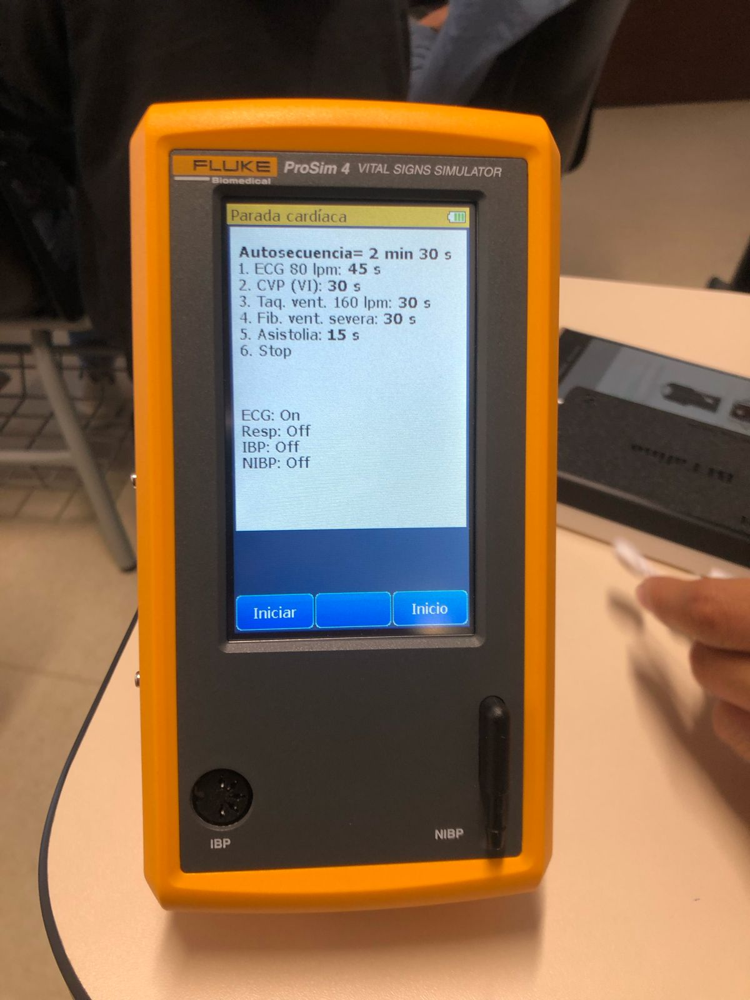</p>          | <p align="center">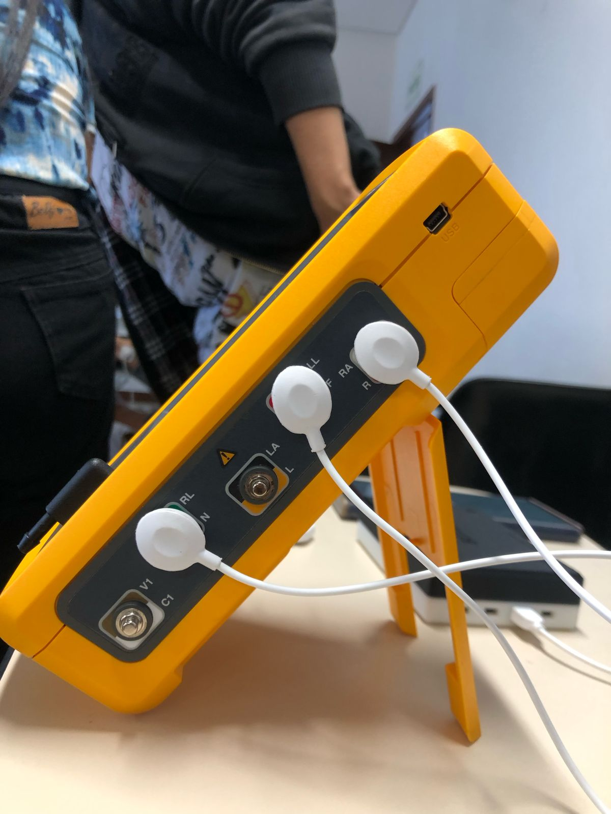</p> |


## Registro de pruebas en ProSim4

  | Simulación                                     | Señal Ploteada en Open Signals                                                           |
  |-----------------------------------------------|----------------------------------------------------------------------------------------------------|
  | Paso 1. RSN (adulto): Frecuencia Respiratoria Normal en Adultos  | <p align="center"></p>  |
  | Paso 2. Onda de presión venosa central (CVP) | [Video Paso 2](https://github.com/renatog2500/inb_2024_gh12/blob/main/ISB_Informes/L4_Lectura_de_ECG/Imagenes_L4/Paso2_video_ProSim.mp4) |
  | Paso 3. Taquicardia ventricular a 160 lpm    | [Video Paso 3](https://github.com/renatog2500/inb_2024_gh12/assets/130946164/dc749f45-d7ee-46b9-a4ab-283b90a89cf0)              |
  | Paso 4. Fibrilación ventricular severa       | [Video Paso 4](https://github.com/renatog2500/inb_2024_gh12/assets/130946164/dc749f45-d7ee-46b9-a4ab-283b90a89cf0)              |
  | Paso 5. Asistolia                            | [Video Paso 5](https://github.com/renatog2500/inb_2024_gh12/assets/130946164/dc749f45-d7ee-46b9-a4ab-283b90a89cf0)              |

<p align="center">
  <b>Tabla 4. Videos de las pruebas realizadas en el FLuke ProSim4 </b>
</p>

## Ploteo en Python de las pruebas en ProSim4
| Simulación        | Ploteo de la señal |
|-------------------|-----------------------------------------------|
| Paso 1. RSN (adulto): Frecuencia Respiratoria Normal en Adultos |  |
| Paso 2. Onda de presión venosa central (CVP) | <p align="center">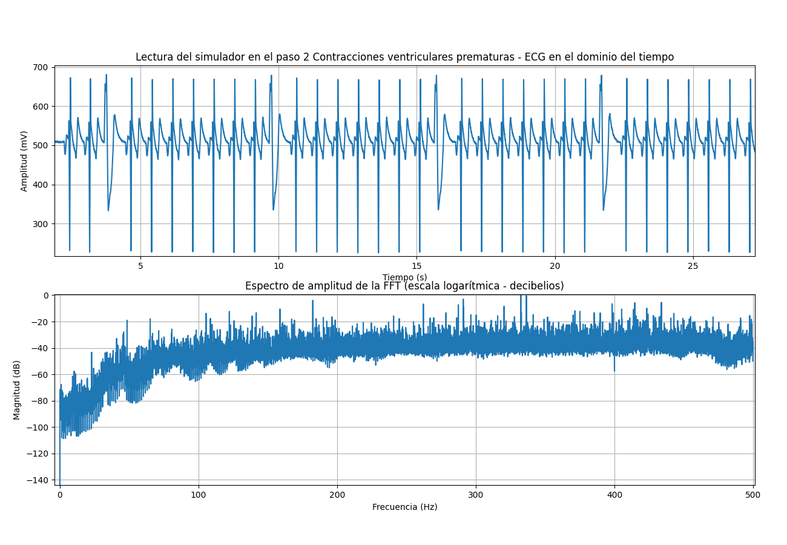</p> |
|  Paso 3. Taquicardia ventricular a 160 lpm  | <p align="center">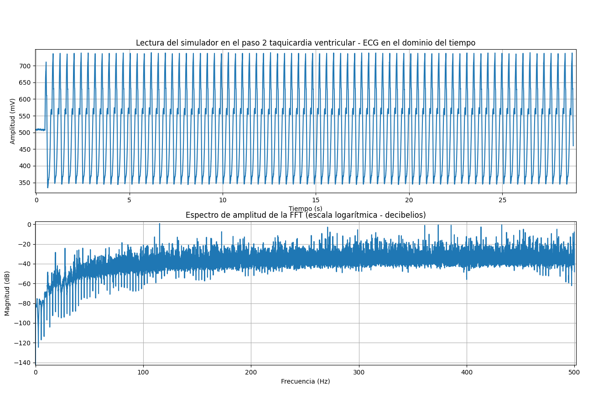</p> |
| Paso 4. Fibrilación ventricular severa |  |
|Paso 5. Asistolia   | <p align="center">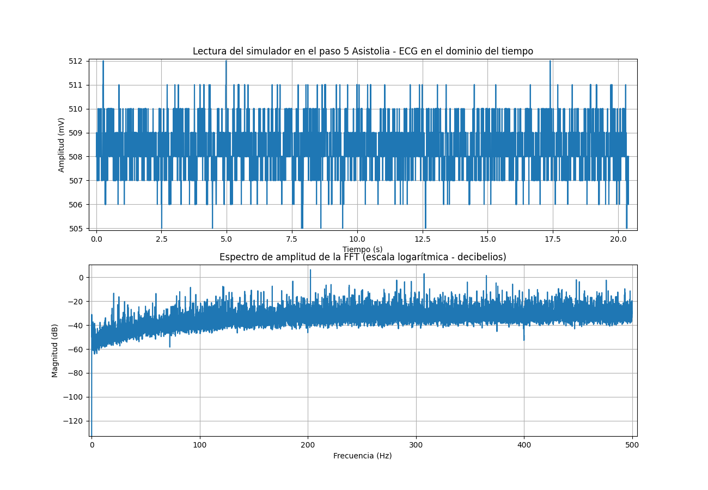</p> |

<p align="center">
  <b>Tabla 5. Ploteo en Python de las pruebas realizadas en el FLuke ProSim4 </b>
</p>


## **Conclusiones** <a name="t11"></a>

//////////////////////

## **Bibliografía** <a name="t12"></a>
[1] E. A. Ashley and J. Niebauer, “Conquering the ECG,” Nih.gov, 2024. https://www.ncbi.nlm.nih.gov/books/NBK2214/ (accessed Apr. 20, 2024).

[2]Y. Sattar and L. Chhabra, “Electrocardiogram,” Nih.gov, Jun. 05, 2023. https://www.ncbi.nlm.nih.gov/books/NBK549803/ (accessed Apr. 20, 2024).

[3] R. Joe Noble, J Stanley Hillis, and D. A. Rothbaum, “Electrocardiography,” Nih.gov, 2024. https://www.ncbi.nlm.nih.gov/books/NBK354/ (accessed Apr. 20, 2024).

[4] BITalino (r)evolution Home Guide. PLUX-Wireless Biosignals, S A. Lisbon Portugal 2020. Disponible en: https://support.pluxbiosignals.com/wp-content/uploads/2022/04/HomeGuide2_ECG.pdf

[1] I. Dotsinsky, “Review of ‘Advanced Methods and Tools for ECG Data Analysis’, by Gari D. Clifford, Francisco Azuaje and Patrick E. McSharry (Editors),” BioMedical engineering online, vol. 6, no. 1, pp. 18–18, Jan. 2007, doi: https://doi.org/10.1186/1475-925x-6-18.
‌

[2] F. Shaffer and J. P. Ginsberg, “An Overview of Heart Rate Variability Metrics and Norms,” Frontiers in public health, vol. 5, Sep. 2017, doi: https://doi.org/10.3389/fpubh.2017.00258.
‌

[3] M. Malik et al., “Heart rate variability: Standards of measurement, physiological interpretation, and clinical use,” European heart journal, vol. 17, no. 3, pp. 354–381, Mar. 1996, doi: https://doi.org/10.1093/oxfordjournals.eurheartj.a014868.
‌

[4] P. Kligfield et al., “Recommendations for the Standardization and Interpretation of the Electrocardiogram,” Journal of the American College of Cardiology, vol. 49, no. 10, pp. 1109–1127, Mar. 2007, doi: https://doi.org/10.1016/j.jacc.2007.01.024.
‌

[5] C. J. Lavie et al., “Exercise and the Cardiovascular System,” Circulation research, vol. 117, no. 2, pp. 207–219, Jul. 2015, doi: https://doi.org/10.1161/circresaha.117.305205.
‌


