# Laboratorio N°5 - Uso de BITalino para EEG

## Tabla de contenidos:
 __________________________________________________________________________________________________
1. [Lista de participantes](#t1)
2. [Introducción](#t2)
3. [Objetivos del laboratorio](#t3)
4. [Materiales y Equipo Utilizado](#t4)
5. [Protocolo de conexión](#t5)
6. [Resultados y discusión](#t6)\
   6.1 [Visualización de la señal mediante video y OpenSignals ](#t7)\
   6.2 [Visualización de la señal mediante video y OpenBCI ](#t8)\
   6.3 [BITalino: Ploteo de la señal en Python](#t9)\
   6.4 [OpenBCI GUI: Ploteo de la señal en Python](#t10)\
   6.5 [Archivos de la señal ploteada en Python y datos de la señal](#t11)\
7. [Bibliografía](#t12)
__________________________________________________________________________________________________
## **Lista de participantes** <a name = "t1"></a>
* Jimena Alpiste Espinoza - 74297329
* Jossymar León Mallma - 74905684
* Renato Cardoso Cardenas - 73061678


## Introducción  <a name = "t2"></a>


**Señal de un Electroencefalograma**: 


## **Objetivos del Laboratorio** <a name = "t3"></a>
* Adquirir señales biomédicas de EEG.
* Hacer una correcta configuración de BiTalino.
* Extraer la información de las señales EEG del software OpenSignals (r)evolution
  
## **Materiales y Equipo Utilizado** <a name="t4"></a>
<table align="center">
  <tr>
    <th>Modelo</th>
    <th>Descripción</th>
    <th>Cantidad</th>
  </tr>
  <tr>
    <td>(R)EVOLUTION</td>
    <td>Kit de BITalino</td>
    <td>1</td>
  </tr>
  <tr>
    <td>-</td>
    <td>Laptop</td>
    <td>1</td>
  </tr>
   <tr>
    <td>-</td>
    <td>Electrodos</td>
    <td>3</td>
  </tr>
  <tr>
    <td>OpenBCI</td>
    <td>Ultracortex Mark IV EEG Headset	</td>
    <td>1</td>
  </tr>
  <tr>
    <td>OpenBCI</td>
    <td>OpenBCI Cyton 8-channel Board	</td>
    <td>1</td>
  </tr>
</table>
<p align="center">
  <b>Tabla 1. Materiales y equipos utilizados</b>
</p>

## Protocolo de conexión <a name="t5"></a>
Para capturar las señales EEG, se empleó el dispositivo BITalino y su conjunto de sensores EEG de tres electrodos. Se siguió el procedimiento detallado en la guía BiTalino,**(BITalino HOME-GUIDE #3 ELECTROENCEPHALOGRAPHY (EEG) Exploring Brain Signals ")** [1J], como referencia para posicionar correctamente los electrodos en el sujeto de prueba. 

Para el registro de las señales de EEG con el BITalino, es común utilizar la modalidad de medición bipolar. En esta modalidad se requieren dos electrodos de medición (IN + e IN -) y uno de referencia. Este último se coloca adicionalmente en una zona ósea para garantizar una referencia estable y consistente durante la adquisición de las señales cerebrales. La guía BITalino Home Guide #3 sigue el sistema internacional 10-20 para la colocación de los electrodos. 


<p align="center">
  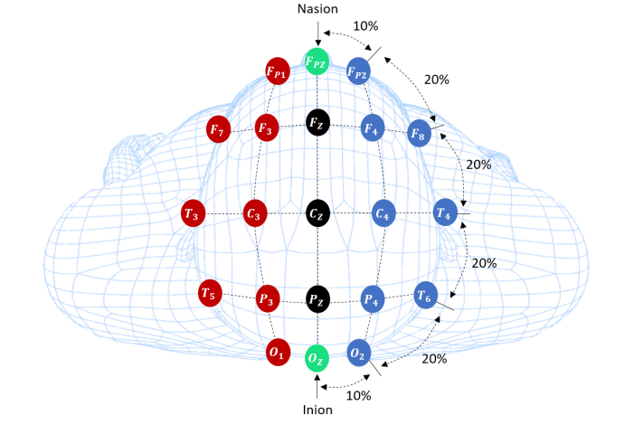
  <br>
  <b>Figura 2. Vista superior de una cabeza con la posición de electrodos de acuerdo al sistema internacional 10-20</b>
</p>


En este sistema, los puntos de referencia se nombran de acuerdo con la distancia entre ellos, que es aproximadamente el 10% o el 20% de la distancia total entre el nasión (parte superior del puente de la nariz) y el inión (punto más prominente en la parte posterior del cráneo). Como se puede observar en la Figura 2. Los puntos etiquetados con "F" corresponden a la región frontal, mientras que los etiquetados con "P" corresponden a la región parietal. Por otro lado: Los numeros indican la distancia del nasión- inión. Donde "1" indica que el punto está a una distancia del 10% en esa dirección, mientras que el "2" indica que está a una distancia del 20% [1J]. 

A continuación, se presentan los protocolos de conexión específicos utilizados en cada prueba llevada a cabo en este laboratorio:

| Figura 3. Colocación de electrodos según el sistema 10-20 (posiciones referenciales) [4J]. | Figura 4. Colocación de los electrodos en el laboratorio para la derivación en el sujeto de prueba     |
|------------------------------------------------------------|---------------------------------------------------------------------------|
| 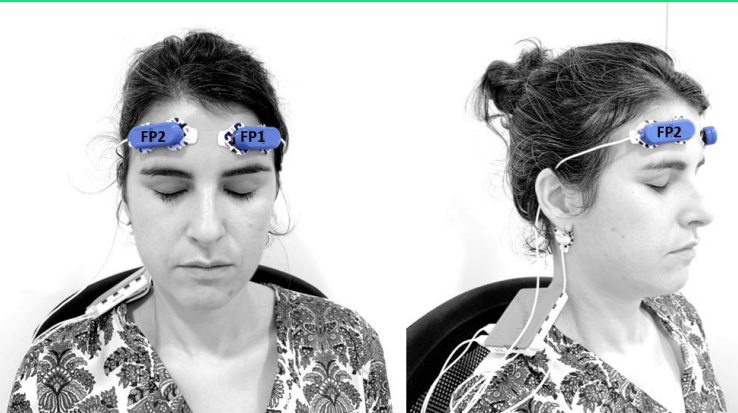 | 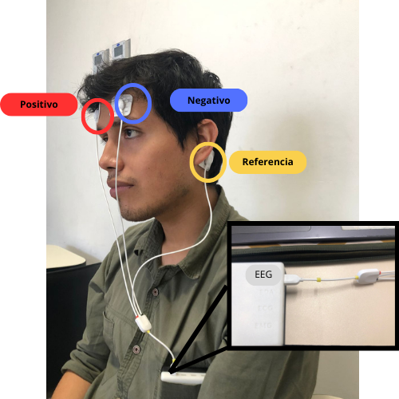 |

La siguiente actividad implica el uso de la plataforma Open BCI, la cual actúa como una interfaz entre el cerebro y la computadora para simular señales de electroencefalograma y analizar e interpretar la actividad cerebral. Se utilizó el "Ultracortex Mark IV EEG Headset" como casco con electrodos, siguiendo también el sistema 10-20. Es relevante mencionar que OpenBCI puede mostrar información en las cinco bandas de frecuencia (delta, theta, alpha, beta y gamma). [5J]


Las imágenes a continuación fueron tomadas del grupo 11 debido a que no se pudo realizar la prueba por falta de tiempo. En la figura 5 se indican las ubicaciones predeterminadas de 10 a 20 electrodos que la intergaz OpenBCI espera al recibir una señal. El kit OpenBCI permite la adquisición para la adquisición y análisis de señales cerebrales utilizando hasta 16 canales de EEG . Los puntos marcados en azul en una representación gráfica identifican los primeros 8 canales de la placa Cyton de OpenBCI. Estos canales, numerados del 1 al 8, están predefinidos para ciertos propósitos o ubicaciones en la placa. Mientras que aquellos puntos marcados en rojo en la representación gráfica corresponden a los canales restantes, del 9 al 16. Estos canales pueden tener funciones distintas o estar destinados a ubicaciones específicas en la placa Cyton.

En la figura 6 se muestra la colocación del UltraCortex, para garantizar la mejor toma de señales se busca que el nodo central posterior esté aproximadamente a la misma distancia, por encima del inion, que el nodo central frontal, el cual está por encima del puente de la nariz.

| Figura 5.Ubicaciones predeterminadas de OpenBCI [5J]. | Figura 6. Colocación de los electrodos en el laboratorio para la derivación en el sujeto de prueba     |
|------------------------------------------------------------|---------------------------------------------------------------------------|
| 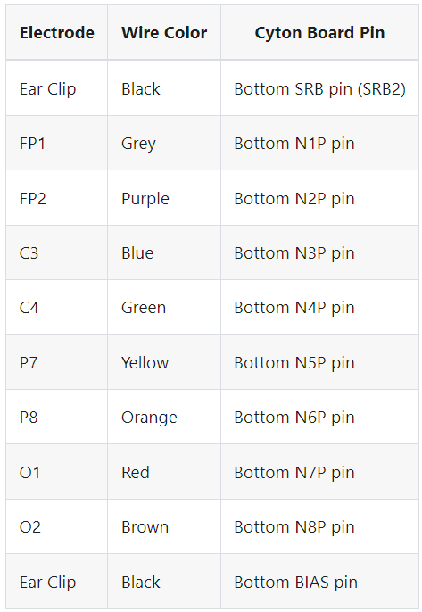 | 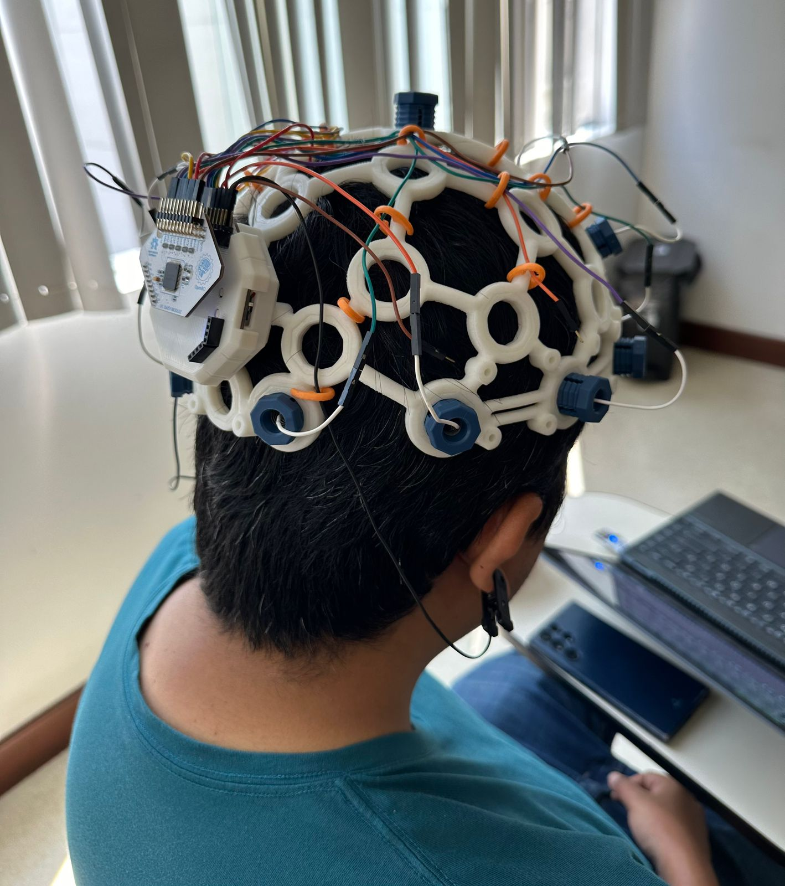 |

**Protocolo para las pruebas realizadas:**
El protocolo seguido para evaluar la actividad neuronal en vivo con el encefalograma fue el de la guía experimental de BITalino [1], estas mismas pruebas se tomaron como referencia para la segunda actividad del laboratorio usando el UltraCortex:

**1. Lectura de la señal Basal:** Para adquirir esta señal el sujeto de prueba debe permanecer en una posición estable  , con ello se registrará la línea base de señal con poco ruido y sin movimientos (respiración normal,sin movimientos oculares/ojos cerrados) durante 30 segundos. Este estado sirve como nuestra prueba de referencia.

**2. Lectura de Ojos Abiertos - Ojos Cerrados:** A continuación el participante repetirá un ciclo de OJOS ABIERTOS - OJOS CERRADOS cinco veces, manteniendo ambas fases durante 5 segundos. El sujeto debe permanecer en una posición estable y mirando a un poco fijo para evitar ruido en la señal.

**3. Lectura de la Señal Basal 2 (paso 1):** Tras la Prueba N°2, se debe registrar una segunda fase de referencia en el que el participante se mantendra en una posición estable por un tiempo de 30 segundos.

**4. Resolución de preguntas :** En esta prueba uno de los compañeros se encontrará leyendo en voz alta una serie de ejercicios obtenidos de [2], los ejercicios se dividiran en dos secciones de preguntas: simples y complejas. El particpante evaluado dbe intentar resolverlas manteniendo una posición estable. Las preguntas realizadas se observan en la Tabla 2.

| Categoría| Pregunta |
| --------- | --------- |
| Simple | Hay 3 pájaros en un árbol; Llegan 7 más. ¿Cuántos pájaros hay ahora?  |
| Simple  | Jonás tiene 5 manzanas y Mary tiene 4. ¿Cuántas manzanas tienen en total?  |
| Simple  | Hanna tiene 9 dólares pero gastó 4. ¿Cuántos dólares le quedan? |
| Compleja   | John anotó 45 puntos para su equipo; 10 más que José. Marie anotó 13 puntos más que John y Joseph juntos. ¿Cuántos puntos obtuvieron en total? |
| Compleja   | El grupo A tiene 24 estudiantes; 13 menos que el grupo B. El grupo C tiene 12 alumnos más que los grupos A y B juntos. ¿Cuál es el número total de estudiantes? |
| Compleja | Una tienda vendió 21 refrescos por la mañana y 13 más que por la tarde. Por la noche vendió 10 más que por la mañana y por la tarde juntas. ¿Cuántos refrescos se vendieron en total? |

<p align="center">
  <b>Tabla 2. Preguntas de lógica y matemáticas utilizadas </b>
</p>


## Resultados y discusión  <a name="t6"></a>

### **Visualización de señal eléctrica mediante video y OpenSignalsl** <a name="t7"></a>
A continuación se mostrarán los videos de la señal EEG en OpenSignals. Seguimos el protocolo mencionado previamente, manteniendo las mismas conexiones de electrodos para cada medición. Con esto se asegura la coherencia de los datos recopilados y la fiabilidad de los resultados obtenidos.

(*) Es importante destacar que la prueba 3, al tratarse de una segunda señal basal, no fue considerada para la grabación de video, aunque sí se tomó en cuenta para la representación gráfica mediante Python que se mostrará más adelante.

| Prueba | Señal Ploteada en Open Signals |
| --------- | ---- |
| 1.Lectura de la señal Basal    | [](https://youtu.be/vVzU5VYG40Y) |
| 2. Lectura de Ojos Abiertos y Cerrados (Fases de 5 segundos)| [](https://youtu.be/qGDZA1MTl0I) |
| 3. Lectura de la Segunda señal Basal| No se registro video de esta señal basa, pero si se considero para el ploteo |
| 4. Resolución de preguntas Simples | [](https://youtu.be/dlAMXUPAE9I) |
| 5.Resolución de preguntas Complejas| [](https://youtu.be/ADb1Umvjf0A) |

<p align="center">
  <b>Tabla 3. Videos mostrando las conexiones electrodos-cuerpo y la señal ploteada en OpenSignals del protocolo.
 </b>
</p>

### **Explicación de la variación de la señal de OpenSignals**

**1. Lectura del Estado Basal:**

Estado de reposo (Lectura Basal):
El cambio abrupto inicial en la señal de EEG durante el estado de reposo puede atribuirse a artefactos de movimiento o ajustes en el sistema de adquisición. Después de este cambio inicial, la señal se vuelve estable y constante, lo que refleja un estado de reposo mental y una actividad cerebral reducida [1R]. Según Gu et al. (2020), "durante el estado de reposo, la actividad cerebral espontánea se caracteriza por oscilaciones de baja frecuencia y alta amplitud en las bandas alfa y theta" [2R].

**2. Lectura de los ciclos de Ojos Abiertos y Cerrados (Fases de 5 segundos):**

Los picos de gran tamaño observados al abrir o cerrar los ojos se deben a artefactos oculares causados por el movimiento de los ojos y los párpados. Estos artefactos se superponen a la señal de EEG y pueden tener una amplitud mucho mayor que la actividad cerebral subyacente [3R]. Plichta et al. (2021) mencionan que "los artefactos oculares, como los parpadeos y los movimientos sacádicos, pueden introducir grandes picos en la señal de EEG" [4R].

**3. Segunda lectura en estado de reposo (no se repitio la grabación de video):**

La similitud entre la primera y la segunda lectura en estado basal sugiere que el sujeto pudo relajarse y volver a un estado de reposo mental después de la tarea de abrir y cerrar los ojos. La reproducibilidad de las mediciones basales es importante para evaluar la estabilidad de la señal de EEG a lo largo del tiempo [1R].

**4. Resolución de preguntas Simples:**

Los cambios en los picos negativos y positivos de la señal de EEG durante la resolución de preguntas simples pueden estar relacionados con la activación de áreas cerebrales específicas involucradas en el procesamiento cognitivo y la formulación de respuestas [5R]. Los pequeños cambios observados durante el razonamiento sugieren una mayor actividad cerebral en comparación con el estado de reposo. Según Bhattacharya et al. (2020), "la resolución de problemas y el razonamiento están asociados con cambios en la actividad oscilatoria en las bandas theta y alfa del EEG" [6R].

**5. Resolución de preguntas Complejas:**

Resolución de preguntas complejas:
Los cambios en la señal de EEG durante la resolución de preguntas complejas pueden reflejar una mayor demanda cognitiva y la activación de múltiples áreas cerebrales. La complejidad de las preguntas puede requerir un procesamiento más profundo y una mayor integración de la información, lo que se manifiesta como cambios en la actividad oscilatoria del EEG [7R]. Según Pinti et al. (2020), "la resolución de problemas complejos implica la coordinación de múltiples regiones cerebrales y se asocia con cambios en la conectividad funcional medida por el EEG" [8R].

### **Visualización de señal eléctrica mediante video y OpenBCI** <a name="t8"></a>

| Prueba | Señal Ploteada en OpenBCI |
| --------- | ---- |
| 1.Lectura de la señal Basal | [](https://www.youtube.com/watch?v=XvO9Swg0UOs) |
| 2. Lectura de los ciclos de Ojos Abiertos y Cerrados (Fases de 5 segundos)  | [](https://www.youtube.com/watch?v=5O7GbBteY9w) |
| 3. Registro fase de referencia | [](https://www.youtube.com/watch?v=g9LNPO2JDDc) |
| 4. Ejercicios Matemáticos | [](https://www.youtube.com/watch?v=p1FOJwmLAsk) |

<p align="center">
  <b>Tabla 4. Videos de la señal ploteada en OpenBCI del protocolo </b>
</p>

### **Explicación de la variación de la señal ploteada en OpenBCI**

**1. Lectura del Estado Basal:**

Durante el estado de reposo, la señal de EEG de 16 derivaciones muestra un patrón estable y sincronizado en múltiples canales, lo que refleja una actividad cerebral basal coherente [1R]. Según Gu et al. (2020), "el EEG de múltiples canales permite una evaluación más completa de la actividad cerebral espontánea durante el estado de reposo, revelando patrones espaciales y temporales de sincronización" [2R].

**2. Lectura de los ciclos de Ojos Abiertos y Cerrados (Fases de 5 segundos):**

Los picos de gran amplitud observados en múltiples canales al abrir o cerrar los ojos se deben a artefactos oculares, que se propagan a través de los electrodos cercanos a los ojos [3R]. Blum et al. (2021) señalan que "los artefactos oculares pueden contaminar varios canales de EEG, especialmente los ubicados en las regiones frontal y temporal" [4R].

**3. Registro de fase de referencia**

La consistencia entre la primera y la segunda lectura basal en los 16 canales de EEG indica una buena reproducibilidad de las mediciones y una estabilidad en la actividad cerebral de fondo [9R]

**4. Resolución de preguntas matemáticas:**


### **Ploteo de la señal en Python** 
________________________________________________________________________________________________
### **BITalino: Ploteo de la señal obtenida en Python** <a name="t9"></a>
A continuación se mostrará la señal junto con el código de Python utilizado para su representación:

| Prueba     | Ploteo de la señal en el tiempo y su dominio en frecuencia     |
| -------------- | -------------- |
| **1.Estado de reposo (lectura basal**| |
| **2.Lectura de los ciclos de Ojos Abiertos y Cerrados (Fases de 5 segundos)** | |
| **3. Segunda lectura Basal** | 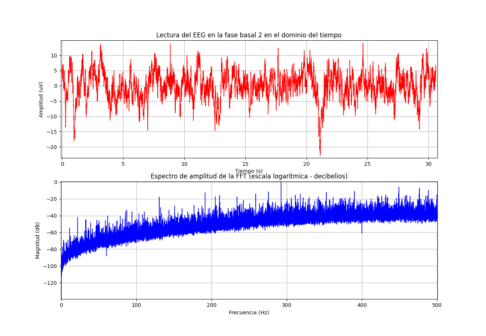|
| **4. Resolución de preguntas Simples** | 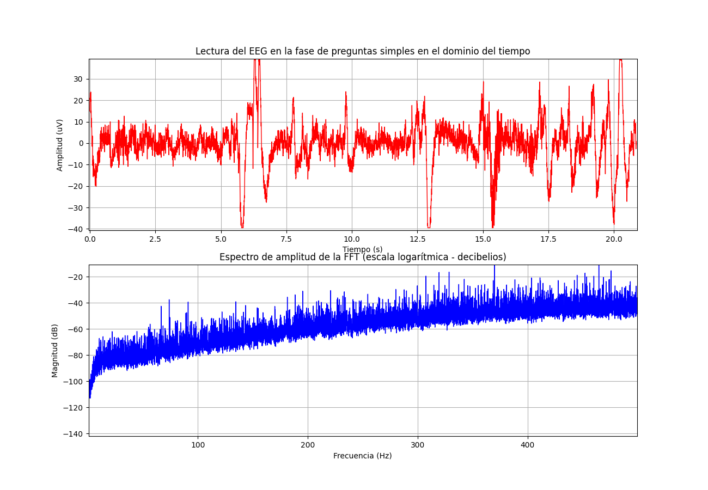|
| **5. Resolución de preguntas Complejas** |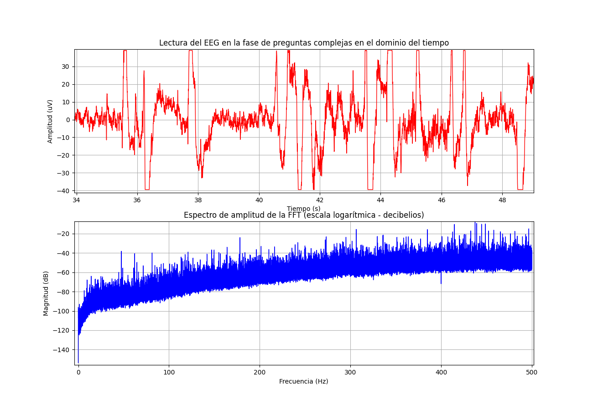 |

<p align="center">
  <b>Tabla 5. Ploteo del protocolo en Python de la señal del BITalino </b>
</p>


**Código en Python para ploteo de señales de BiTalino:**
```python
import pandas as pd
import numpy as np
import matplotlib.pyplot as plt
import re

# Cargar datos desde el archivo de texto según la ubicación del 
archivo = "C:/Users/Equipo/OneDrive/Escritorio/Introduccion_a_señales_biomedicas/Github/inb_2024_gh12/ISB_Informes/L5_Lectura_de_EEG/EEG_L5/BiTalino/Prueba_ojos_abiertos_cerrado_5s.txt"
def extraer_nombres_columnas(archivo):
    with open(archivo, 'r') as f:
        for linea in f:
            if linea.startswith("#"):
                columnas = re.findall(r'column":\s*\[(.*?)\]', linea)
                entrada = re.findall(r'label":\s*\[(.*?)\]', linea)
                if columnas:
                    if entrada:
                        # Extraer la lista de nombres de columna de la línea
                        column_names = [name.strip().strip('"') for name in columnas[0].split(',')]
                        # Extraemos los canales usados
                        entrada = [name.strip().strip('"') for name in entrada[0].split(',')]
                        return column_names, entrada [0]
                    else:
                        continue
                else:
                    continue


                    
#Me devuelve una tupla pues esta en "(...)"
nombres_columnas,Entrada=extraer_nombres_columnas(archivo) #Aquí te devuelve la lista como un string dentro de otra lista y también el nombre del canal usado
#print(nombres_columnas) Imprime la lista: ['nSeq', 'I1', 'I2', 'O1', 'O2', 'A1']
#print(Entrada)
#Leyendo el TxT que nos da OpenSignal, podemos entender que las columnas para nuestro Dataframe serán las siguientes:
#Se le coloca una columna "NaN" debido a que en el txt cada ultimo valor de fila tiene un espacio que lee como NaN
#nombres_columnas = ["nSeq", "I1", "I2", "O1", "O2", "A1"]

#Una vez tenemos claro, convertirmos nuestro TXT un dataframe
#Eliminamos las 3 primeras filas
#Declaramos la separación de tabulación
#Se elimina la ultima fila debido a que en el txt cada ultimo valor de fila tiene un espacio que se lee como NaN
datos = pd.read_csv(archivo, sep='\t', skiprows=3, header=None, usecols=[0, 1 ,2,3,4,5])

#Declaramos las columnas para poder tener una mejor observación del resultado
datos.columns = nombres_columnas

#Imprimimos el Dataframe resultante para ver si se obtuvo un buen resultado
#print(datos.columns)
#Comprobado el resultado solo escogemos la columna "A1", la cual usamos para nuestra medición
Lectura = datos[Entrada]
#print(Lectura)
# Convertir los datos a números
Lectura = Lectura.apply(pd.to_numeric)

# Calculate FFT
fft_result = np.fft.fft(Lectura)

# Calculate frequencies
frequencies = np.fft.fftfreq(len(Lectura), d=1/1000)

# Compute the FFT magnitude
magnitudes_db = -20*np.log10(np.abs(fft_result))

#print(Lectura)
Lectura.index = Lectura.index / 1000

#Convertimos los valores digitales de una resoluciónde 10 bit a una analógica para un EEG
# Define the constants from the transfer function image
VCC = 3.3  # Operating voltage
G_EEG = 41782  # Sensor gain
n_bits = 10  # Number of bits for ADC

# Convert ADC to EEG(V)
Lectura = (Lectura / (2**n_bits) - 0.5) * VCC / G_EEG

# Convert EEG(V) to EEG(uV)
Lectura = Lectura * 1e6

# Plotear la señal de EMG en el dominio del tiempo
plt.figure(figsize=(13,9))
plt.subplot(211)
plt.plot(Lectura, color="red",linewidth=1)
plt.title("Lectura del EEG en la fase de abrir y cerrar los ojos en el dominio del tiempo")
plt.xlabel("Tiempo (s)")
plt.ylabel("Amplitud (uV)")
plt.grid(True)

# Plotear el espectro de amplitud de la FFT (escala logarítmica - decibelios)
plt.subplot(212)
plt.plot(frequencies[:len(frequencies)//2], magnitudes_db[:len(frequencies)//2],color="Blue",linewidth=1)
plt.title("Espectro de amplitud de la FFT (escala logarítmica - decibelios)")
plt.xlabel("Frecuencia (Hz)")
plt.ylabel("Magnitud (dB)")
plt.grid(True)

plt.show()

```
**Descripción del código en python:** 
Este código de Python utiliza las bibliotecas pandas, numpy, matplotlib y re para cargar y analizar datos de un archivo de texto que contiene mediciones de un electroencefalograma (EEG), específicamente para un experimento de abrir y cerrar los ojos. El código sigue varios pasos para procesar los datos, realizar una transformada rápida de Fourier (FFT) y visualizar tanto la señal temporal como el espectro de frecuencias. Aquí te explico cada parte del código:

Importación de Librerías: Importa las librerías necesarias para manejo de datos (pandas y numpy), visualización (matplotlib.pyplot), y expresiones regulares (re).
Definición de la Función extraer_nombres_columnas:
  El código abre y lee un archivo especificado, buscando líneas que comienzan con "#" para identificar metadatos relevantes, como los nombres de las columnas y el canal utilizado. Emplea expresiones regulares para extraer eficazmente esta información del texto.
Carga de Datos:
  Utilizamos pandas.read_csv para leer el archivo de OpenSignal, omitiendo las primeras tres filas las cuales no tienen información necesaria para el ploteo. Extraemos las primeras 6 columnas según los canales que tenga el BiTalino.
Procesamiento y Conversión de Datos:
  Selecciona la columna correspondiente al canal utilizado (extraído anteriormente) para las mediciones.
  Convierte los valores de la columna seleccionada de string a int para realizar operaciones matemáticas.
Transformada Rápida de Fourier (FFT):
  El código aplica la Transformada Rápida de Fourier (FFT) a la serie temporal para obtener el espectro de frecuencias. Luego, calcula las frecuencias asociadas con los puntos de la FFT y determina las magnitudes en decibelios de estos resultados para visualizar la amplitud de la señal en una escala logarítmica.
Conversión de Valores Digitales a Analógicos:
  Convierte los valores digitales a voltaje usando las especificaciones del ADC (voltaje de operación y ganancia del sensor) del data sheet del BiTalino [10R], donde extraemos los valores de ganancia de 41782, una resolución de 10 bits ya que en los canales A1-A4 usan esa resolución y un voltaje de referencia de 3.3V. Para luego convertir los voltajes a microvoltios para presentar la señal en un rango típico para EEG.
Visualización:
  El código crea figuras para mostrar la señal de EEG tanto en el dominio del tiempo como en el dominio de la frecuencia. Utiliza dos subplots: uno dedicado a la visualización de la señal en el tiempo y el otro al espectro de frecuencias. Para facilitar la interpretación, se añaden títulos, etiquetas y cuadrículas a los gráficos.


### **OpenBCI GUI: Ploteo de la señal en Python** <a name="t10"></a>
---
A continuación se muestra el ploteo en Python del procedimiento utilizado para examinar la alteración en la actividad neuronal a través de la plataforma OpenBCI: 

| Prueba     | Ploteo de la señal en el tiempo y su dominio en frecuencia     |
| -------------- | -------------- |
| **1.Estado de reposo (lectura basal**| 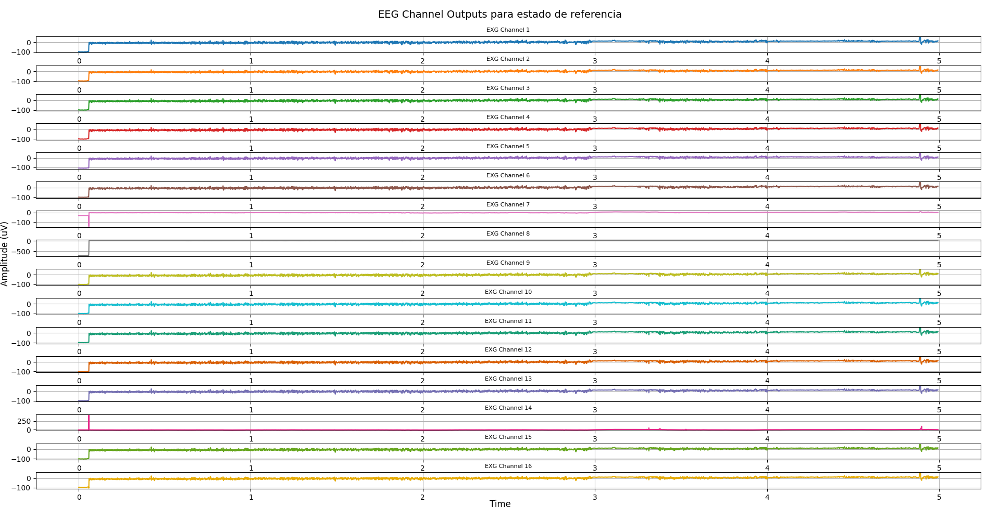|
| **2.Lectura de los ciclos de Ojos Abiertos y Cerrados (Fases de 5 segundos)** | |
| **3. Segunda lectura Basal** | 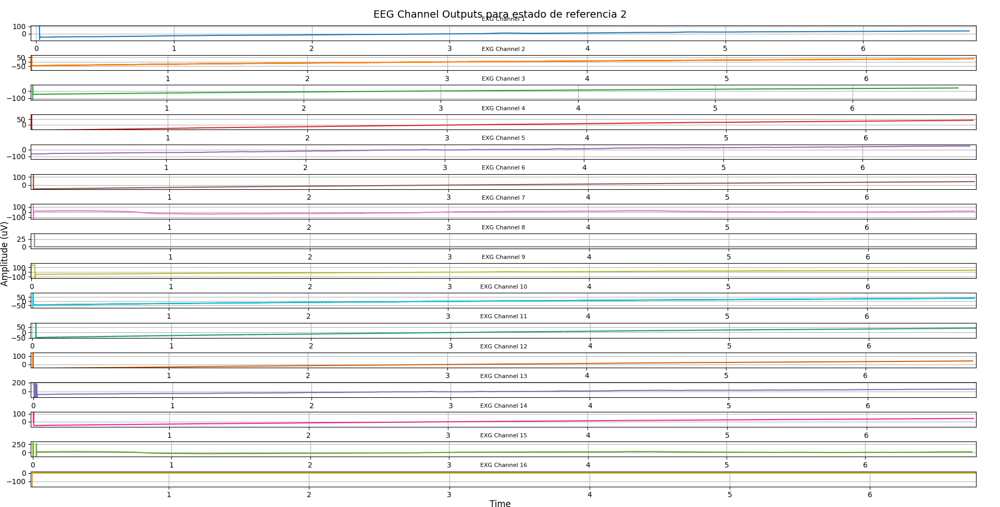|
| **4. Resolución de preguntas matemáticas** | 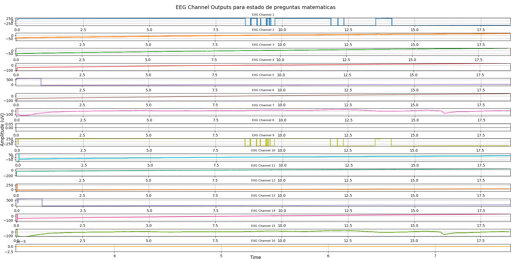|

<p align="center">
  <b>Tabla 6. Ploteo en Python del protocolo en UltraCortex </b>
</p>


**-Código de ploteo para señal de OpenBCI:**
```python
import pandas as pd
import matplotlib.pyplot as plt


def interpret16bitAsInt32(two_byte_value):
    # Asumimos que two_byte_value es un entero de 16 bits y extrae los bytes
    high_byte = (two_byte_value >> 8) & 0xFF
    low_byte = two_byte_value & 0xFF
    
    # Combina los bytes en un nuevo entero de 16 bits
    newInt = (high_byte << 8) | low_byte
    
    # Extiende el signo si es necesario
    if newInt & 0x8000:  # Si el bit de signo está establecido
        newInt = newInt - 0x10000  # Extiende el signo a 32 bits
        
    return newInt

# Cargar datos desde el archivo de texto según la ubicación del archivo
archivo = "C:/Users/Equipo/OneDrive/Escritorio/Introduccion_a_señales_biomedicas/Github/inb_2024_gh12/ISB_Informes/L5_Lectura_de_EEG/EEG_L5/EEG_Casco/OpenBCI-RAW-mate_Grupo_12.txt"

# Definir las constantes del ADC
vref = 4.5  # Voltaje de referencia en volts
ganancia = 24  # Ganancia del ADC
resolucion = 16  # Resolución en bits

# Calcular el voltaje por bit en volts
voltaje_por_bit = vref / (ganancia) /(2**16 - 1)

# Load the data
data = pd.read_csv(archivo, skiprows=5, usecols=range(1, 17))

# Convertir los datos a enteros si no lo son ya
data = data.applymap(int)

# Aplica la función de interpretación a cada elemento
data_signed_32 = data.applymap(interpret16bitAsInt32)

data_centered = data_signed_32.sub(data_signed_32.mean(axis=0), axis=1)

# Convertir de bits a voltaje y luego a microvoltios
data_uV = data_centered * voltaje_por_bit * 1e6  # Multiplica por 1e6 para convertir de V a uV

# Imprimir los primeros datos transformados
print(data_uV)

#Se convierten los ms en segundos
data_uV.index = data_uV.index / 1000

# Plotting
fig, axes = plt.subplots(16, 1, figsize=(150, 100))  # Crea una figura y un conjunto de subplots
colors = [
    '#1f77b4', '#ff7f0e', '#2ca02c', '#d62728',
    '#9467bd', '#8c564b', '#e377c2', '#7f7f7f',
    '#bcbd22', '#17becf', '#1b9e77', '#d95f02',
    '#7570b3', '#e7298a', '#66a61e', '#e6ab02',
]

for i in range(16):
    axes[i].plot(data_uV.iloc[:, i],color=colors[i])
    axes[i].set_title(f'EXG Channel {i+1}', fontsize=8)
    axes[i].grid(True)

# Configuración de la figura
fig.tight_layout()
fig.subplots_adjust(top=0.95)

# Agrega un título general a la figura completa
fig.suptitle("EEG Channel Outputs para estado de preguntas matematicas", fontsize=14)

# Configurar etiquetas para toda la figura (ajuste las coordenadas según sea necesario)
fig.text(0.5, 0.005, 'Time', ha='center', va='center', fontsize=12)
fig.text(0.005, 0.5, 'Amplitude (uV)', ha='center', va='center', rotation='vertical', fontsize=12)

plt.show()
```

- **Descripción del código:**
En el código proporcionado, se describe un proceso completo para cargar, transformar y visualizar datos de EEG (electroencefalograma) provenientes de un archivo de texto usando Python. Este código utiliza las bibliotecas pandas y matplotlib para realizar estas tareas. Aquí está el desglose de lo que cada parte del código hace:

Importación de Librerías: 
  Importa las librerías pandas para manipulación de datos y matplotlib.pyplot para visualización.
Definición de Función: 
  Define la función interpret16bitAsInt32, que convierte valores de 16 bits a enteros de 32 bits con signo. Esta función maneja la representación de enteros negativos que están en formato de complemento a dos. Esta función fue extraia de la guía de OpenBCI para hacer la transformación de 16 bit con signo a 32 bit enteros sin signo. [10R]
Preparación de Datos:
  Definimos constantes para el cálculo (Vref, Gain, Resolucion)
  
Carga de Datos:
  Carga los datos desde un archivo de texto especificado en la ruta archivo. Se omiten las primeras cinco filas y se seleccionan las primeras 16 columnas para enfocarnos en la lectura de EEG directamente. Convertimos los datos a enteros (si es necesario) y aplica la función interpret16bitAsInt32 [11R] para ajustar los datos de 16 bits a valores de 32 bits con signo.
Transformación de Datos:
  Para obtener una gráfica que se asemeje a la lectura del OpenBCI se centró los datos ya convertidos a  vU, restando la media de cada columna a todos los valores de 
Visualización:
  Crea una figura y un conjunto de subtramas para visualizar los datos de cada uno de los 16 canales.
  Utiliza un color distinto para cada canal y configura títulos y etiquetas apropiados para cada gráfico.
  Ajusta la configuración del gráfico para mejorar la legibilidad, incluyendo títulos y etiquetas generales para los ejes.
Función de Visualización: 
  Muestra los gráficos en pantalla.


### **Archivos de la señal ploteada en Python y datos de la señal** <a name="t11"></a>
- [Documentos (.txt)](https://github.com/renatog2500/inb_2024_gh12/tree/main/ISB_Informes/L5_Lectura_de_EEG/EEG_L5)
- [Programa de ploteo de OpenSignal (python)](https://github.com/renatog2500/inb_2024_gh12/blob/main/Software/Ploteo_de_datos_lab.py) 
- [Programa de ploteo de UltraCortex (python)](https://github.com/renatog2500/inb_2024_gh12/blob/main/Software/Ploteo_datos_EEG_ultracortex.py) 


## ** Bibliografía** : <a name="t12"></a>

[1J] BITalino, “BITalino HOME-GUIDE #3 ELECTROENCEPHALOGRAPHY (EEG) Exploring Brain signals” 2020 Accessed: Apr. 19, 2023. [Online]. Available from:https://bitalino.com/storage/uploads/media/homeguide3-eeg.pdf

[4J] J. Molina del Río, M. A. Guevara, M. Hernández González, R. M. Hidalgo Aguirre, y M. A. Cruz Aguilar, “EEG correlation during the solving of simple and complex logical–mathematical problems”, Cogn. Affect. Behav. Neurosci., vol. 19, núm. 4, pp. 1036–1046, 2019.

[5J] “Ultracortex Mark IV”, Openbci.com, 2016. [En línea]. Disponible en: https://docs.openbci.com/AddOns/Headwear/MarkIV/

[‌1R] X. Gu et al., "EEG-Based Brain-Computer Interfaces (BCIs): A Survey of Recent Studies on Signal Sensing Technologies and Computational Intelligence Approaches and Their Applications," in IEEE/ACM Transactions on Computational Biology and Bioinformatics, vol. 18, no. 5, pp. 1645-1666, 1 Sept.-Oct. 2021, doi: 10.1109/TCBB.2021.3052811.

[2R] B. Yang, K. Duan, C. Fan, C. Hu y J. Wang, “Automatic ocular artifacts removal in EEG using deep learning”, Biomed. Signal Process. Control, vol. 43, pp. 148–158, mayo de 2018. Accedido el 28 de abril de 2024. [En línea]. Disponible: https://doi.org/10.1016/j.bspc.2018.02.021

[3R] L. Gila, A. Villanueva y R. Cabeza, “Fisiopatología y técnicas de registro de los movimientos oculares”, Anales del Sist. Sanitario de Navarra, vol. 32, 2009. Accedido el 28 de abril de 2024. [En línea]. Disponible: https://doi.org/10.4321/s1137-66272009000600002 

[4R] M. M. Plichta et al., “Event-related functional near-infrared spectroscopy (fNIRS): Are the measurements reliable?”, NeuroImage, vol. 31, n.º 1, pp. 116–124, mayo de 2006. Accedido el 28 de abril de 2024. [En línea]. Disponible: https://doi.org/10.1016/j.neuroimage.2005.12.008

[5R] A. M. Norcia, L. G. Appelbaum, J. M. Ales, B. R. Cottereau y B. Rossion, “The steady-state visual evoked potential in vision research: A review”, J. Vis., vol. 15, n.º 6, p. 4, mayo de 2015. Accedido el 28 de abril de 2024. [En línea]. Disponible: https://doi.org/10.1167/15.6.4

[6R] Y. Zhou, S. Huang, Z. Xu, P. Wang, X. Wu and D. Zhang, "Cognitive Workload Recognition Using EEG Signals and Machine Learning: A Review," in IEEE Transactions on Cognitive and Developmental Systems, vol. 14, no. 3, pp. 799-818, Sept. 2022, doi: 10.1109/TCDS.2021.3090217.

[7R] A. Curtin y H. Ayaz, “The Age of Neuroergonomics: Towards Ubiquitous and Continuous Measurement of Brain Function with fNIRS”, Japanese Psycholog. Res., vol. 60, n.º 4, pp. 374–386, agosto de 2018. Accedido el 28 de abril de 2024. [En línea]. Disponible: https://doi.org/10.1111/jpr.12227

[8R] P. Pinti et al., “The present and future use of functional near‐infrared spectroscopy (fNIRS) for cognitive neuroscience”, Ann. New York Acad. Sci., vol. 1464, n.º 1, pp. 5–29, marzo de 2020. Accedido el 28 de abril de 2024. [En línea]. Disponible: https://doi.org/10.1111/nyas.13948

[9R] A. J. Casson, “Wearable EEG and beyond”, Biomed. Eng. Lett., vol. 9, n.º 1, pp. 53–71, enero de 2019. Accedido el 28 de abril de 2024. [En línea]. Disponible: (https://pubmed.ncbi.nlm.nih.gov/30956880/) 

[10R] BiTalino, “BITalino (r)evolution Board Kit Data Sheet”, 2016. 2020 Accessed: Apr. 27, 2024. [Online]

[11R] “Cyton data format”, Openbci.com. [En línea]. Disponible en: https://docs.openbci.com/Cyton/CytonDataFormat/. [Consultado: 28-abr-2024].

[9R] BiTalino, “BITalino (r)evolution Board Kit Data Sheet”, 2016. 2020 Accessed: Apr. 27, 2024. [Online]

[10R] “Cyton data format”, Openbci.com. [En línea]. Disponible en: https://docs.openbci.com/Cyton/CytonDataFormat/. [Consultado: 28-abr-2024].


