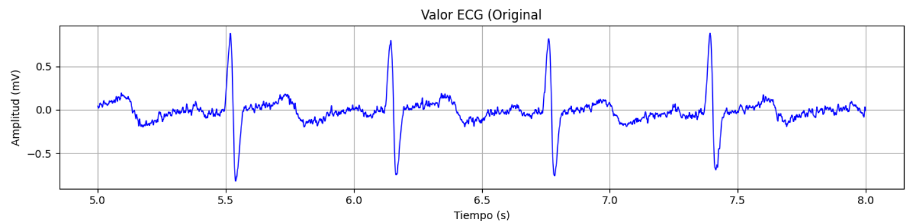
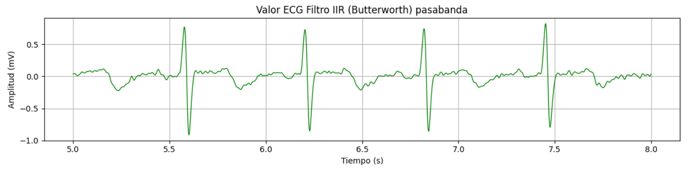
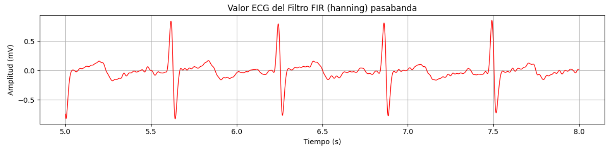
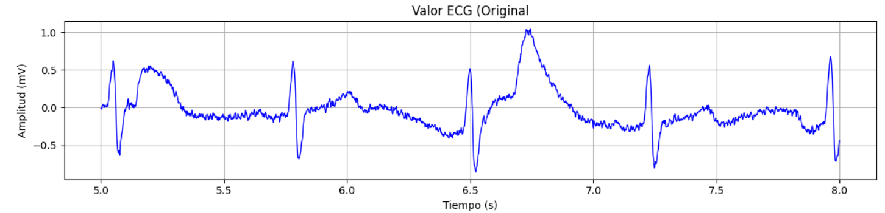
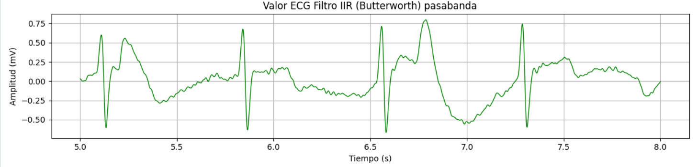
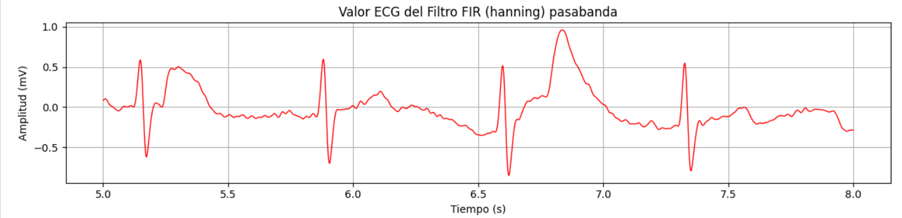
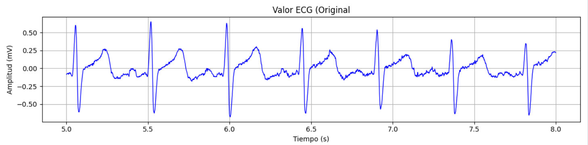
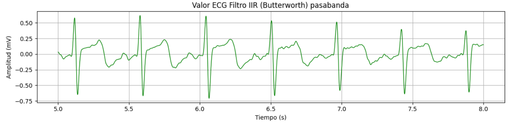
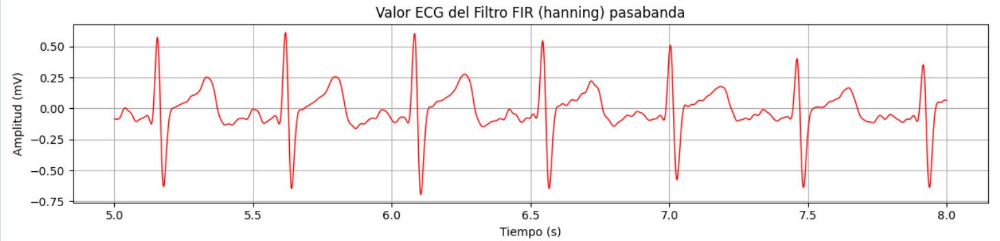

# Laboratorio N°6 - Diseño de Filtros IIR y FIR 

## Tabla de contenidos:
 __________________________________________________________________________________________________
1. [Lista de participantes](#t1)
2. [Introducción](#t2)
3. [Objetivos del laboratorio](#t3)
4. [Metodología](#t4)
6. [Resultados](#t5)\
   5.1 [Ejercicio ECG](#t6)\
   5.2 [Ejercicio EMG ](#t7)\
   5.3 [Ejercicio EEG](#t8)
7. [Discusión](#t9)\
   6.1 [Señal ECG](#t10)\
   6.2 [Señal EMG](#t11)\
   6.3 [Señal EEG](#t12)\
8. [Bibliografía](#t13)
__________________________________________________________________________________________________
## **Lista de participantes** <a name = "t1"></a>
* Jimena Alpiste Espinoza - 74297329
* Jossymar León Mallma - 74905684
* Renato Cardoso Cardenas - 73061678


## Introducción  <a name = "t2"></a>

**Filtros Digitales**

En el procesamiento de señales, los filtros digitales surgen como una herramienta que permite manipular las características de las señales como la forma, amplitud, frecuencia o fase de una onda de interés . Los objetivos comunes del filtrado son mejorar la calidad de una señal que requiera suprimir el ruido , extraer información relevante o la separación de señales combinadas [1]. 

Mediante algoritmos matemáticos implementados en hardware o software, los filtros digitales pueden adaptarse de manera flexible a diferentes requisitos de filtrado, ofreciendo una solución precisa y adaptable para una amplia gama de aplicaciones en el procesamiento de señales. En comparación con los filtros analógicos, estos se prefieren en una amplia gama de aplicaciones biomédicas por las siguientes ventajas [1]: 
- Ofrecen  una respuesta de fase  lineal, una característica que no es posible lograr con los filtros analógicos.
- Su rendimiento no se ve afectado por cambios ambientales, como las variaciones térmicas. Lo cual elimina la necesidad de realizar ajustes o calibraciones periódicas para mantener su funcionamiento óptimo.
- Permiten filtrar varias señales o canales de entrada sin necesidad de replicar el hardware, lo que resulta en una mayor eficiencia y flexibilidad.
- Tanto los datos filtrados como los no filtrados pueden ser almacenados para su posterior uso, brindando una mayor capacidad de procesamiento y análisis.

<div align="center">
    
    <p><b>Figura 1. Representación de un filtro digital</b> - Extraído de [1]</p>
</div>


**Tipos de filtros digitales**

Podemos dividir los  filtros digitales en dos grupos: filtros de respuesta al impulso infinito (IIR) y filtros de respuesta al impulso finito (FIR). Ambos tipos de filtros, en su forma más elemental, pueden ser representados por su secuencia de respuesta al impulso, denotada como h(k) (donde k = 0, 1, ...), tal como se ilustra en la Figura 1. La relación entre las señales de entrada y salida del filtro se establece mediante la operación de convolución, expresada en las ecuación 1 para el filtro IIR y en 2 para el filtro FIR.


<div style="margin: 0 auto; width: fit-content;">

| Ecuación 1      | Ecuación 2 |
|-------------     |------|
|      |    |
| Filtro IIR       | Filtro FIR   | 

</div>

**Filtros FIR [2]**

Un filtro FIR (Respuesta al Impulso Finita) es un tipo de filtro digital empleado ampliamente en el procesamiento de señales digitales. Se caracteriza por tener una respuesta al impulso de longitud finita, lo que significa que si se aplica un impulso unitario a la entrada del filtro, la salida eventualmente decae a cero después de un número finito de muestras.

El funcionamiento básico de un filtro FIR consiste en realizar una operación de convolución entre la secuencia de entrada y una secuencia finita de coeficientes predeterminados. Cada muestra de salida es una suma ponderada de un número finito de muestras de entrada recientes, donde los pesos son los coeficientes del filtro. Estos coeficientes determinan la respuesta en frecuencia, es decir, cómo el filtro modifica la amplitud de las diferentes componentes de frecuencia presentes en la señal de entrada. Por lo tanto, es crucial seleccionar con precisión los coeficientes durante el diseño del filtro para alcanzar las especificaciones deseadas, tales como las características de paso de banda, el rechazo de banda y las transiciones entre ellas.

La ventaja principal de estos filtros es que tiene una respuesta de fase lineal ,  lo que significa que no introducen distorsión de fase en la señal filtrada, solo un retraso constante. Esto los hace atractivos para aplicaciones donde la integridad de la forma de onda es importante.

<div align="center">
     
    <p><b>Figura 2. Estructura de filtro de respuesta de impulso finito. </b> - Extraído de [2] </p>
</div>

**Filtros IIR [3]**

Un filtro IIR es un tipo de filtro digital que se caracteriza por utilizar una estructura de retroalimentación, donde la salida del filtro se realimenta como entrada. Esta configuración hace que la respuesta del filtro pueda prolongarse indefinidamente en el tiempo, a diferencia de los filtros FIR.  La implementación de este filtro implica el uso de ecuaciones de diferencias que involucran polos y ceros en el dominio de la transformada Z. Los polos están relacionados con la retroalimentación y determinan la estabilidad del sistema, mientras que los ceros influyen en la respuesta impulsiva del filtro.

Los filtros IIR tienden a ser más eficientes computacionalmente que los FIR, ya que requieren menos coeficientes para lograr una respuesta en frecuencia comparable. Sin embargo, su realimentación puede provocar inestabilidad y problemas de representación numérica. Derivados de diseños analógicos recursivos como condensadores e inductores, los filtros IIR permiten respuestas de frecuencia más abruptas y pueden preservar mejor características de fase de filtros analógicos. No obstante, introducen distorsión de fase no lineal a diferencia de los FIR. Su diseño, que implica colocar polos y ceros cuidadosamente, los hace más complejos y sensibles que los filtros FIR.

<div align="center">
     
    <p><b>Figura 3. Estructura de filtro de respuesta al impulso infinito. </b> - Extraído de [3] </p>
</div>

Los filtros electrónicos analógicos tradicionales se construyen utilizando componentes pasivos como resistencias, capacitores e inductores interconectados en configuraciones específicas. Estos implementan inherentemente funciones de transferencia con realimentación, lo que da como resultado una respuesta al impulso de duración infinita, característica de los filtros IIR. Esto se debe a la naturaleza recursiva de los capacitores e inductores, donde la salida en un instante depende no solo de la entrada actual, sino también de entradas y salidas pasadas [4]. 


## **Objetivos  Laboratorio** <a name = "t3"></a>
* Comprender los principios básicos de filtros digitales, en particular, los relacionados con los filtros de respuesta infinita al impulso (IRR) y los de respuesta finita al impulso (FIR).
* Filtrar las señales ECG, EMG y EEG para la eliminación de ruidos y artefactos
* Analizar las señales obtenidas y extraer características de interés de cada una. 
  
## Metodología <a name="t4"></a>
En este laboratorio, nos enfocamos en el diseño e implementación de filtros digitales FIR e IIR con el objetivo de atenuar las frecuencias altas indeseadas, originadas por el ruido presente en las señales ECG, EMG y EEG adquiridas previamente utilizando el Kit BITalino. 

**Materiales y Equipo Utilizado**
<table align="center">
  <tr>
    <th>Modelo</th>
    <th>Descripción</th>
    <th>Cantidad</th>
  </tr>
  <tr>
    <td>(R)EVOLUTION</td>
    <td>Kit de BITalino</td>
    <td>1</td>
  </tr>
  <tr>
    <td>-</td>
    <td>Laptop</td>
    <td>1</td>
  </tr>
</table>
<p align="center">
  <b>Tabla 1. Materiales y equipos utilizados</b>
</p>

**Procedimiento**

**Señal ECG**

El electrocardiograma (ECG) es una herramienta crucial que registra la actividad eléctrica del corazón, proporcionando información vital sobre su funcionamiento. Este registro capta las variaciones de voltaje generadas por la actividad eléctrica que rige la contracción y relajación de las distintas regiones del músculo cardíaco. Para el proceso de filtrado de la señal ECG correspondiente a este laboratorio, se tomaron como referencia las mediciones realizadas en el laboratorio 3 [5]. En dicho laboratorio, se pudo capturar el potencial eléctrico de las derivaciones entre dos electrodos en distintas condiciones, tales como: reposo, respiración controlada y posterior a ejercicios.

**Justificación de uso del filtro IIR en ECG:**

Para justificar la elección de los valores del filtro IIR Butterworth en el contexto del estudio, es importante considerar el rendimiento observado en investigaciones previas.

Según el estudio realizado por Das y Chakraborty (2017), los filtros IIR Butterworth mostraron un buen rendimiento en términos de relación señal-ruido (SNR) para la eliminación de ruido en señales de ECG en el modo de monitorización. Los autores encontraron que los filtros Butterworth alcanzaron valores máximos de SNR cuando el orden del filtro estaba en el rango de 2 a 4 [6].

El rango de frecuencia útil para el modo de monitorización de ECG que se acepta generalmente es de 0.5 a 40 Hz según lo que indica el manual Electrocardiography (ECG) Sensor Datasheet [7].

Dado que el estudio de Das y Chakraborty (2017) demostró que los filtros Butterworth de orden 2 a 4 proporcionan un buen rendimiento de SNR para la eliminación de ruido en señales de ECG en modo de monitorización, se recomienda probar el filtro Butterworth con órdenes en este rango.

**Señal EMG**

**Justificación de uso del filtro IIR en EMG**

Según el estudio realizado por Roland et al. (2019) [8], los filtros IIR de segundo orden, tanto Chebyshev como Butterworth, son adecuados para la eliminación de artefactos de movimiento y ruido de baja frecuencia en señales de EMG aisladas.

Los autores evaluaron diferentes frecuencias de corte para estos filtros y encontraron que un filtro Chebyshev de segundo orden con una frecuencia de corte de 60 Hz proporcionó el mejor equilibrio entre la atenuación de artefactos y el mantenimiento de la potencia de la señal de EMG. Este filtro mostró la máxima diferencia entre la pérdida de señal de artefactos y la pérdida de señal de EMG, lo que indica un rendimiento óptimo.

Para el diseño del filtro Chebyshev, se pueden utilizar los siguientes parámetros:

- Frecuencia de esquina de la banda de paso (Wp) = 301.59 rad/s
- Frecuencia de esquina de la banda de atenuación (Ws) = 389.02 rad/s

Estos valores de frecuencia son consistentes con el rango de frecuencia útil para la señal de EMG, que se acepta generalmente de 20 a 500 Hz [8].

Aunque el filtro Butterworth de segundo orden también mostró un buen rendimiento, el filtro Chebyshev fue seleccionado para la implementación final en el sistema de medición de EMG aislado debido a su mejor atenuación de artefactos.

En resumen, el uso de un filtro IIR Chebyshev de segundo orden con una frecuencia de corte de 60 Hz y los parámetros Wp = 301.59 rad/s y Ws = 389.02 rad/s está justificado por los resultados del estudio de Roland et al. (2019) [8] para la eliminación efectiva de artefactos de movimiento y ruido de baja frecuencia en señales de EMG aisladas, manteniendo al mismo tiempo la potencia de la señal de EMG.


**Señal EEG**

**Justificación de uso del filtro IIR en EMG**

Según el estudio realizado por Tiwari, Goel y Bhardwaj (2024) [9], se utilizó un filtro pasabanda Butterworth de 5to orden para realizar el sub-bandeo de las señales de EEG en seis bandas más pequeñas: delta (0.5-4 Hz), theta (4-8 Hz), alfa (8-12 Hz), beta baja (12-16 Hz), beta alta (16-24 Hz) y gamma (24-40 Hz).

Este procesamiento de señales fue un paso importante antes de aplicar la Transformada de Hilbert-Huang (HHT) a las señales de EEG de cada sub-banda. La HHT se utilizó para obtener la Amplitud Instantánea (IA), la Fase Instantánea (IP) y la Frecuencia Instantánea (IF) de las señales de EEG en dicho estudio.

El uso del filtro Butterworth pasabanda de 5to orden para el sub-bandeo de las señales de EEG en las bandas delta, theta, alfa, beta y gamma, seguido de la HHT, resultó en un preprocesamiento híbrido y eficiente de las señales. 

Los autores reportaron una precisión promedio de clasificación del 97.67% usando la técnica de validación cruzada de 5 pliegues en las seis sub-bandas. Esto demuestra la eficacia del enfoque de preprocesamiento que emplea el filtro Butterworth pasabanda de 5to orden para el sub-bandeo de las señales de EEG.


**Justificación de uso del filtro FIR para las señales de ECG, EMG y EEG**

De acuerdo con Proakis y Manolakis en su libro "Digital Signal Processing: Principles, Algorithms, and Applications" [10], las ventanas de Hamming y Hanning son dos de las mejores opciones para el diseño de filtros FIR en el procesamiento de señales debido a las siguientes razones:

1. Ventana de Hamming:
La ventana de Hamming tiene un buen equilibrio entre la selectividad en frecuencia y la atenuación de los lóbulos laterales.
Proporciona una buena supresión de los lóbulos laterales, lo que reduce la interferencia de las frecuencias no deseadas en la señal filtrada.
Tiene una transición relativamente estrecha entre la banda de paso y la banda de rechazo, lo que permite una buena separación entre las bandas de frecuencia.

2. Ventana de Hanning:
La ventana de Hanning tiene una forma similar a la ventana de Hamming, pero con una atenuación de los lóbulos laterales ligeramente menor.
Ofrece una buena selectividad en frecuencia y una transición suave entre la banda de paso y la banda de rechazo.
Produce una distorsión mínima de la señal en la banda de paso debido a su forma de campana suave.

Proakis y Manolakis destacan que tanto la ventana de Hamming como la ventana de Hanning son ampliamente utilizadas en el diseño de filtros FIR debido a sus características favorables en términos de selectividad en frecuencia, atenuación de los lóbulos laterales y distorsión de la señal. Estas ventanas proporcionan un buen compromiso entre el rendimiento del filtro y la complejidad computacional, lo que las hace adecuadas para una variedad de aplicaciones de procesamiento de señales, incluyendo el filtrado de señales de EEG.

En resumen, según Proakis y Manolakis [10], las ventanas de Hamming y Hanning son dos de las mejores opciones para el diseño de filtros FIR debido a su buen equilibrio entre la selectividad en frecuencia, la atenuación de los lóbulos laterales y la distorsión mínima de la señal en la banda de paso.


 
**CÓDIGOS UTILIZADOS**
--------------------------------------------------------------------------------------------------------------
**Código de ploteo para EEG y adquisición de las ondas cerebrales:**
```python
import numpy as np
import matplotlib.pyplot as plt
from scipy.signal import firwin, freqz, lfilter, iirfilter, butter
import pywt

# Cargar los datos desde el archivo TXT
archivo_txt = "C:/Users/Equipo/OneDrive/Escritorio/Introduccion_a_señales_biomedicas/Github/inb_2024_gh12/ISB_Informes/L5_Lectura_de_EEG/EEG_L5/BiTalino/Prueba_ojos_abiertos_cerrado_5s.txt"
datos = np.loadtxt(archivo_txt)
lectura = datos[:, 5]  # Sexta columna

fs = 1000
VCC = 3.3  # Operating voltage
G = 41782  # Sensor gain
n_bits = 10  # Number of bits for ADC

# Convert ADC to EEG(V)
#Lectura = (Lectura / ((2**n_bits) - 0.5)) * VCC / G_EEG
lectura = ((((lectura)/(2**n_bits))-1/2)*VCC)/G

# Convert EEG(V) to EEG(uV)
lectura = lectura * 1e6

# Crear un arreglo de tiempo en segundos
tiempo = np.arange(len(lectura)) / fs

# Frecuencia de corte de los filtros
cutoff_frequency = 60 / (fs / 2) # Normalización de la frecuencia de corte
iir_filter = iirfilter(N=5, Wn=[cutoff_frequency], btype='low', ftype='butter')

#Todo esto es para otros módulos para filtrar
    # #Declaramos la frecuencia de corte para un filtro pasa banda
    # frecuencia_low_cut=0.2/ (fs / 2)
    # frecuencia_high_cut=4/ (fs / 2)

    # Diseño del filtro rechazo de banda
    # Parámetros del filtro

    # Frecuencia de muestreo en Hz
    # notch_freq = 60  # Frecuencia a rechazar en Hz
    # bandwidth = 0.005  # Ancho de banda alrededor de la frecuencia a rechazar
    # f1 = notch_freq - bandwidth / 2
    # f2 = notch_freq + bandwidth / 2

#Declaramos la frecuencia de corte para un filtro pasa banda
wc_delta=[0.2/ (fs / 2), 4/ (fs / 2)]
wc_tetha=[4/ (fs / 2), 8/ (fs / 2)]
wc_alfa=[8/ (fs / 2), 12/ (fs / 2)]
wc_beta=[12/ (fs / 2), 24/ (fs / 2)]
wc_gamma=[24/ (fs / 2), 48/ (fs / 2)]

# Diseñar filtros
num_taps = 101 # Número de coeficientes
fir_filter_delta = firwin(num_taps, wc_delta, window="hann" ,pass_zero=False)

fir_filter_tetha = firwin(num_taps, wc_tetha, window="hann" ,pass_zero=False)

fir_filter_alfa = firwin(num_taps, wc_alfa, window="hann" ,pass_zero=False)

fir_filter_beta = firwin(num_taps, wc_beta, window="hann" ,pass_zero=False)

fir_filter_gamma = firwin(num_taps, wc_gamma, window="hann" ,pass_zero=False)

# Respuesta en frecuencia del filtro FIR
w, h = freqz(fir_filter_delta, worN=8000)
plt.figure(figsize=(9, 9))
plt.subplot(6, 1, 2)
plt.plot(0.5*fs*w/np.pi, np.abs(h), 'b')
plt.title('Respuesta en Frecuencia del Filtro FIR (hanning)')
plt.xlabel('Frecuencia [Hz]')
plt.grid(True)

# Respuesta en frecuencia del filtro IIR (Butterworth)
w, h = freqz(*butter(4, Wn=[cutoff_frequency], btype='low'))
plt.subplot(6, 1, 1)
plt.plot(0.5*fs*w/np.pi, np.abs(h), 'g')
plt.title('Respuesta en Frecuencia del Filtro IIR (Butterworth) pasabaja')
plt.xlabel('Frecuencia [Hz]')
plt.grid(True)

w, h = freqz(fir_filter_tetha, worN=8000)

plt.subplot(6, 1, 3)
plt.plot(0.5*fs*w/np.pi, np.abs(h), 'r')
plt.title('Respuesta en Frecuencia del Filtro FIR (hanning)')
plt.xlabel('Frecuencia [Hz]')
plt.grid(True)

w, h = freqz(fir_filter_alfa, worN=8000)

plt.subplot(6, 1, 4)
plt.plot(0.5*fs*w/np.pi, np.abs(h), 'brown')
plt.title('Respuesta en Frecuencia del Filtro FIR (hanning)')
plt.xlabel('Frecuencia [Hz]')
plt.grid(True)

w, h = freqz(fir_filter_beta, worN=8000)

plt.subplot(6, 1, 5)
plt.plot(0.5*fs*w/np.pi, np.abs(h), 'pink')
plt.title('Respuesta en Frecuencia del Filtro FIR (hanning)')
plt.xlabel('Frecuencia [Hz]')
plt.grid(True)

w, h = freqz(fir_filter_gamma, worN=8000)

plt.subplot(6, 1, 6)
plt.plot(0.5*fs*w/np.pi, np.abs(h), 'black')
plt.title('Respuesta en Frecuencia del Filtro FIR (hanning)')
plt.xlabel('Frecuencia [Hz]')
plt.grid(True)

plt.tight_layout()

# Aplicar los filtros
eeg_iir = lfilter(iir_filter[0], iir_filter[1], lectura)

eeg_fir_delta = lfilter(fir_filter_delta, 1.0, eeg_iir)
eeg_fir_tetha = lfilter(fir_filter_tetha, 1.0, eeg_iir)
eeg_fir_alfa = lfilter(fir_filter_alfa, 1.0, eeg_iir)
eeg_fir_beta = lfilter(fir_filter_beta, 1.0, eeg_iir)
eeg_fir_gamma = lfilter(fir_filter_gamma, 1.0, eeg_iir)

# Define el intervalo de tiempo que deseas visualizar (segundos)
inicio_segundo = 25
fin_segundo = 50
inicio_muestra = int(inicio_segundo * fs)
fin_muestra = int(fin_segundo * fs)

# Crear gráficos de las señales filtradas
plt.figure(figsize=(12, 9))
plt.subplot(7, 1, 1)
plt.plot(tiempo[inicio_muestra:fin_muestra], lectura[inicio_muestra:fin_muestra], lw=1, color='blue')
plt.title('Valor EEG (Original) Prueba_ojos_abiertos_cerrado_5s')
plt.xlabel('Tiempo (s)')
plt.ylabel('Amplitud (uV)')
plt.grid(True)

plt.subplot(7, 1, 3)
plt.plot(tiempo[inicio_muestra:fin_muestra], eeg_fir_delta[inicio_muestra:fin_muestra], lw=1, color='red')
plt.title('Valor EEG del Filtro FIR (blackman) pasabanda para ondas delta')
plt.xlabel('Tiempo (s)')
plt.ylabel('Amplitud (uV)')
plt.grid(True)

plt.subplot(7, 1, 2)
plt.plot(tiempo[inicio_muestra:fin_muestra], eeg_iir[inicio_muestra:fin_muestra], lw=1, color='green')
plt.title('Valor EEG Filtro IIR (Butterworth) pasabaja')
plt.xlabel('Tiempo (s)')
plt.ylabel('Amplitud (uV)')
plt.grid(True)

plt.subplot(7, 1, 4)
plt.plot(tiempo[inicio_muestra:fin_muestra], eeg_fir_tetha[inicio_muestra:fin_muestra], lw=1, color='yellow')
plt.title('Valor EEG del Filtro FIR (blackman) pasabanda para ondas tetha')
plt.xlabel('Tiempo (s)')
plt.ylabel('Amplitud (uV)')
plt.grid(True)

plt.subplot(7, 1, 5)
plt.plot(tiempo[inicio_muestra:fin_muestra], eeg_fir_alfa[inicio_muestra:fin_muestra], lw=1, color='pink')
plt.title('Valor EEG del Filtro FIR (blackman) pasabanda para ondas alfa')
plt.xlabel('Tiempo (s)')
plt.ylabel('Amplitud (uV)')
plt.grid(True)

plt.subplot(7, 1, 6)
plt.plot(tiempo[inicio_muestra:fin_muestra], eeg_fir_beta[inicio_muestra:fin_muestra], lw=1, color='brown')
plt.title('Valor EEG del Filtro FIR (blackman) pasabanda para ondas beta')
plt.xlabel('Tiempo (s)')
plt.ylabel('Amplitud (uV)')
plt.grid(True)

plt.subplot(7, 1, 7)
plt.plot(tiempo[inicio_muestra:fin_muestra], eeg_fir_gamma[inicio_muestra:fin_muestra], lw=1, color='black')
plt.title('Valor EEG del Filtro FIR (blackman) pasabanda para ondas gamma')
plt.xlabel('Tiempo (s)')
plt.ylabel('Amplitud (mV)')

plt.grid(True)
plt.tight_layout()
plt.show()
```

**-Código de ploteo para EMG y ECG:**
```python
import numpy as np
import matplotlib.pyplot as plt
from scipy.signal import firwin, freqz, lfilter, iirfilter, butter
import pywt

# Cargar los datos desde el archivo TXT
archivo_txt = "C:/Users/Equipo/OneDrive/Escritorio/Introduccion_a_señales_biomedicas/Github/inb_2024_gh12/ISB_Informes/L4_Lectura_de_ECG/ECG_L4/Post_ejercicio.txt"
datos_emg = np.loadtxt(archivo_txt)
ecg = datos_emg[:, 5]  # Sexta columna

VCC = 3.3  # Operating voltage
G_EMG = 1100  # Sensor gain
n_bits = 10  # Number of bits for ADC

# Convert ADC to EEG(V)
#Lectura = (Lectura / ((2**n_bits) - 0.5)) * VCC / G_EEG
ecg = ((((ecg)/(2**n_bits))-1/2)*VCC)/G_EMG

# Convert EEG(V) to EEG(uV)
ecg = ecg * 1e3

# Crear un arreglo de tiempo en segundos
frecuencia_muestreo = 1000
tiempo = np.arange(len(ecg)) / frecuencia_muestreo

# Frecuencia de corte de los filtros
cutoff_frequency_fir = 25 / (frecuencia_muestreo / 2)
cutoff_frequency_iir= 20 / (frecuencia_muestreo/2) # Normalización de la frecuencia de corte
#cutoff_frequency_iir = 25 / (frecuencia_muestreo / 2)

# Diseñar filtros
num_taps = 101
fir_filter = firwin(num_taps, cutoff_frequency_fir,window="hamming")
iir_filter = iirfilter(N=4, Wn=cutoff_frequency_iir, btype='low', ftype='butter')


# Respuesta en frecuencia del filtro FIR
w, h = freqz(fir_filter, worN=8000)
plt.figure(figsize=(9, 9))
plt.subplot(3, 1, 1)
plt.plot(0.5*frecuencia_muestreo*w/np.pi, np.abs(h), 'b')
plt.title('Respuesta en Frecuencia del Filtro FIR')
plt.xlabel('Frecuencia [Hz]')
plt.grid(True)

# Respuesta en frecuencia del filtro IIR (Butterworth)
w, h = freqz(*butter(4, cutoff_frequency_iir, btype='low'))
plt.subplot(3, 1, 2)
plt.plot(0.5*frecuencia_muestreo*w/np.pi, np.abs(h), 'g')
plt.title('Respuesta en Frecuencia del Filtro IIR (Butterworth)')
plt.xlabel('Frecuencia [Hz]')
plt.grid(True)
plt.tight_layout()
# El filtro Wavelet no es un filtro en el dominio de la frecuencia 

# Aplicar los filtros
ecg_fir = lfilter(fir_filter, 1.0, ecg)
ecg_iir = lfilter(iir_filter[0], iir_filter[1], ecg)
#ecg_wavelet, _ = pywt.dwt(ecg, wavelet_filter)

# Define el intervalo de tiempo que deseas visualizar (segundos)
inicio_segundo = 5
fin_segundo = 8
inicio_muestra = int(inicio_segundo * frecuencia_muestreo)
fin_muestra = int(fin_segundo * frecuencia_muestreo)

# Crear gráficos de las señales filtradas
plt.figure(figsize=(12, 9))
plt.subplot(3, 1, 1)
plt.plot(tiempo[inicio_muestra:fin_muestra], ecg[inicio_muestra:fin_muestra], lw=1, color='blue')
plt.xlabel('Tiempo (s)')
plt.ylabel('Valor ECG (Original)')
plt.grid(True)

plt.subplot(3, 1, 2)
plt.plot(tiempo[inicio_muestra:fin_muestra], ecg_fir[inicio_muestra:fin_muestra], lw=1, color='red')
plt.xlabel('Tiempo (s)')
plt.ylabel('Valor ECG (FIR Filtro)')
plt.grid(True)

plt.subplot(3, 1, 3)
plt.plot(tiempo[inicio_muestra:fin_muestra], ecg_iir[inicio_muestra:fin_muestra], lw=1, color='green')
plt.xlabel('Tiempo (s)')
plt.ylabel('Valor ECG (IIR Filtro)')
plt.grid(True)


plt.tight_layout()
plt.show()
```

## Resultados   <a name="t5"></a>

### **Ejercicio ECG** <a name="t6"></a>
| Campo | Señal Cruda | Filtro IIR | Filtro FIR |
|-----------|-----------|-----------|-----------|
| Basal   |   |  | |
| Respiración   |   | |  |
| Post Ejercicios   |   |   |  |


### **Ejercicio EMG** <a name="t7"></a>
| Campo | Señal Cruda | Filtro IIR | Filtro FIR |
|-----------|-----------|-----------|-----------|
| Descanso  | Valor 2   | Valor 3   | Valor 4   |
| Contracción Leve   | Valor 6   | Valor 7   | Valor 8   |
| Contracción Fuerte | Valor 6   | Valor 7   | Valor 8   |

### **Ejercicio EEG** <a name="t8"></a>
| Campo | Señal Cruda | Filtro IIR | Filtro FIR |
|-----------|-----------|-----------|-----------|
| Basal  | Antes del filtrado, la señal de EKG contiene ruido de baja frecuencia, como la deriva de la línea base, y ruido de alta frecuencia, como la interferencia electromagnética. Estos ruidos dificultan la identificación de las ondas características del EKG, como las ondas P, QRS y T.| Valor 3   | Valor 4   |
| Parpadero de ojos  | Valor 6   | Valor 7   | Valor 8   |
| Actvidad  | Valor 6   | Valor 7   | Valor 8   |

## Discusión <a name="t9"></a>


### **ECG** <a name="t10"></a>
Basal: Antes del filtrado, la señal de EKG contiene ruido de baja frecuencia, como la deriva de la línea base, y ruido de alta frecuencia, como la interferencia electromagnética. Estos ruidos dificultan la identificación de las ondas características del EKG, como las ondas P, QRS y T.

IIR: Después del filtrado con un filtro IIR, el ruido de baja y alta frecuencia se atenúa, lo que resulta en una señal más limpia. Las ondas P, QRS y T son más prominentes y fáciles de identificar. Sin embargo,se observa una ligera distorsión de la forma de onda debido a la fase no lineal del filtro IIR.

FIR:Con un filtro FIR, se ve una atenuación similar del ruido de baja y alta frecuencia. La señal resultante también es más limpia, con las ondas P, QRS y T claramente visibles. A diferencia del filtro IIR, el filtro FIR no introduce distorsión de fase, por lo que la forma de onda se preserva mejor.


### **EMG** <a name="t11"></a>

Basal: La señal EMG contiene ruido de baja frecuencia que pueden ser debidos a artefactos en movimiento y ruido de alta frecuencia debido a interferencias electromagnéticas. Este ruido puede ocultar la información relevante relacionada con la actividad muscular. 

IIR: Después del filtrado con un filtro IIR, se observa una reducción del ruido de baja y alta frecuencia, lo que resulta en una señal más limpia. Las componentes espectrales características del EMG, que contienen información sobre la frecuencia y amplitud de la actividad muscular, son más evidentes. 

FIR: Después del filtrado con un filtro FIR, se observa atenuación similar del ruido de baja y alta frecuencia. La señal resultante también es más limpia, con las componentes espectrales del EMG claramente visibles.

### **EEG** <a name="t12"></a>

Basal: Observamos una gran cantidad de ruido en las señales al momento de plotear cada una. Lo cual dificulta su lectura de informaciòn. 

IIR: La señal EEG, después de pasar por un filtro Butterworth, nos permite reconocer las magnitudes de las oscilaciones en distintos rangos de frecuencia, tales como delta, theta, alpha, beta y gamma. Este diagrama nos facilita la medición de la amplitud en microvoltios (uV) o en unidades relativas.

FIR: Cuando aplicamos la ventana Hamming en el análisis de una señal EEG, estamos seleccionando una ventana específica para la respuesta de frecuencia. Esto influye en la percepción y el análisis de las oscilaciones en la señal EEG. Esperaríamos poder distinguir las ondas alfa, delta, beta y gamma; sin embargo, en algunos casos, podríamos notar que la calidad de la señal no es óptima y la identificación de la banda de frecuencia con mayor amplitud en momentos específicos no es clara. Esto resalta la importancia de comprender las diferencias entre las ventanas Hamming y Hann, y cómo afectan el procesamiento de la señal.


## ** Bibliografía** : <a name="t13"></a>


[1] E. C. Ifeachor and B. W. Jervis, "Digital signal processing: a practical approach," Pearson Education, pp. 367-379, 2002.

[2] M. Parker, “Finite Impulse Response (FIR) Filters,” Elsevier eBooks, pp. 41–57, Jan. 2017, doi: https://doi.org/10.1016/b978-0-12-811453-7.00005-6.

[3] M. Parker, “Infinite Impulse Response (IIR) Filters,” Elsevier eBooks, pp. 75–82, Jan. 2017, doi: https://doi.org/10.1016/b978-0-12-811453-7.00008-1.

[4] P. Ramesh Babu, "Digital Signal Processing", 4th ed. Chennai: Scitech Publication (India) Pvt. Ltd, 2008.

[5] Renatog2500, "L4_Lectura_de_ECG", GitHub, 2024. [Online]. Available: https://github.com/renatog2500/inb_2024_gh12/blob/main/ISB_Informes/L4_Lectura_de_ECG/L4_Lectura_de_ECG.md. [Accessed: May 05, 2024].

[6] N. Das y M. Chakraborty, "Performance Analysis of FIR and IIR Filters for ECG Signal Denoising based on SNR," en 2017 IEEE International Conference on Intelligent Techniques in Control, Optimization and Signal Processing (INCOS), 2017, pp. 1-6, doi: 10.1109/ITCOSP.2017.8303099.  https://sci-hub.se/https://ieeexplore.ieee.org/abstract/document/8234487 

[7] BITalino, “Electrocardiography (ECG) Sensor Data Sheet”, Lisboa, DataSheet, 2020. https://www.bitalino.com/storage/uploads/media/revolution-ecg-sensor-datasheet-revb-1.pdf 

[8] T. Roland, S. Amsuess, M. Russold y W. Baumgartner, “Ultra-Low-Power Digital Filtering for Insulated EMG Sensing”, Sensors, vol. 19, n.º 4, p. 959, febrero de 2019. Accedido el 5 de mayo de 2024. [En línea]. Disponible: https://doi.org/10.3390/s19040959 

[9] S. Tiwari, S. Goel, y A. Bhardwaj, "Classification of imagined speech of vowels from EEG signals using multi-headed CNNs feature fusion network", Digital Signal Processing, vol. 148, p. 104447, 2024, doi: 10.1016/j.dsp.2024.104447. https://www.sciencedirect.com/science/article/pii/S1051200424000721 

[10] J. G. Proakis y D. G. Manolakis, "Digital Signal Processing: Principles, Algorithms, and Applications", 4th ed., Prentice-Hall, 2007.https://www.academia.edu/75221190/Digital_signal_processing_principles_algorithms_and_applications?auto=download 


