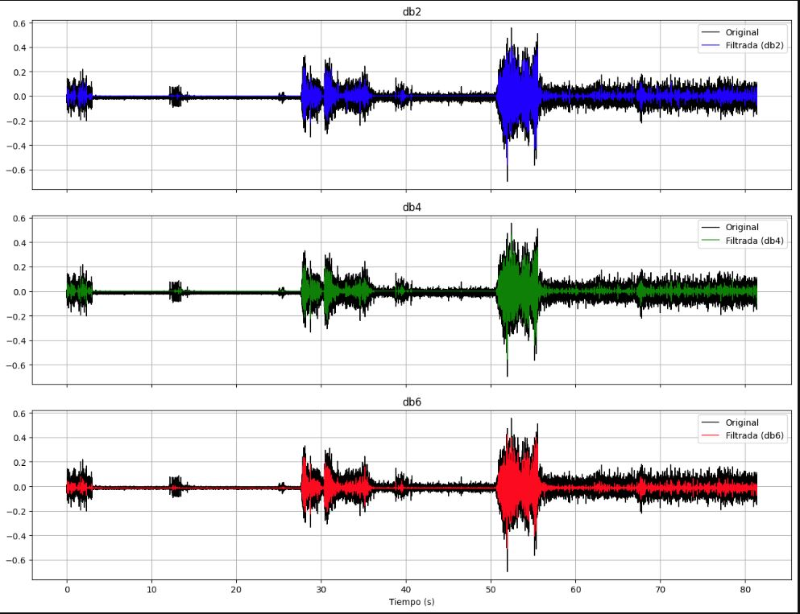
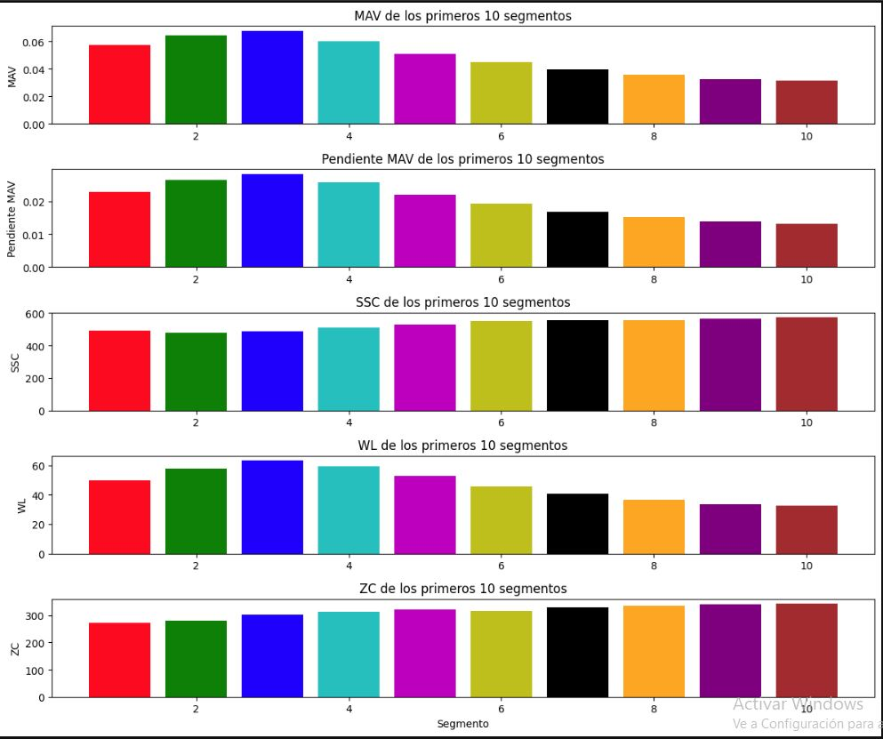

# Laboratorio N°8 - Procesamiento EMG

## Tabla de contenidos:
 __________________________________________________________________________________________________
1. [Lista de participantes](#t1)
2. [Introducción](#t2)
3. [Objetivos del laboratorio](#t3)
4. [Metodología](#t4)\
   4.1.[Materiales y Equipo utilizado](#t5)\
   4.2.[Procedimiento](#t6)
6. [Resultados](#t7)
7. [Discusión](#t8)
8. [Archivos](#t9)
7. [Bibliografía](#t10)
__________________________________________________________________________________________________
## **Lista de participantes** <a name = "t1"></a>
* Jimena Alpiste Espinoza - 74297329
* Jossymar León Mallma - 74905684
* Renato Cardoso Cardenas - 73061678


## Introducción  <a name = "t2"></a>
La electromiografía (EMG) es una técnica versátil que nos permite estudiar las señales eléctricas generadas por la actividad muscular. En ella, se registran los potenciales eléctricos producidos por las corrientes iónicas que fluyen durante la contracción muscular, reflejando así la actividad neuromuscular [1]. Estas señales bioeléctricas son iniciadas por las neuronas motoras del sistema nervioso central, que controlan la función muscular [2].

Las señales EMG pueden clasificarse en dos tipos principales según el método de adquisición: EMG de superficie y EMG intramuscular. La EMG de superficie utiliza electrodos no invasivos colocados sobre la piel, mientras que la EMG intramuscular implica la inserción de electrodos dentro del músculo [3]. Actualmente, se prefieren las señales detectadas en la superficie debido a su carácter no invasivo y su capacidad para obtener información sobre el tiempo o la intensidad de la activación muscular superficial [3].

Las señales electromiográficas (EMG) se consideran altamente útiles como señales electrofisiológicas, tanto en el campo médico como en el de ingeniería. Sin embargo, cada vez que se captura una señal EMG del músculo, esta tiende a contaminarse con varios tipos de ruido. Factores como el movimiento de los electrodos, la actividad muscular cercana, las interferencias electromagnéticas y el ruido inherente de los dispositivos de adquisición pueden introducir artefactos indeseados en la señal [3].

Por lo tanto, un adecuado procesamiento de la señal EMG es crucial para eliminar o minimizar estos ruidos y obtener información confiable y significativa de la actividad neuromuscular. Técnicas avanzadas de procesamiento de señales, como el filtrado, la eliminación de artefactos y la extracción de características, son fundamentales para aprovechar al máximo el potencial de la EMG en aplicaciones médicas, biomecánicas y de ingeniería. 

**Adquisición de señales**

Las señales de electromiografía de superficie (sEMG) se caracterizan por no ser estacionarias, lo que implica que su comportamiento y características no permanecen constantes a lo largo del tiempo. A pesar de esta variabilidad, es posible capturar estas señales utilizando electrodos superficiales, tal como se mencionó anteriormente. 
Estos se pueden clasificar según su diseño y su disposición. En cuanto a la adquisición precisa de estas señales sEMG, el sensor utilizado debe cumplir con el teorema de muestreo de Nyquist-Shannon. Esto significa que la frecuencia de muestreo debe ser al menos el doble de la frecuencia más alta presente en las señales sEMG. Por lo tanto, se recomienda una frecuencia de muestreo superior a 1000 Hz para capturar adecuadamente estas señales [4].


**Pre procesamiento**

Las señales obtenidas a través de electrodos de superficie presentan una amplitud baja y un nivel considerable de ruido, lo que dificulta su análisis directo. Por lo tanto, es necesario realizar una serie de pasos de preparación antes de poder extraer información significativa de estas señales.

* **Filtrado**: En esta etapa, se aplican técnicas de filtrado para eliminar cualquier tipo de interferencia no deseada presente en las señales electromiográficas. Esto ayuda a mejorar la calidad de los datos al eliminar artefactos y ruido, permitiendo un análisis más preciso y confiable [4] .

* **Rectificación**: La rectificación es un proceso esencial que se utiliza para abordar la parte negativa de las señales electromiográficas. Al rectificar las señales, se convierten en valores absolutos, lo que facilita la interpretación de la activación neural y mejora la representación de la señal para su posterior análisis[4] .

* **Normalización**: Dado que las señales electromiográficas pueden variar significativamente entre diferentes individuos, es crucial normalizar la amplitud de estas señales para poder compararlas de manera efectiva. La normalización implica ajustar las señales a un valor de referencia bajo condiciones idénticas, lo que facilita la comparación entre sujetos y mejora la eficiencia computacional en etapas posteriores de procesamiento [4]. Sin embargo, para este laboratorio, no se realizará este análisis, ya que se estarán comparando las mediciones de una misma persona.

* **Segmentación**: La segmentación divide las señales procesadas en segmentos más pequeños, lo que facilita la extracción de características relevantes de cada segmento. Esta división en segmentos permite un análisis más detallado de las señales y ayuda a equilibrar la necesidad de extraer características precisas con la minimización de retrasos computacionales, especialmente en sistemas en tiempo real [4].

**Extracción de características:** 
La extracción de características es un paso crítico en el análisis de señales electromiográficas, donde se identifican y derivan atributos significativos de los datos preprocesados para mejorar la precisión de la clasificación. Esta etapa implica la selección y extracción de características relevantes de las señales, lo que ayuda a reducir la complejidad de los datos y simplifica los procesos de clasificación posteriores. La extracción de características puede incluir atributos como el dominio del tiempo, dominio de la frecuencia y dominio tiempo-frecuencia, con el objetivo de proporcionar información relevante para la clasificación precisa de las señales electromiográficas [4] .


## **Objetivos del Laboratorio** <a name = "t3"></a>
* Obtener características estadísticas de la señal: Incluye la extracción de características como la amplitud de la señal, el valor promedio (media), la frecuencia y el valor Root Mean Square (RMS) de la señal EMG.
* Realizar el análisis de las características y compararlo con valores de la literatura: Evalúa las características extraídas y compáralas con valores de referencia disponibles en la literatura. Esto ayuda a entender cómo se comporta la señal en relación con los datos previamente documentados.
* Verificar el comportamiento de la señal EMG: Asegúrate de examinar el comportamiento general de la señal EMG para identificar patrones, tendencias o anomalías que puedan ser relevantes para tu análisis o aplicación específica.
  
## Metodología <a name="t4"></a>
En este laboratorio, nos enfocaremos en el tratamiento de la señal de EMG adquirida previamente utilizando el Kit BITalino. 

### **Materiales y Equipo Utilizado** <a name="t5"></a>
<table align="center">
  <tr>
    <th>Modelo</th>
    <th>Descripción</th>
    <th>Cantidad</th>
  </tr>
  <tr>
    <td>(R)EVOLUTION</td>
    <td>Kit de BITalino</td>
    <td>1</td>
  </tr>
  <tr>
    <td>-</td>
    <td>Laptop</td>
    <td>1</td>
  </tr>
</table>
<p align="center">
  <b>Tabla 1. Materiales y equipos utilizados</b>
</p>

### **Procedimiento** <a name="t6"></a>

**Procesamiento EMG**
El artículo "Surface Electromyography Signal Processing and Classification Techniques" [3] fue creado por Rubana et. al, aborda dos áreas principales en el procesamiento y clasificación de señales de electromiografía de superficie (sEMG). La primera área se enfoca en los métodos de preprocesamiento para eliminar posibles artefactos y ruido de las señales sEMG, con el objetivo de mejorar la calidad de la señal antes de su análisis posterior. La segunda área se centra en una explicación concisa de las diferentes técnicas utilizadas para procesar y clasificar las señales sEMG.

El propósito fundamental de este estudio fue revisar los desarrollos y avances más recientes relacionados con el procesamiento y clasificación de señales sEMG. Los autores realizaron una comparación de diversos métodos de análisis de señales sEMG en términos de su rendimiento, con el objetivo de proporcionar una evaluación más estandarizada y precisa de los hallazgos neurofisiológicos, de rehabilitación y de tecnología asistencial [3].

En el contexto de este laboratorio, este estudio resulta de gran relevancia ya que proporciona una base sólida para seleccionar y aplicar técnicas de filtrado adecuadas a las señales sEMG. En particular, nos enfocaremos en el uso de tres filtros basados en la transformada wavelet discreta (DWT) con diferentes funciones wavelet: Daubechies 2 (db2), Daubechies 4 (db4) y Daubechies 6 (db6), todas aplicadas a un nivel de descomposición 4.

La selección de estos filtros se basa en las recomendaciones y hallazgos presentados en el artículo, donde se destaca la capacidad de la DWT para reducir el ruido y preservar las características importantes de las señales sEMG. Además, el estudio sugiere que el nivel de descomposición 4 proporciona un buen compromiso en la reducción de ruido para diferentes niveles de contaminación de la señal.

**1. Transformada Wavelet Discreta (DWT) con filtro Daubechies 2 (db2):**

***Justificación de uso:*** La DWT con filtro db2 al nivel de descomposición 4 se seleccionó como una opción para filtrar señales EMG debido a su capacidad para reducir el ruido y preservar las características importantes de la señal.

| Parámetro                 | Valor                                                |
|---------------------------|----------------------------------------------------|
| Función wavelet           | Daubechies 2 (db2)                                |
| Nivel de descomposición   | 4                                                 |
| Método de umbralización   | Umbralización universal con estimación de sigma   |

***Código de implementación***

```python
import pywt
import numpy as np

# Cargar la señal EMG
emg_signal = [...]

# Aplicar la DWT con filtro db2 al nivel de descomposición 4
coefficients = pywt.wavedec(emg_signal, 'db2', level=4)

# Estimar la desviación estándar del ruido
sigma = np.median(np.abs(coefficients[1])) / 0.6745

# Calcular el umbral universal
threshold = sigma * np.sqrt(2 * np.log(len(emg_signal)))

# Realizar la umbralización suave
coefficients_filtered = pywt.threshold(coefficients, threshold, mode='soft')

# Reconstruir la señal filtrada
emg_filtered_db2 = pywt.waverec(coefficients_filtered, 'db2')
```


**2.  Transformada Wavelet Discreta (DWT) con filtro Daubechies 4 (db4):**

***Justificación de uso:*** La DWT con filtro db4 al nivel de descomposición 4 se seleccionó debido a su capacidad para proporcionar un buen compromiso en la reducción de ruido y la preservación de características importantes en señales EMG con diferentes niveles de ruido.

| Parámetro                 | Valor                                                |
|---------------------------|----------------------------------------------------|
| Función wavelet           | Daubechies 4 (db4)                                |
| Nivel de descomposición   | 4                                                 |
| Método de umbralización   | Umbralización universal con estimación de sigma   |

***Código:***

```python

import pywt
import numpy as np

# Cargar la señal EMG
emg_signal = [...]

# Aplicar la DWT con filtro db4 al nivel de descomposición 4
coefficients = pywt.wavedec(emg_signal, 'db4', level=4)

# Estimar la desviación estándar del ruido
sigma = np.median(np.abs(coefficients[1])) / 0.6745

# Calcular el umbral universal
threshold = sigma * np.sqrt(2 * np.log(len(emg_signal)))

# Realizar la umbralización suave
coefficients_filtered = pywt.threshold(coefficients, threshold, mode='soft')

# Reconstruir la señal filtrada
emg_filtered_db4 = pywt.waverec(coefficients_filtered, 'db4')
```

**3. Transformada Wavelet Discreta (DWT) con filtro Daubechies 6 (db6):**

***Justificación del uso:*** La DWT con filtro db6 al nivel de descomposición 4 se seleccionó como otra opción para filtrar señales EMG, proporcionando un equilibrio entre la reducción de ruido y la preservación de características relevantes.


| Parámetro                           | Valor                                                                       |
|-------------------------------------|---------------------------------------------------------------------|
| Función wavelet                 | Daubechies 6 (db6)                                                  |
| Nivel de descomposición   | 4                                                                               |
| Método de umbralización   | Umbralización universal con estimación de sigma   |

***Código:***

```python
import pywt
import numpy as np

# Cargar la señal EMG
emg_signal = [...]

# Aplicar la DWT con filtro db6 al nivel de descomposición 4
coefficients = pywt.wavedec(emg_signal, 'db6', level=4)

# Estimar la desviación estándar del ruido
sigma = np.median(np.abs(coefficients[1])) / 0.6745

# Calcular el umbral universal
threshold = sigma * np.sqrt(2 * np.log(len(emg_signal)))

# Realizar la umbralización suave
coefficients_filtered = pywt.threshold(coefficients, threshold, mode='soft')

# Reconstruir la señal filtrada
emg_filtered_db6 = pywt.waverec(coefficients_filtered, 'db6')
```


**Comparación de filtros**
En el artículo "Surface electromyography signal denoising via EEMD and improved wavelet thresholds" de Sun et al. [5], los autores comparan el rendimiento de diferentes algoritmos de filtrado de señales EMG utilizando tres métodos cuantitativos: la relación señal-ruido (SNR), que mide la relación entre la energía de la señal y la energía del error; la relación señal-ruido pico (PSNR), que representa la relación entre la máxima potencia posible de una señal y la potencia del ruido que afecta su fidelidad; y el error cuadrático medio (RMSE), que define la energía de la señal de error durante el filtrado. Los autores aplican estos métodos a señales EMG con diferentes niveles de ruido gaussiano blanco y comparan los resultados para determinar qué algoritmo logra el mejor rendimiento de filtrado. Haciendo estas comparaciones, se basan en los valores más altos de SNR y PSNR, y el valor más bajo de RMSE para determinar cuál es el mejor filtro utilizado. Donde el resuldato del código nos indicó que el tercer filtro es el mejor.

***Código:***

```python
import numpy as np

def snr(signal, filtered_signal):
    noise = signal - filtered_signal
    return 10 * np.log10(np.sum(signal**2) / np.sum(noise**2))

def psnr(signal, filtered_signal):
    mse = np.mean((signal - filtered_signal)**2)
    return 20 * np.log10(np.max(signal) / np.sqrt(mse))

def rmse(signal, filtered_signal):
    return np.sqrt(np.mean((signal - filtered_signal)**2))

def compare_filtering_methods(original_signal, filtered_signal1, filtered_signal2, filtered_signal3):
    snr_results = [snr(original_signal, filtered_signal) for filtered_signal in [filtered_signal1, filtered_signal2, filtered_signal3]]
    psnr_results = [psnr(original_signal, filtered_signal) for filtered_signal in [filtered_signal1, filtered_signal2, filtered_signal3]]
    rmse_results = [rmse(original_signal, filtered_signal) for filtered_signal in [filtered_signal1, filtered_signal2, filtered_signal3]]

    best_snr_index = np.argmax(snr_results)
    best_psnr_index = np.argmax(psnr_results)
    best_rmse_index = np.argmin(rmse_results)

    if best_snr_index == best_psnr_index == best_rmse_index:
        best_method = best_snr_index + 1
    else:
        best_method = np.argmax([snr_results[best_snr_index], psnr_results[best_psnr_index], -rmse_results[best_rmse_index]]) + 1

    print(f"SNR Results: {snr_results}")
    print(f"PSNR Results: {psnr_results}")
    print(f"RMSE Results: {rmse_results}")
    print(f"Best Filtering Method: Signal {best_method}")

# Load the original EMG signal and the three filtered signals
original_signal = signal_vm
filtered_signal1 = emg_filtered_db2 
filtered_signal2 = emg_filtered_db4 
filtered_signal3 = emg_filtered_db6 

# Compare the filtering methods
compare_filtering_methods(original_signal, filtered_signal1, filtered_signal2, filtered_signal3)
```
***Resultados***: 

<div align="center">
    
    <p><b>Figura 1. Resultado del código </b> </p>
</div>


<div align="center">
    
    <p><b>Figura 2. Comparación visual de los gráficos </b> </p>
</div>


**Segmentación:**

El ventaneo es una técnica crucial para la extracción de características de las señales de electromiografía de superficie (sEMG) con el fin de reconocer movimientos y patrones musculares. Aunque existe una relación entre las regiones de actividad muscular y los movimientos de las extremidades, esta relación no es totalmente directa. La intensidad de la actividad muscular en función de la posición de los músculos activos proporciona una representación más precisa de estos movimientos complejos. En este contexto, la longitud de la ventana determina la cantidad de muestras utilizadas para el reconocimiento, dónde ventanas más grandes mejoran la precisión, pero a costa de una mayor latencia. Basándonos en la investigación del paper “An Improved Feature Extraction Method for Surface Electromyography Based on Muscle Activity Regions”  se emplea un algoritmo de ventana deslizante con una ventana de 1000 ms y un incremento de 200 ms para extraer características de sEMG de manera óptima [6].

Además, esta elección se respalda con lo expuesto en el artículo "A Review of Classification Techniques of EMG Signals during Isotonic and Isometric Contractions" [7], el cual indica que las distintas longitudes de los datos de EMG impactan en su error de clasificación. Se ha confirmado que el rendimiento de la clasificación de características se ve comprometido al emplear segmentos de longitud menor a 128 ms, lo que resulta en un sesgo alto y una variación considerable en las características.

Es importante destacar que en la generación de ventanas de datos se emplean dos métodos principales: adyacentes y superpuestos. En el caso de las ventanas adyacentes, la extracción y clasificación de características se lleva a cabo tras un cierto retraso de procesamiento, denotado como τ, que corresponde al tiempo necesario para calcular la característica y clasificar los datos [7]. Sin embargo, esta técnica presenta el inconveniente de que el procesador queda inactivo durante el tiempo restante de la longitud del segmento, como se menciona en la fuente " Moving Approximate Entropy and its Application to the Electromyographic Control of an Artificial Hand" [8].

Por consiguiente, se opta por el enfoque de ventaneo superpuesto, donde el nuevo segmento se desplaza sobre el segmento actual con un tiempo de incremento menor que la longitud del segmento. Si bien esta elección no mejora la precisión de la clasificación, resulta crucial para la utilización de segmentos de 200 ms a fin de evitar retrasos temporales significativos.[9].


***Código:***

```python
señal_filtrada=emg_filtered_db6
# Definir la duración de la ventana y el aumento en segundos
window_duration = 1.000  # 1000 ms
window_shift = 0.200     # 200 ms

# Convertir la duración de la ventana y el aumento a muestras
sampling_rate = len(señal_filtrada) / time[-1]  # Frecuencia de muestreo en muestras por segundo
window_size = int(window_duration * sampling_rate)
shift_size = int(window_shift * sampling_rate)

segundo=30
# Encontrar el índice a partir del cual la señal comienza desde el segundo 30
start_index = np.searchsorted(time, segundo)

# Segmentar la señal en ventanas a partir del segundo 9
segments = []
for start in range(start_index, len(signal_mv) - window_size + 1, shift_size):
    end = start + window_size
    segment = signal_mv[start:end]
    segments.append(segment)

# Convertir la lista de segmentos a un array numpy
segments = np.array(segments)

# Graficar algunos segmentos para ver los resultados
plt.figure(figsize=(12, 8))
for i in range(6):  # Graficar hasta 10 segmentos
    plt.subplot(5, 2, i + 1)
    plt.plot(np.arange(window_size) / sampling_rate, segments[i])
    plt.xlabel('Tiempo (s)')
    plt.ylabel('Valor EMG')
    plt.title(f'Segmento {i+1} (a partir de {segundo}s)')
    plt.grid(True)

plt.tight_layout()
plt.show()
```

***Resultado***: 

<div align="center">
    
    <p><b>Figura 3. Segmentación de la onda </b> </p>
</div>


**Extracción de características**

En el artículo "Surface Electromyography Signal Processing and Classification Techniques" [3], los autores respaldan la elección de la extracción de características en el dominio del tiempo para las señales de electromiografía de superficie (sEMG) en lugar de las técnicas en el dominio de la frecuencia y tiempo-frecuencia, debido a varias ventajas significativas.

En este contexto, las características en el dominio del tiempo, como el valor absoluto medio (MAV), la pendiente del valor absoluto medio, los cambios de signo de pendiente (SSC), las longitudes de forma de onda (WL) y los cruces por cero (ZC), desarrolladas por Hudgins et al., se han demostrado efectivas para representar patrones mioeléctricos. Los autores destacan que la selección de estas características resultó en una tasa de clasificación más alta en comparación con las señales sin procesar [3].

Además, se enfatiza la ventaja de las características en el dominio del tiempo sobre las técnicas de tiempo-frecuencia, ya que estas últimas, debido a su alta dimensionalidad y resolución, a menudo requieren recursos computacionales adicionales para la extracción de características [3].

***Código utilizado para la extracción de características:***

```python
def MAV(segment):
    return np.mean(np.abs(segment))

def MAV_slope(segment):
    mav_values = [np.mean(np.abs(segment[i:i+2])) for i in range(len(segment)-1)]
    return np.mean(np.abs(np.diff(mav_values)))

def SSC(segment):
    return np.sum(np.diff(np.sign(np.diff(segment))) != 0)

def WL(segment):
    return np.sum(np.abs(np.diff(segment)))

def ZC(segment, threshold=0):
    zero_crossings = np.where(np.diff(np.sign(segment)))[0]
    return np.sum(np.abs(segment[zero_crossings]) > threshold)

# Extraer características de los primeros 10 segmentos
features = []
for i in range(10):
    segment = segments[i]
    features.append({
        'MAV': MAV(segment),
        'MAV_slope': MAV_slope(segment),
        'SSC': SSC(segment),
        'WL': WL(segment),
        'ZC': ZC(segment)
    })

# Mostrar las características de los primeros 10 segmentos
#for i, feature_set in enumerate(features, start=1):
#    print(f"Segmento {i}:")
#    for feature_name, value in feature_set.items():
#        print(f"  {feature_name}: {value}")
#    print()

# Lista de colores
colors = ['r', 'g', 'b', 'c', 'm', 'y', 'k', 'orange', 'purple', 'brown']

# Graficar características
fig, axs = plt.subplots(5, 1, figsize=(12, 10))

mav_values = [f['MAV'] for f in features]
mav_slope_values = [f['MAV_slope'] for f in features]
ssc_values = [f['SSC'] for f in features]
wl_values = [f['WL'] for f in features]
zc_values = [f['ZC'] for f in features]

axs[0].bar(range(1, 11), mav_values, color=colors)
axs[0].set_title('MAV de los primeros 10 segmentos')
axs[0].set_ylabel('MAV')

axs[1].bar(range(1, 11), mav_slope_values, color=colors)
axs[1].set_title('Pendiente MAV de los primeros 10 segmentos')
axs[1].set_ylabel('Pendiente MAV')

axs[2].bar(range(1, 11), ssc_values, color=colors)
axs[2].set_title('SSC de los primeros 10 segmentos')
axs[2].set_ylabel('SSC')

axs[3].bar(range(1, 11), wl_values, color=colors)
axs[3].set_title('WL de los primeros 10 segmentos')
axs[3].set_ylabel('WL')

axs[4].bar(range(1, 11), zc_values, color=colors)
axs[4].set_title('ZC de los primeros 10 segmentos')
axs[4].set_ylabel('ZC')
axs[4].set_xlabel('Segmento')

plt.tight_layout()

plt.show()

```
***Resultado***: 

<div align="center">
    
    <p><b>Figura 4. Representación de las características extraidas </b> </p>
</div>


## Discusión de los resultados  <a name="t8"></a>

* Comparación de Filtros:
  
El análisis realizado mediante el código implementado muestra que el filtro 3 es el más apropiado según los parámetros predefinidos. Visualmente, no se observa una pérdida significativa de información relevante, logrando filtrar el ruido innecesario en áreas con poca activación muscular. Al examinar la Figura 2, donde la sombra representa la señal original y las señales de color (azul, verde o rojo) representan las señales filtradas, se nota que para los tres filtros, a los 10 segundos, la señal de color es casi imperceptible, indicando una falta de información relevante en esa sección. Sin embargo, a los 30 segundos, la señal filtrada abarca una porción más amplia, lo que sugiere un filtrado adecuado.

En conclusión, aunque no se observan diferencias sustanciales entre los tres filtros utilizados a simple vista, el código ha sido útil, ya que los parámetros establecidos permitieron descartar los otros dos filtros y seleccionar el filtro 3 como el más adecuado.

* Segmentación: 

## Archivos <a name="t9"></a>

- [Programa de procesamiento de señal EMG (python)](https://github.com/renatog2500/inb_2024_gh12/blob/main/ISB_Informes/L8_Procesamiento_EMG/LAB_8.ipynb) 


## Bibliografía: <a name="t10"></a>

[1] M. B. I. Reaz, M. S. Hussain, y F. Mohd-Yasin, “Techniques of EMG signal analysis: detection, processing, classification and applications”, Biological Procedures Online, vol. 8, n.o 1, pp. 11-35, dic. 2006, doi: 10.1251/bpo115.
 
[2] V. Gohel y N. Mehendale, “Review on electromyography signal acquisition and processing”, Biophysical Reviews, vol. 12, n.o 6, pp. 1361-1367, nov. 2020, doi: 10.1007/s12551-020-00770-w.   

[3] R. H. Chowdhury, M. B. I. Reaz, Mohd. A. Mohd. Ali, A. A. A. Bakar, K. Chellappan, y T. G. Chang, “Surface Electromyography Signal Processing and Classification Techniques”, Sensors, vol. 13, n.o 9, pp. 12431-12466, sep. 2013, doi: 10.3390/s130912431.   

[4] A. M. Moslhi, H. H. Aly, y M. ElMessiery, “The Impact of Feature Extraction on Classification Accuracy Examined by Employing a Signal Transformer to Classify Hand Gestures Using Surface Electromyography Signals”, Sensors, vol. 24, n.o 4, p. 1259, feb. 2024, doi: 10.3390/s24041259.

[5] Z. Sun, X. Xi, C. Yuan, Y. Yang, and X. Hua, “Surface electromyography signal denoising via EEMD and improved wavelet thresholds,” Mathematical biosciences and engineering, vol. 17, no. 6, pp. 6945–6962, Jan. 2020, doi: https://doi.org/10.3934/mbe.2020359.
‌
[6] “An Improved Feature Extraction Method for Surface Electromyography Based on Muscle Activity Regions”, IEEE Journals & Magazine | IEEE Xplore, 2023. https://ieeexplore.ieee.org/document/10168895

[7] N. Nazmi, M. A. A. Rahman, S.-I. Yamamoto, S. A. Ahmad, H. Zamzuri, y S. A. Mazlan, “A Review of Classification Techniques of EMG Signals during Isotonic and Isometric Contractions”, Sensors, vol. 16, n.o 8, p. 1304, ago. 2016, doi: 10.3390/s16081304.

[8] S. A. Ahmad, “Moving approximate entropy and its application to the electromyographic control of an artificial hand - ePrints Soton,” Soton.ac.uk, Jun. 2009, doi: https://eprints.soton.ac.uk/66794/1/FinalThesis.pdf.

[9] A. Phinyomark, F. Quaine, S. Charbonnier, C. Serviere, F. Tarpin-Bernard, y Y. Laurillau, “EMG feature evaluation for improving myoelectric pattern recognition robustness”, Expert Systems With Applications, vol. 40, n.o 12, pp. 4832-4840, sep. 2013, doi: 10.1016/j.eswa.2013.02.023. 


