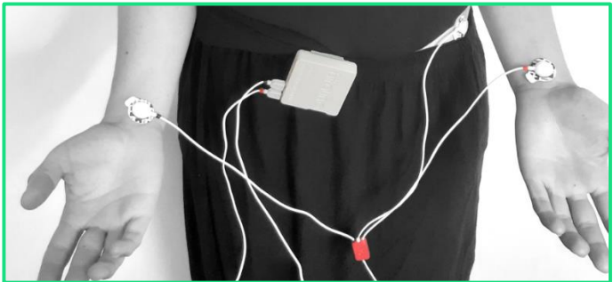
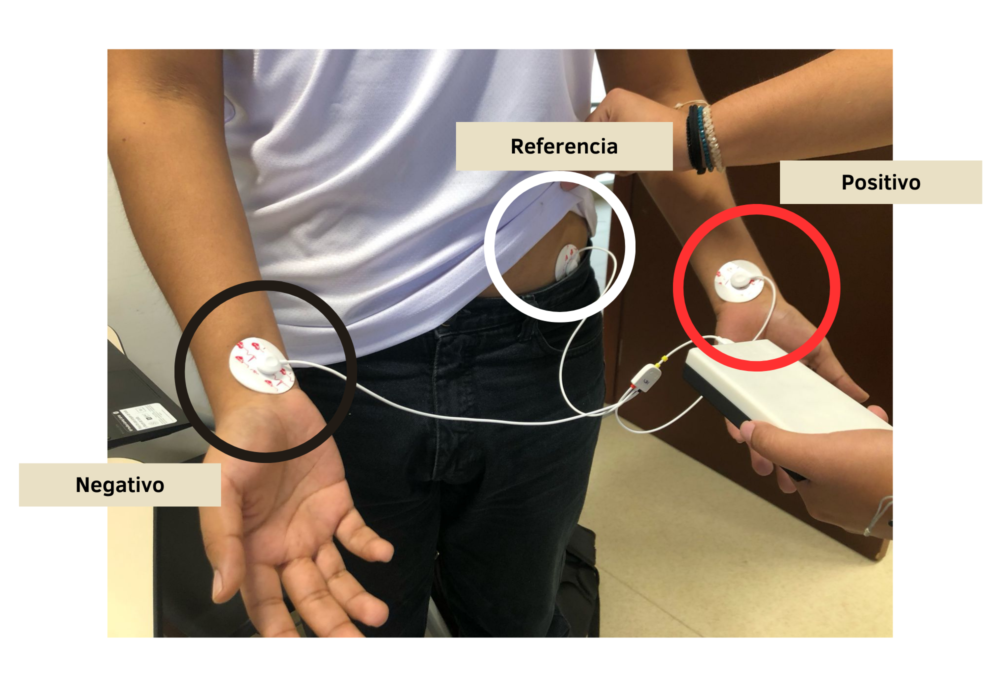
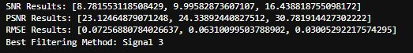
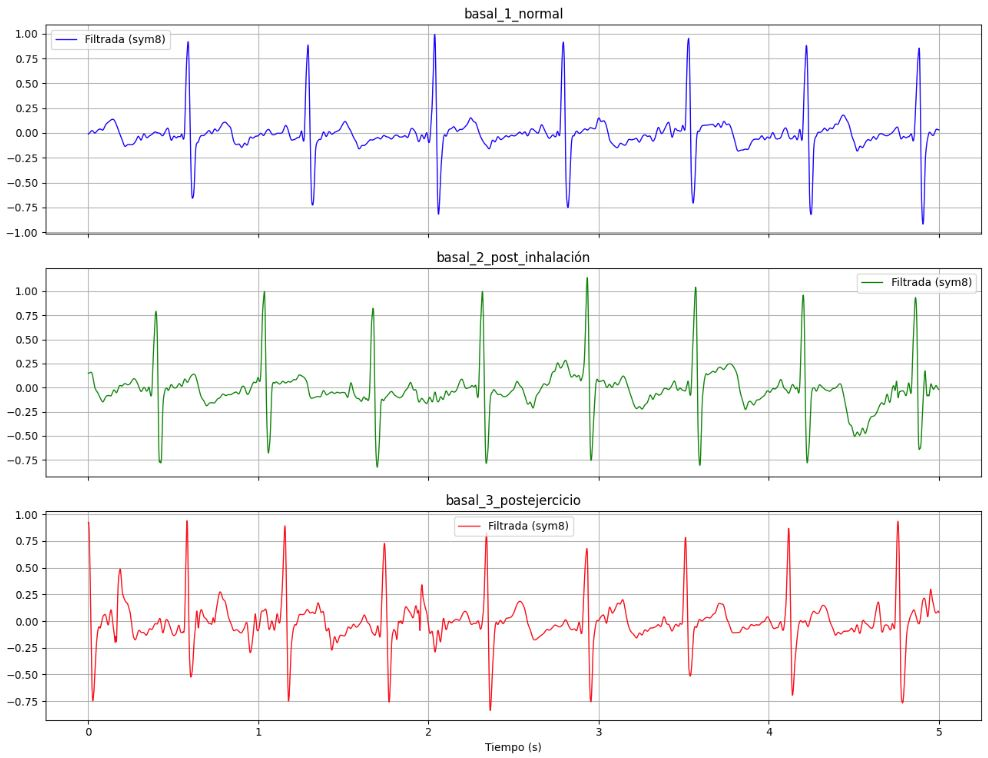
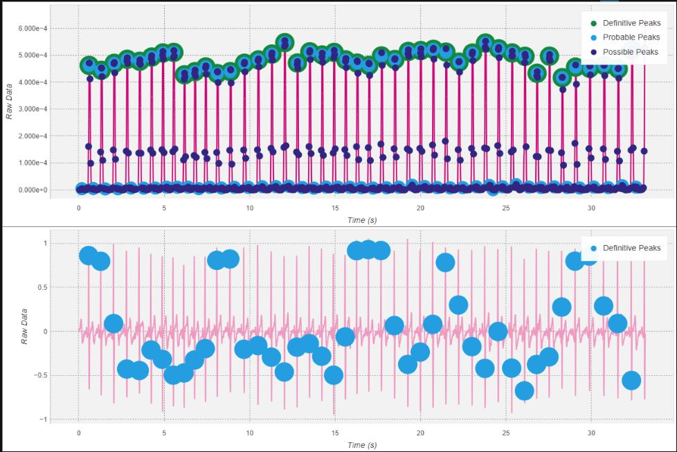
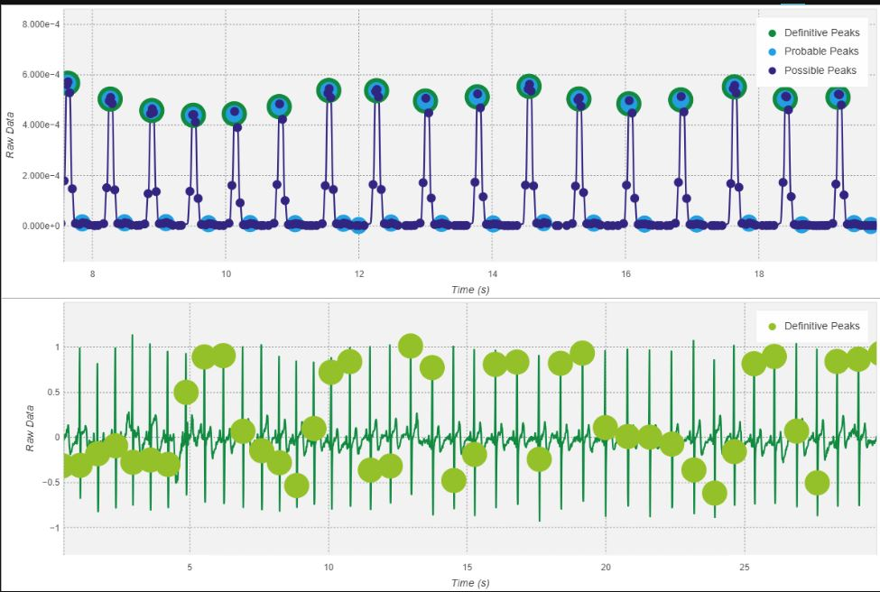
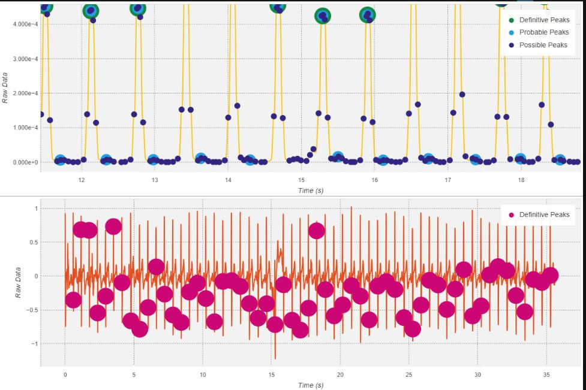

# Laboratorio N°9 - Procesamiento ECG

## Tabla de contenidos:
 __________________________________________________________________________________________________
1. [Lista de participantes](#t1)
2. [Introducción](#t2)
3. [Objetivos del laboratorio](#t3)
4. [Metodología](#t4)\
   4.1.[Materiales y Equipo utilizado](#t5)\
   4.2.[Procedimiento](#t6)\
       4.2.1.[Adquisición de la señal](#t7)\
       4.2.3.[Filtrado](#t8)\
       4.2.4.[Obtención de la variabilidad de la frecuencia cardíaca (HRV)](#t9)\
       4.2.5.[Extracción de características](#t10)\
       4.2.6.[Generación de señales y obtención de características](#t11)
7. [Discusión](#t12)
8. [Conclusión](#t13)
9. [Archivos](#t14)
7. [Bibliografía](#t15)
__________________________________________________________________________________________________
## **Lista de participantes** <a name = "t1"></a>
* Jimena Alpiste Espinoza - 74297329
* Jossymar León Mallma - 74905684
* Renato Cardoso Cardenas - 73061678


## Introducción  <a name = "t2"></a>
Cuando el impulso cardíaco se transmite a través del corazón, la corriente eléctrica se extiende hacia los tejidos circundantes. Una pequeña fracción de esta corriente se disemina hacia la superficie corporal. Al colocar electrodos en la piel en diferentes áreas alrededor del corazón, es posible registrar los potenciales eléctricos generados por esta corriente; este registro se conoce como electrocardiograma (ECG) [1].
El ECG es una modalidad de diagnóstico no invasiva que tiene un impacto clínico sustancial en la investigación de la gravedad de las enfermedades cardiovasculares.  Dado que refleja la actividad eléctrica dentro del corazón durante la contracción, el momento en que ocurre y su forma proporciona mucha información sobre el estado del corazón [2]. En la figura 1, se muestra el registro esquemático de un latido cardíaco normal, en este se observan las ondas P, Q , R, T y U. 

<div align="center">
    
    <p><b>Figura 1. Señal de ECG de latido cardíaco normal. Extraído de [2] </b> </p>
</div>

Esta herramienta se utiliza cada vez más para monitorear pacientes que toman antiarrítmicos y otros medicamentos, como parte integral de la evaluación preoperatoria de pacientes sometidos a cirugía no cardíaca, y para evaluar a personas en ocupaciones de alto riesgo y a quienes practican deportes [3]. Estas aplicaciones requieren una determinación adecuada de los aspectos morfológicos y de intervalo de la señal de ECG registrada, que son susceptibles a diversos tipos de ruidos predominantes, como la desviación de la línea base, los artefactos musculares, los artefactos musculares (MA), el ruido del electromiograma (EMG), el ruido blanco gaussiano aditivo (AWGN), la interferencia de la línea eléctrica (PLI), y otros ruidos diversos como el ruido compuesto (CN), el ruido aleatorio, los artefactos de movimiento de electrodos (EM) y el ruido de instrumentación. Estos ruidos dificultan la determinación de anomalías morfológicas específicas en las señales del ECG, complicando el diagnóstico preciso de enfermedades [4].

Por lo tanto, un adecuado procesamiento de la señal ECG es crucial para eliminar o minimizar estos ruidos y obtener información confiable y significativa de la actividad cardíaca. Técnicas avanzadas de procesamiento de señales, como el filtrado, la eliminación de artefactos y la extracción de características, son fundamentales para aprovechar al máximo el potencial de la ECG en aplicaciones médicas y de ingeniería.

Hay varios métodos propuestos en la literatura para la clasificación de señales ECG, los cuales se pueden dividir en cuatro categorías: preprocesamiento, segmentación, extracción de características y clasificación. Este procedimiento se explicará a continuación usando las referencias [2] y [5]. Asimismo, estos cuatro pasos del tratamiento de señales ECG se muestran a modo de diagrama en la figura 2, donde A, B, C y D simulan las clasificaciones finales de los latidos analizados.

<div align="center">
    
    <p><b> Figura 2.Diagrama de la clasificación de la señal ECG. Extraído de [2] </b> </p>
</div>

**Etapas de la clasificación:** 

1. **Preprocesamiento**:  En esta etapa se busca detectar y atenuar frecuencias relacionadas con artefactos en la señal de ECG, además de realizar normalización y mejora de la señal. Algunos métodos comunes son el uso de filtros digitales recursivos de respuesta finita al impulso (FIR), transformada wavelet y filtros adaptativos.
2. **Segmentación**: El objetivo de esta etapa es dividir la señal de ECG en segmentos más pequeños que representen mejor la actividad eléctrica del corazón. Los métodos más estudiados se enfocan en la detección del complejo QRS o pico R. Algunas técnicas empleadas son filtros digitales, redes neuronales, algoritmos genéticos, transformada wavelet, bancos de filtros, entre otros.
3. **Extracción de características**: Esta es una etapa crucial, donde se busca obtener un conjunto de valores representativos y no redundantes (características) a partir de los segmentos de ECG. Algunas características comunes son intervalos entre ondas (intervalo RR), amplitudes, duración de ondas, transformadas tiempo-frecuencia, análisis de componentes independientes (ICA), entre otras.
4. **Clasificación**:En esta etapa, se asigna una categoría o diagnóstico a cada segmento de la señal ECG mediante el uso de algoritmos que utilizan las características extraídas. Este paso es crucial para la identificación de arritmias y otros problemas cardíacos. Entre los clasificadores más comunes se encuentran Support Vector Machine (SVM), que busca encontrar el hiperplano que mejor separa las clases en el espacio de características; Artificial Neural Network (ANN), modelos computacionales inspirados en el cerebro humano capaces de aprender patrones complejos; K-Nearest Neighbours (KNN), que clasifica un punto basado en la mayoría de las clases de sus K vecinos más cercanos; y Decision Tree (DT), que utiliza una estructura jerárquica de decisiones para dividir el espacio de características en regiones con decisiones simples. Estos clasificadores son ampliamente utilizados debido a su efectividad en la clasificación de señales ECG, proporcionando diagnósticos precisos y rápidos para diversas condiciones cardíacas .


**Heart Rate Variability (HRV)**

El Heart Rate Variability (HRV) o Variabilidad de la Frecuencia Cardíaca es una medida que evalúa las variaciones en el tiempo entre latidos cardíacos consecutivos. Específicamente, el HRV se basa en el análisis de los intervalos R-R en el electrocardiograma (ECG).

Los intervalos R-R se refieren al tiempo transcurrido entre dos ondas R consecutivas en el ECG. Estas ondas R representan la despolarización ventricular en cada ciclo cardíaco. Por lo tanto, el intervalo R-R corresponde al tiempo entre dos despolarizaciones ventriculares sucesivas, lo que equivale al período entre latidos cardíacos [6].

Al analizar las fluctuaciones en los intervalos R-R, el HRV proporciona información valiosa sobre la capacidad del sistema nervioso autónomo para modular la frecuencia cardíaca. Una mayor variabilidad en los intervalos R-R indica una mejor regulación autonómica del corazón, lo que refleja un equilibrio saludable entre las ramas simpática y parasimpática del sistema nervioso autónomo [7].

Algunas razones por las cuales la HRV es una medida significativa, según la información obtenida de [6], incluyen:

* **Reflejo de la actividad autonómica**: La HRV es un indicador clave de la regulación autonómica del corazón, permitiendo evaluar el equilibrio entre el sistema nervioso simpático y parasimpático. Cambios en la HRV pueden indicar desequilibrios en esta regulación, lo que puede estar asociado con diversas condiciones de salud.
* **Pronóstico de enfermedades cardiovasculares**: La HRV se ha relacionado con el riesgo de eventos cardiovasculares adversos, como infartos de miocardio y muerte súbita cardíaca.
* **Evaluación de la adaptabilidad del corazón**: La capacidad del corazón para ajustar su frecuencia en respuesta a estímulos fisiológicos y emocionales se refleja en la HRV. Una HRV adecuada sugiere una adaptabilidad saludable del corazón a diferentes situaciones.
* **Monitorización de la salud y el estrés** La HRV puede utilizarse como una herramienta para evaluar el impacto del estrés, la fatiga y otras condiciones en el sistema cardiovascular. Cambios en la HRV pueden indicar alteraciones en la respuesta del cuerpo a factores estresantes

En la siguiente tabla, elaborada utilizando la referencia [7], se explicará en detalle cómo se relacionan los cambios en el HRV con diversas patologías. La variabilidad del HRV se mide utilizando el SDNN (Standard Deviation of NN intervals), una medida crucial en el análisis del Heart Rate Variability. El SDNN se refiere a la desviación estándar de los intervalos NN (intervalos entre latidos normales) en un registro de ECG. A diferencia de los intervalos RR, que incluyen todos los latidos sucesivos, los intervalos NN excluyen los latidos ectópicos o artefactos, proporcionando así una medida más precisa de la variabilidad en condiciones normales. El SDNN refleja todas las variaciones cíclicas presentes en el registro, incluyendo las de origen fisiológico y patológico. Un SDNN alto indica una alta variabilidad en los intervalos entre latidos, lo que generalmente se asocia con un buen estado de salud y una capacidad de adaptación eficiente del sistema nervioso autónomo. Por otro lado, un SDNN bajo indica una baja variabilidad en los intervalos entre latidos, lo que puede ser un signo de estrés, fatiga, enfermedad cardiovascular o disfunción autonómica.

| Cambio en el HRV                        | Relación con Patologías                                                                                      | Magnitud del Cambio                                          |
|-----------------------------------------|-------------------------------------------------------------------------------------------------------------|--------------------------------------------------------------|
| Reducción significativa del HRV         | Indicador de enfermedades cardíacas, riesgo elevado de muerte súbita, insuficiencia cardíaca congestiva.     | HRV total significativamente menor (<50 ms SDNN)             |
| Reducción moderada del HRV              | Asociado con condiciones de estrés, fatiga, depresión, y enfermedades crónicas no específicas.               | HRV moderadamente reducido (50-100 ms SDNN)                  |
| Incremento del HRV                      | Frecuentemente observado en atletas bien entrenados, indicando un sistema cardiovascular saludable y una alta capacidad de adaptación autónoma. | HRV elevado (>100 ms SDNN)                                   |
| Variabilidad circadiana reducida        | Relacionada con desórdenes del sueño, diabetes, y disfunción autonómica.                                      | Variabilidad circadiana significativamente reducida          |

<p align="center">
  <b> Tabla 1. Cambios en el HRV y su Relación con Patologías </b>
</p>


## **Objetivos del Laboratorio** <a name = "t3"></a>
* Aplicar técnicas de filtrado para eliminar ruidos e interferencias presentes en las señales ECG, como desviaciones de la línea base, ruido muscular y artefactos de movimiento.
* Detectar con precisión las ubicaciones de los picos de las ondas R en las señales ECG filtradas.
* Graficar y visualizar las ondas R detectadas.
* Calcular la variabilidad de la frecuencia cardíaca (HRV) a partir de los intervalos R-R. 
  
## Metodología <a name="t4"></a>
En este laboratorio, nos enfocaremos en el tratamiento de la señal de ECG adquirida previamente utilizando el Kit BITalino. 

### **Materiales y Equipo Utilizado** <a name="t5"></a>
<table align="center">
  <tr>
    <th>Modelo</th>
    <th>Descripción</th>
    <th>Cantidad</th>
  </tr>
  <tr>
    <td>(R)EVOLUTION</td>
    <td>Kit de BITalino</td>
    <td>1</td>
  </tr>
  <tr>
    <td>-</td>
    <td>Laptop</td>
    <td>1</td>
  </tr>
</table>
<p align="center">
  <b>Tabla 2. Materiales y equipos utilizados</b>
</p>

## **Procedimiento** <a name="t6"></a>

## Adquisición de la señal <a name="t7"></a>

Para capturar las señales ECG, se empleó el dispositivo BITalino junto con su sensor ECG de tres electrodos. Se siguió el procedimiento detallado en la guía BiTalino,**(BITalino HOME-GUIDE #2 ELECTROCARDIOGRAPHY (ECG) Exploring Cardiac Signals at the Skin Surface")** [8], como referencia para posicionar correctamente los electrodos en el sujeto de prueba. A continuación, se presentan los protocolos de conexión específicos utilizados en cada prueba llevada a cabo en este laboratorio:

| Figura 3. Colocación de electrodos para la derivación I referencia[8].                                                                                                   | Figura 4. Colocación de los electrodos en el laboratorio para la derivación I                                                                                                     |
|-------------------------------------------------------------------------------------------------------------|-----------------------------------------------------------------------------------------------------------------|
|  |  |


La derivación 1 en un ECG es una de las vistas básicas utilizadas para monitorear la actividad eléctrica del corazón. La colocación adecuada de los electrodos es fundamental para capturar con precisión esta actividad. En la Figura 3 se muestra la colocación de los electrodos para esta derivación. En esta configuración, se utilizaron tres electrodos: 
* IN+ (rojo) se coloca en la muñeca izquierda.
* IN- (negro) se coloca en la muñeca derecha.
* REF (blanco) se coloca en la cresta ilíaca.

**Protocolo:**

Se implementaron tres protocolos para medir la señal ECG eléctrica cardíaca en diferentes estados: estado de reposo, estado de respiración prolongada y estado de ejercicio intensivo. Cabe destacar que las ubicaciones mencionadas se mantuvieron para todas las pruebas: 

* Estado de Reposo: En esta prueba, se capturó la señal eléctrica generada por el corazón del sujeto mientras se encontraba en una posición estable y tranquila. Este escenario sirvió como referencia o control. La adquisición de datos se realizó durante un lapso de 30 segundos.
* Estado de Respiración Prolongada: El individuo retuvo su respiración durante 30 segundos, y se registró la señal eléctrica cardíaca durante la inhalación, retención y exhalación. La grabación de la señal tuvo una duración de 30 segundos. La colocación del electrodo permitió una posición cómoda y no invasiva durante las mediciones, lo cual es beneficioso para evaluar la función cardíaca.
* Estado de Ejercicio Intensivo: En esta prueba, se registró la actividad eléctrica del corazón del sujeto mientras realizaba planchas durante 3 minutos, capturando la señal durante y después del ejercicio. 

## Filtros para el procesamiento de ECG <a name="t8"></a>

En el artículo "Heart rate variability: a review" de U. Rajendra Acharya et al., se discuten en detalle los diferentes métodos utilizados para analizar la señal de variabilidad de la frecuencia cardíaca (HRV). Sin embargo, no se especifica el método exacto utilizado para el filtrado inicial de la señal de ECG antes de la detección de los intervalos RR. Los autores mencionan la importancia de eliminar cuidadosamente los artefactos y latidos ectópicos antes de calcular los parámetros de HRV en el dominio del tiempo, pero no proporcionan detalles sobre las técnicas de filtrado empleadas. [6]

Es por eso que para el filtrado de las señales EKG nos basaremos en el estudio realizado por Kania et. al. [9], en donde se investigó la aplicación del filtrado wavelet para reducir el ruido en señales EKG de alta resolución. Los autores evaluaron diferentes funciones wavelet madre y niveles de descomposición para determinar los parámetros óptimos que minimizan el error cuadrático medio (MSE) entre la señal original y la señal filtrada, preservando al mismo tiempo las características morfológicas del EKG.
Los resultados de Kania et al.[9] mostraron que las funciones wavelet db1 (Daubechies de primer orden) con niveles de descomposición del 4 al 6, sym3 (Symlet de tercer orden) con nivel 4, y sym8 (Symlet de octavo orden) con nivel 4, proporcionaron el mejor desempeño en términos de reducción de ruido y preservación de la morfología del EKG. Además, se destacó la ventaja del filtrado wavelet sobre técnicas convencionales como el promediado de latidos, especialmente en casos de arritmia donde el promediado puede distorsionar la señal.
**1. Transformada Wavelet Discreta (DWT) con filtro Daubechies 1 (db1):**

***Justificación de uso:*** La DWT con filtro db2 al nivel de descomposición 4 se seleccionó como una opción para filtrar señales EMG debido a su capacidad para reducir el ruido y preservar las características importantes de la señal.

| Parámetro                 | Valor                                                |
|---------------------------|----------------------------------------------------|
| Función wavelet           | Daubechies 2 (db2)                                |
| Nivel de descomposición   | 4                                                 |
| Método de umbralización   | Umbralización universal con estimación de sigma   |

<p align="center">
  <b>Tabla 2. Parametros para el filtro db2</b>
</p>

***Código de implementación***

```python
# Cargar la señal EcG
ecg_signal = signal_mv

# Aplicar la DWT con filtro db2 al nivel de descomposición 4
coefficients = pywt.wavedec(ecg_signal, 'db1', level=4)

# Estimar la desviación estándar del ruido
sigma = np.median(np.abs(coefficients[1])) / 0.6745

# Calcular el umbral universal
threshold = sigma * np.sqrt(2 * np.log(len(ecg_signal)))

# Realizar la umbralización suave
coefficients_filtered = [pywt.threshold(c, threshold, mode='soft') for c in coefficients]

# Reconstruir la señal filtrada
ecg_filtered_db1 = pywt.waverec(coefficients_filtered, 'db1')

# Mostrar la señal filtrada
ecg_filtered_db1
```

**2.  Transformada Wavelet Discreta (DWT) con filtro Daubechies 4 (Sym3):**

***Justificación de uso:*** La DWT con filtro db4 al nivel de descomposición 4 se seleccionó debido a su capacidad para proporcionar un buen compromiso en la reducción de ruido y la preservación de características importantes en señales EMG con diferentes niveles de ruido.

| Parámetro                 | Valor                                                |
|---------------------------|----------------------------------------------------|
| Función wavelet           | Daubechies 4 (db4)                                |
| Nivel de descomposición   | 4                                                 |
| Método de umbralización   | Umbralización universal con estimación de sigma   |

<p align="center">
  <b>Tabla 2. Parametros para el filtro db4 </b>
</p>

***Código:***

```python
# Cargar la señal ECG
ecg_signal = signal_mv
# Aplicar la DWT con filtro db4 al nivel de descomposición 4
coefficients = pywt.wavedec(ecg_signal, 'sym3', level=4)

# Estimar la desviación estándar del ruido
sigma = np.median(np.abs(coefficients[1])) / 0.6745

# Calcular el umbral universal
threshold = sigma * np.sqrt(2 * np.log(len(ecg_signal)))

# Realizar la umbralización suave en cada conjunto de coeficientes
coefficients_filtered = [pywt.threshold(c, threshold, mode='soft') for c in coefficients]

# Reconstruir la señal filtrada
ecg_filtered_sym3 = pywt.waverec(coefficients_filtered, 'sym3')

# Mostrar la señal filtrada
ecg_filtered_sym3
```


**3. Transformada Wavelet Discreta (DWT) con filtro Daubechies 6 (Sym8):**

***Justificación del uso:*** La DWT con filtro db6 al nivel de descomposición 4 se seleccionó como otra opción para filtrar señales EMG, proporcionando un equilibrio entre la reducción de ruido y la preservación de características relevantes.


| Parámetro                           | Valor                                                                       |
|-------------------------------------|---------------------------------------------------------------------|
| Función wavelet                 | Daubechies 6 (db6)                                                  |
| Nivel de descomposición   | 4                                                                               |
| Método de umbralización   | Umbralización universal con estimación de sigma   |

<p align="center">
  <b>Tabla 3. Parametros para el filtro db6</b>
</p>

```python
# Cargar la señal ECG
ecg_signal = signal_mv

# Aplicar la DWT con filtro db6 al nivel de descomposición 4
coefficients = pywt.wavedec(ecg_signal, 'sym8', level=4)

# Estimar la desviación estándar del ruido
sigma = np.median(np.abs(coefficients[1])) / 0.6745

# Calcular el umbral universal
threshold = sigma * np.sqrt(2 * np.log(len(ecg_signal)))

# Realizar la umbralización suave en cada conjunto de coeficientes excepto el primero (cA)
coefficients_filtered = [coefficients[0]] + [pywt.threshold(c, threshold, mode='soft') for c in coefficients[1:]]

# Reconstruir la señal filtrada
ecg_filtered_sym8 = pywt.waverec(coefficients_filtered, 'sym8')
```

***Resultados***: 
```python
def snr(signal, filtered_signal):
    noise = signal - filtered_signal
    return 10 * np.log10(np.sum(signal**2) / np.sum(noise**2))

def psnr(signal, filtered_signal):
    mse = np.mean((signal - filtered_signal)**2)
    return 20 * np.log10(np.max(signal) / np.sqrt(mse))

def rmse(signal, filtered_signal):
    return np.sqrt(np.mean((signal - filtered_signal)**2))

def compare_filtering_methods(original_signal, filtered_signal1, filtered_signal2, filtered_signal3):
    snr_results = [snr(original_signal, filtered_signal) for filtered_signal in [filtered_signal1, filtered_signal2, filtered_signal3]]
    psnr_results = [psnr(original_signal, filtered_signal) for filtered_signal in [filtered_signal1, filtered_signal2, filtered_signal3]]
    rmse_results = [rmse(original_signal, filtered_signal) for filtered_signal in [filtered_signal1, filtered_signal2, filtered_signal3]]

    best_snr_index = np.argmax(snr_results)
    best_psnr_index = np.argmax(psnr_results)
    best_rmse_index = np.argmin(rmse_results)

    if best_snr_index == best_psnr_index == best_rmse_index:
        best_method = best_snr_index + 1
    else:
        best_method = np.argmax([snr_results[best_snr_index], psnr_results[best_psnr_index], -rmse_results[best_rmse_index]]) + 1


# Load the original ECG signal and the three filtered signals
original_signal = signal_mv
filtered_signal1 = ecg_filtered_db1
filtered_signal2 = ecg_filtered_sym3
filtered_signal3 = ecg_filtered_sym8

# Compare the filtering methods
compare_filtering_methods(original_signal, filtered_signal1, filtered_signal2, filtered_signal3)
```

<div align="center">
    
    <p><b>Figura 3. Resultado del cálculo de SNR, PSNR, RMSE de cada filtro y cuál es el filtro ganador </b> </p>
</div>


<div align="center">
    
    <p><b>Figura 4. Comparación visual de los gráficos </b> </p>
</div>

## Obtención de la variabilidad de la frecuencia cardíaca (HRV):  <a name="t9"></a>

El artículo "Heart rate variability: a review" de U. Rajendra Acharya et al. [6] dedica una parte significativa a la discusión de los diferentes métodos utilizados para analizar la señal de HRV. Estos métodos se pueden agrupar en cuatro categorías principales: métodos de dominio de tiempo, métodos de dominio de frecuencia, métodos no lineales y métodos de tiempo-frecuencia.

Todos los métodos han sido extraídos de [6]:

A. Métodos de dominio de tiempo:
Estos métodos implican el cálculo de parámetros estadísticos a partir de la serie de intervalos RR, como la desviación estándar de los intervalos NN (SDNN), la raíz cuadrada de la media de las diferencias al cuadrado de intervalos RR sucesivos (RMSSD) y el porcentaje de intervalos RR adyacentes que difieren en más de 50 ms (pNN50).

B. Métodos de dominio de frecuencia:
Estos métodos utilizan la transformada de Fourier para descomponer la señal de HRV en sus componentes de frecuencia. Se calcula la densidad espectral de potencia (PSD) y se analizan las potencias en diferentes bandas de frecuencia, como la banda de muy baja frecuencia (VLF, 0-0.04 Hz), la banda de baja frecuencia (LF, 0.04-0.15 Hz) y la banda de alta frecuencia (HF, 0.15-0.4 Hz). También se calcula la relación LF/HF, que se considera un indicador del equilibrio simpático-vagal.

C. Métodos no lineales:
Estos métodos buscan cuantificar la complejidad y la predictibilidad de la serie de HRV. Incluyen medidas como la entropía aproximada (ApEn), la dimensión de correlación (CD), los exponentes de Lyapunov, el exponente de Hurst y la dimensión fractal. Estas técnicas se basan en la teoría del caos y los sistemas dinámicos no lineales y pueden proporcionar información adicional sobre la dinámica de la HRV que no se captura con los métodos lineales.

D. Métodos de tiempo-frecuencia:
Estos métodos, como la transformada wavelet, permiten analizar cambios en el contenido de frecuencia de la HRV a lo largo del tiempo. La transformada wavelet descompone la señal en diferentes escalas y proporciona una representación tiempo-frecuencia de la HRV. Esto es útil para detectar cambios transitorios en la HRV que pueden estar asociados con eventos fisiológicos o patológicos.

Entre estos, los métodos de dominio de tiempo serían los más fáciles de aplicar en una señal de ECG para analizar la variabilidad de la frecuencia cardíaca (HRV) debido a su simplicidad conceptual, facilidad de implementación, interpretación directa y menor complejidad computacional en comparación con los métodos de dominio de frecuencia, no lineales y tiempo-frecuencia. Estos métodos implican el cálculo de parámetros estadísticos como SDNN, RMSSD y pNN50 directamente a partir de la serie de intervalos RR, lo que los hace accesibles y rápidos de aplicar. 

***Resultados***: 

## Extracción de características  <a name="t10"></a>

Haremos uso de BioSignals [10], un software desarrollado por PLUX, el cual ofrece varias opciones para obtener la variabilidad de la frecuencia cardíaca (HRV) a partir de señales de electrocardiograma (ECG). El programa incluye un módulo dedicado al análisis de HRV que permite a los usuarios calcular y visualizar diversos parámetros de HRV en los dominios de tiempo y frecuencia. En el dominio del tiempo, BioSignals puede calcular métricas como SDNN (desviación estándar de los intervalos NN), RMSSD (raíz cuadrada de la media de las diferencias al cuadrado de intervalos RR sucesivos) y pNN50 (porcentaje de intervalos RR adyacentes que difieren en más de 50 ms). 


***Mostramos como obtenemos dichas características del BioSignal***: 

## Generación de señales y obtención de características <a name="t11"></a>

### Reposo
```python
detected_peaks3= bsnb.detect_r_peaks(ecg_filtered_1, sr, time_units=True, plot_result=True)
```
<div align="center">
    
    <p><b>Figura 5. Resultado de la detección de picos </b> </p>
</div>


```python
# Suponiendo que los picos están en el primer elemento de la tupla
definitive_peaks1 = detected_peaks1[0]  # Ajusta el índice según el contenido

# Ahora continúa con el cálculo de los intervalos RR y las métricas HRV
rr_intervals = np.diff(definitive_peaks1) 

# Calcular SDNN
sdnn = np.std(rr_intervals)

# Calcular RMSSD
rmssd = np.sqrt(np.mean(np.diff(rr_intervals) ** 2))

# Calcular pNN50
nn50 = np.sum(np.abs(np.diff(rr_intervals)) > 0.05)
pnn50 = (nn50 / len(rr_intervals)) * 100

# Imprimir los resultados
print(f"SDNN: {sdnn:.4f} s")
print(f"RMSSD: {rmssd:.4f} s")
print(f"pNN50: {pnn50:.2f} %")
```

| Parámetro                                                                                   | Valor                                                |
|---------------------------------------------------------------------------------------------|----------------------------------------------------|
| SDNN (desviación estándar de los intervalos NN)          |                                  | 0.0573 s |
| RMSSD (raíz cuadrada de la media de las diferencias al cuadrado de intervalos RR sucesivos)  |0.0329 s   |
| pNN50 (porcentaje de intervalos RR adyacentes que difieren en más de 50 ms).   |    9.30 %     |

</p>
  <b> Tabla 3. Extracción de características del EKG del evaluado en reposo </b>
</p>


### Post Inhalación

```python
detected_peaks3= bsnb.detect_r_peaks(ecg_filtered_2, sr, time_units=True, plot_result=True)
```
<div align="center">
    
    <p><b>Figura 6. Resultado de la detección de picos </b> </p>
</div>


```python
# Suponiendo que los picos están en el primer elemento de la tupla
definitive_peaks2 = detected_peaks2[0]  # Ajusta el índice según el contenido

# Ahora continúa con el cálculo de los intervalos RR y las métricas HRV
rr_intervals = np.diff(definitive_peaks2) 

# Calcular SDNN
sdnn = np.std(rr_intervals)

# Calcular RMSSD
rmssd = np.sqrt(np.mean(np.diff(rr_intervals) ** 2))

# Calcular pNN50
nn50 = np.sum(np.abs(np.diff(rr_intervals)) > 0.05)
pnn50 = (nn50 / len(rr_intervals)) * 100

# Imprimir los resultados
print(f"SDNN: {sdnn:.4f} s")
print(f"RMSSD: {rmssd:.4f} s")
print(f"pNN50: {pnn50:.2f} %")
```

| Parámetro                                                                                   | Valor                                                |
|---------------------------------------------------------------------------------------------|----------------------------------------------------|
| SDNN (desviación estándar de los intervalos NN)          |                                  |  0.0638 s |
| RMSSD (raíz cuadrada de la media de las diferencias al cuadrado de intervalos RR sucesivos)  |                 0.0342 s                              |
| pNN50 (porcentaje de intervalos RR adyacentes que difieren en más de 50 ms).   |         3.57 %       |

</p>
  <b> Tabla 4. Extracción de características del EKG del evaluado inhalando </b>
</p>

### Post Ejercicio

```python
detected_peaks3= bsnb.detect_r_peaks(ecg_filtered_3, sr, time_units=True, plot_result=True)
```
<div align="center">
    
    <p><b>Figura 6. Resultado de la detección de picos </b> </p>
</div>

```python
# Suponiendo que los picos están en el primer elemento de la tupla
definitive_peaks3 = detected_peaks3[0]  # Ajusta el índice según el contenido

# Ahora continúa con el cálculo de los intervalos RR y las métricas HRV
rr_intervals = np.diff(definitive_peaks3) 

# Calcular SDNN
sdnn = np.std(rr_intervals)

# Calcular RMSSD
rmssd = np.sqrt(np.mean(np.diff(rr_intervals) ** 2))

# Calcular pNN50
nn50 = np.sum(np.abs(np.diff(rr_intervals)) > 0.05)
pnn50 = (nn50 / len(rr_intervals)) * 100

# Imprimir los resultados
print(f"SDNN: {sdnn:.4f} s")
print(f"RMSSD: {rmssd:.4f} s")
print(f"pNN50: {pnn50:.2f} %")
```

| Parámetro                                                                                   | Valor                                                |
|---------------------------------------------------------------------------------------------|----------------------------------------------------|
| SDNN (desviación estándar de los intervalos NN)          |                                  | 0.0214 s |
| RMSSD (raíz cuadrada de la media de las diferencias al cuadrado de intervalos RR sucesivos)  |0.0191 s|
| pNN50 (porcentaje de intervalos RR adyacentes que difieren en más de 50 ms).   |3.57 %|
</p>
  <b> Tabla 5. Extracción de características del EKG del evaluado post ejercicio </b>
</p>


## Discusión de los resultados  <a name="t12"></a>


## Conclusiones <a name="t13"></a>


## Archivos <a name="t14"></a>

- [Programa de procesamiento de señal EMG (python)](https://github.com/renatog2500/inb_2024_gh12/blob/main/ISB_Informes/L8_Procesamiento_EMG/LAB_8.ipynb) 


## Bibliografía: <a name="t15"></a>


