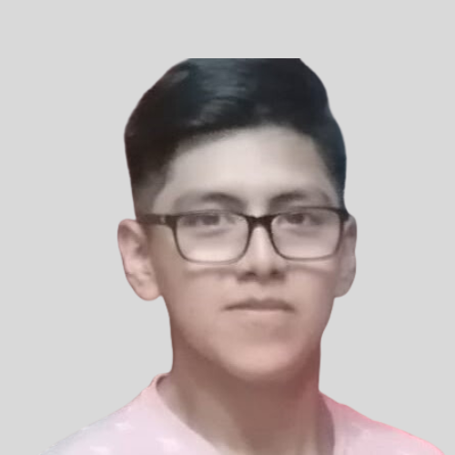

## Introducción a Señales Biomédicas Grupo 13

Bienvenidos al repositorio del Grupo 13 del curso: "Introducción a Señales Biomédicas" del ciclo 2024-1

## Tabla de contenidos:
- [Proyecto](#Proyecto)
- [Sobre Nosotros](#SobreNosotros)
- [Integrantes](#Integrantes)
- [Docentes del curso](#DocentesCurso)

## Proyecto
Proyecto: Aún no determinado :)
Se buscará aplicar lo aprendido en el curso para el buen desarrollo del proyecto

## Sobre Nosotros 
Somos un equipo de estudiantes de Ingeniería Biomédica, provenientes de la Pontificia Universidad Católica del Perú y la Universidad Peruana Cayetano Heredia. Nos motiva profundamente el conocimiento sobre el funcionamiento de los equipos de medición de señales biomédicas, así como el procesamiento de la información que generan y sus diversas aplicaciones en el campo de la medicina.

## Integrantes
| Colaborador 1            | Colaborador 2                          | Colaborador 3                   |
|---------------------------------|---------------------------------|---------------------------------|
||              |      |
|Renato Giusseppi Cardoso Reategui|Jimena Alpiste Espinoza|Jossymar Leon Mallma|
| renato.cardoso@upch.pe | jimena.alpiste@pucp.edu.pe        |  a20200543@pucp.edu.pe                     |
| Estudiante de Ingeniería Biomédica del convenio PUCP-UPCH. Estoy interesado en las ramas de ingeniería clínica y mecánica y rehabilitación. | Estudiante de Ingeniería Biomédica PUCP-UPCH. Estoy interesada en las ramas de Ingeniería clínica e Ingeniería de Tejidos | Estudiante de Ingeniería Biomédica PUCP-UPCH. Estoy interesado en las ramas de ingeniería clínica y mecánica y rehabilitación.                |

## Docentes del Curso
- Umbert Lewis De La Cruz Rodríguez (coordinador)
- Moises Stevend Meza Rodríguez (coordinador)
