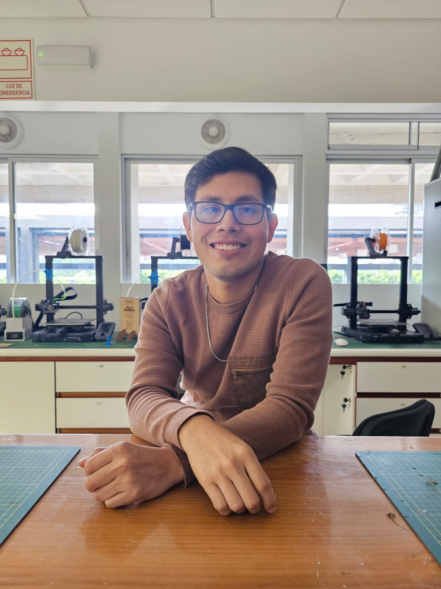
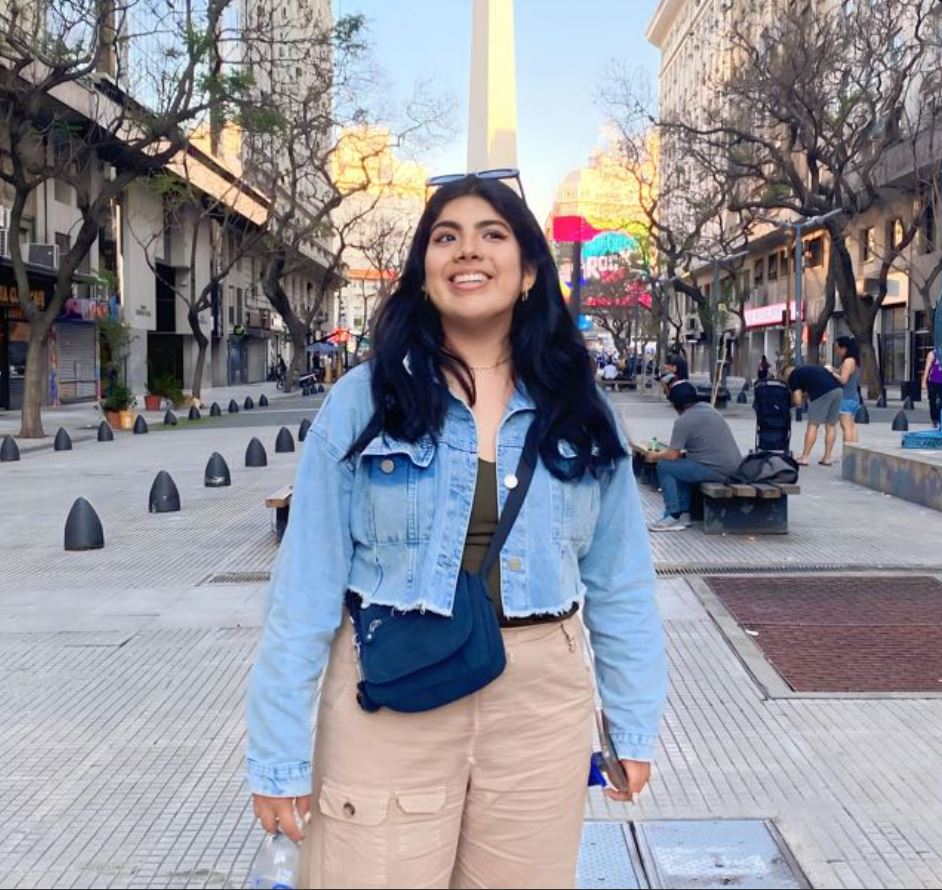
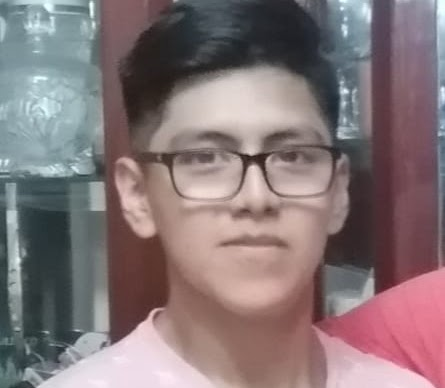

# inb_2024_gh12

Bienvenidos al repositorio del Grupo 12 del curso: "Introducción a Señales Biomédicas"

## Tabla de contenidos:
- [Sobre Nosotros](#SobreNosotros)
- [Imágenes](#Imágenes)
- [Integrantes](#Integrantes)

## Sobre Nosotros
Proyecto: Aún no determinado
Se buscará aplicar lo aprendido en el curso para el buen desarrollo del proyecto
## Imágenes
| Colaborador 1                          | Colaborador 2                          | Colaborador 3                          |
|---------------------------------|---------------------------------|---------------------------------|
|     |     |     |

## Introducción a Señales Biomedicas Grupo 12
### Repositorio del curso introducción Señales Biomédicas

### Integrantes
- Renato Giusseppi Cardoso Reategui(colaborador) renato.cardoso@upch.pe
- Jimena Alpiste Espinoza (colaborador) jimena.alpiste@pucp.edu.pe  
- Jossymar Leon Mallma (colaborador) Jossymarlm7@gmail.com

