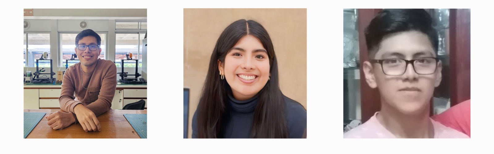

Bienvenidos al repositorio del Grupo 13 del curso: "Introducción a Señales Biomédicas" del ciclo 2024-1

## Tabla de contenidos:
- [Proyecto](#Proyecto)
- [Sobre Nosotros](#SobreNosotros)
- [Integrantes](#Integrantes)
- [Docentes del curso](#DocentesDelCurso)

## Proyecto
Proyecto: Aún no determinado :)
Se buscará aplicar lo aprendido en el curso para el buen desarrollo del proyecto

## Sobre Nosotros 
Somos un equipo de estudiantes de Ingeniería Biomédica, provenientes de la Pontificia Universidad Católica del Perú y la Universidad Peruana Cayetano Heredia. Nos motiva profundamente el conocimiento sobre el funcionamiento de los equipos de medición de señales biomédicas, así como el procesamiento de la información que generan y sus diversas aplicaciones en el campo de la medicina.

## Integrantes
| Colaborador 1                                                 | Colaborador 2                          | Colaborador 3                          |
|---------------------------------|---------------------------------|---------------------------------|

  

- Renato Giusseppi Cardoso Reategui (colaborador) renato.cardoso@upch.pe
- Jimena Alpiste Espinoza (colaboradora) jimena.alpiste@pucp.edu.pe  
- Jossymar Leon Mallma (colaborador) Jossymarlm7@gmail.com
## Introducción a Señales Biomedicas Grupo 13
### Repositorio del curso introducción Señales Biomédicas

## Docentes del Curso
- Umbert Lewis De La Cruz Rodríguez (coordinador)
- Moises Stevend Meza Rodríguez (coordinador)
